# Beyond Persona Prompting: A Cognitive-Process-Based Framework for ADHD Student Simulation with Large Language Models

**Main Research Question**

> How can selected ADHD-related learning characteristics be represented in LLM-based student simulation, and to what extent does a cognitive-process-based representation produce more theory-consistent task behaviour than persona prompting while retaining its constraint-related patterns under additional response-stage learner attributes?

**RQ1 — Mechanism**

> Does the CPB processing pipeline execute its intended rules and produce traceable transitions from instructional information, through attention, working-memory processing and encoding, to Explicit LTM?

**RQ2 — Representation**

> Compared with persona prompting, does CPB produce learning behaviour that shows more theoretically consistent sensitivity to controlled distraction and instructional processing demand?

**RQ3 — Constraint-Pattern Retention under Attribute Additions**

> When Language Ability and Big-Five prompt dimensions are added at the response stage, how do assessment outcomes change, and do CPB's previously established constraint-related aggregate patterns remain observable?

## Abstract

Large Language Models (LLMs) enable flexible student simulation through natural-language persona prompting, but descriptive learner profiles do not necessarily reproduce the learning-process consequences implied by process-relevant characteristics. This thesis investigates whether selected ADHD-related learning characteristics can instead be represented through explicit cognitive-process constraints that shape learner state and downstream behaviour.

A Cognitive-Process-Based (CPB) framework was developed to operationalise susceptibility to controlled distraction and sensitivity to instructional processing demand through Attention- and Working-Memory-related constraints. CPB was compared with persona-prompted student simulation using shared instructional materials, assessment questions and a source-grounded criterion-level evaluation framework.

Three studies evaluated the approach. Study 1 verified that CPB mechanisms executed as intended and produced traceable information-state changes. Study 2 found that CPB produced clearer graded learner-condition patterns and more theory-consistent sensitivity to controlled distraction and processing demand than persona prompting. Study 3 showed that additional response-stage Language Ability and Big-Five prompts changed assessment outcomes but did not eliminate CPB’s previously established constraint-related aggregate patterns.

These findings support functional process-based representation as a promising approach for modelling selected ADHD-related learning characteristics, while not claiming a complete or clinically valid simulation of ADHD cognition.

**Keywords:** Large Language Models; Student Simulation; Learner Modelling; ADHD; Persona Prompting; Cognitive Process Modelling

## Acknowledgements

First and foremost, I would like to express my sincere gratitude to my dissertation supervisor, Dr. Sahan Bulathwela, for his guidance, feedback, and support throughout this project. He always listened patiently to my ideas and offered thoughtful suggestions on the research questions, methodology, and overall direction of the study. When I became uncertain about the topic and scope midway through the research, his encouragement and advice helped me narrow the project and arrive at a clearer and more feasible direction. His support was invaluable to the completion of this dissertation.

I would also like to thank a UCL doctoral student in Applied Psychology whom I have never met in person, but who provided important support when my Research Questions needed to be reconsidered. As this project sits at the intersection of artificial intelligence, cognitive science, and psychology, I was often uncertain about theories outside my main area of expertise. I am very grateful for his willingness to discuss these questions with me and for the psychological perspective he brought to refining the research. These conversations helped me better understand the boundaries of the study and what it could reasonably aim to answer.

I am also grateful to the friends I met at UCL. Your companionship, conversations, and encouragement provided much-needed emotional support throughout the dissertation process and brought many warm memories to a demanding period.

Finally, I would like to thank UCL. Although my time here has been relatively short, I have been deeply impressed by the professionalism, kindness, and dedication of its staff, as well as the care reflected in its teaching and student support. I feel fortunate and honoured to have been part of UCL, and this experience will remain a meaningful and memorable part of my life.

## Acronyms

| Abbreviation | Full term |
|---|---|
| **AAR** | Attention-Stage Availability Ratio |
| **ADHD** | Attention-Deficit/Hyperactivity Disorder |
| **API** | Application Programming Interface |
| **ATRF** | Attention Target-Removal Fidelity |
| **BF** | Big Five |
| **CI** | Confidence Interval |
| **CPB** | Cognitive-Process-Based |
| **DR** | Design Requirement |
| **E2ESR** | End-to-End Semantic Recall |
| **ER** | Complete Equality Rate |
| **ESR** | Encoding Semantic Recall |
| **FIFO** | First-In, First-Out |
| **FRF** | FIFO Rule Fidelity |
| **ICC** | Intraclass Correlation Coefficient |
| **LLM** | Large Language Model |
| **LTM** | Long-Term Memory |
| **MAE** | Mean Absolute Error |
| **NTPR** | Non-Target Preservation Rate |
| **NT** | Neurotypical; used only in the Prompt-NT reference-condition label |
| **OCR** | Ordering Consistency Rate |
| **PDB** | Processing Demand Bits |
| **RQ** | Research Question |
| **SD** | Standard Deviation |
| **SQ** | Subquestion |
| **SWAR** | Source-Word Availability Ratio |
| **VR** | Validation Requirement |
| **WM** | Working Memory |
| **WMAR** | Working-Memory-Stage Availability Ratio |
| **WMTA** | Working-Memory Trigger Agreement |

## Contents

## 1 Introduction

### 1.1 Background and Motivation

Simulated students 长期被用于教师训练、智能教学系统开发以及学习行为研究。Large Language Models（LLMs）的开放语言生成、多轮交互和自然语言条件控制能力进一步扩展了 student simulation 的应用范围，使 simulated learners 能够参与更灵活的课堂对话、回答开放式问题，并根据预设 learner profiles 表现出不同的交互特征 [markel-etal-2023-gpteach; liu-etal-2024-personality; chu-etal-2025-llm]。这使 LLM-based student simulation increasingly relevant not only to teacher rehearsal, but also to tutoring-system testing and synthetic educational experimentation.

然而，随着 simulated learners 被进一步用于比较教学策略、研究 learner differences 和分析 learning outcomes，仅生成自然或表面可信的学生回答已经不足以支持更强的研究结论。近期研究表明，LLM-simulated students 即使能够产生流畅对话，也可能在 behavioural consistency、knowledge level 或 cognitive fidelity 上偏离目标 learner [martynova-etal-2025-can; scarlatos-etal-2026-simulated]。因此，一个更基础的方法学问题随之出现：**如果 simulated learner 的行为被用于推断学习过程或比较 learner conditions，那么 learner characteristics 如何被表示，就会直接影响这些 behavioural differences 能够被如何解释。**

### 1.2 The Representation Problem

Persona prompting 是当前 LLM student simulation 中最直接和灵活的 learner-representation 方法之一。Academic ability、language ability、personality、motivation 或 behavioural tendencies 等 characteristics 都可以通过自然语言 profile 写入 prompt，并由同一个基础模型据此调整生成行为 [benedetto-etal-2024-using; liu-etal-2024-personality]。这种方式无需额外训练，也便于快速组合多个 learner dimensions。

但 learner characteristics 并不一定作用在同一个 functional level。部分 characteristics 主要表现为语言组织、互动倾向或 response style，而另一些 characteristics 如果理论上影响的是 attention、information processing 或 knowledge formation，其作用位置则更接近 learning process 本身。当这些 functionally heterogeneous characteristics 都通过同一个 global persona prompt 表示时，模型能够被告知“学生是什么样”或“应该怎样表现”，但 represented characteristic 如何进入学习过程并产生后续 behaviour 并不显式。

Persona prompting 主要通过 descriptive learner profiles 直接约束生成行为，而 process-based representation 则让 selected learner characteristics 先作用于 learning process，改变 learner state，再由 resulting state 影响 downstream behaviour。两者的核心区别因此不在于是否允许 behavioural variation，而在于 behavioural differences 是被直接描述出来，还是从前序 process constraints 及其形成的 learner state 中产生。两种方式的区别并不在于 process-based representation 应当减少 behavioural variation，而在于 behavioural differences 可以由前序 processing constraints 及其形成的 learner state 产生，而不是全部通过 response-level instruction 直接规定。

因此，本文关注的核心 representation problem 是：**当 learner characteristics 预期通过 learning process 影响 knowledge acquisition 和 downstream task behaviour 时，descriptive persona conditioning 是否足以产生相应的 functional consequences，还是需要将这些 characteristics 表示在其预期发挥作用的 processing level？**

### 1.3 ADHD Student Simulation as a Research Case

ADHD provides a useful case for examining this representation problem because many ADHD-related differences are expected to affect learning processes rather than only observable response style. At the same time, ADHD is highly heterogeneous: learners with the same diagnosis may differ substantially in cognitive profile and behavioural presentation [willcutt-etal-2005-validity; luo-etal-2019-heterogeneity]. It would therefore be inappropriate to treat “ADHD” as a single fixed learner persona or to assume that one set of cognitive characteristics applies to all ADHD learners.

Rather than attempting to simulate ADHD as a whole, this thesis focuses on two bounded learning-related characteristics with established theoretical relevance. The first is **susceptibility to controlled distraction**, reflecting the possibility that task-irrelevant events may disrupt the availability of task-relevant instructional information. The second is **sensitivity to instructional processing demand**, reflecting the possibility that performance becomes more constrained as processing demands exceed available Working-Memory resources [aboitiz2014irrelevant; martinussen2005meta; kofler2010adhd]. These characteristics are used as controlled functional targets rather than diagnostic markers or a complete cognitive model of ADHD.

Both characteristics are particularly suitable for the representation question examined here because their expected effects occur during learning: they concern what information remains available, how that information is processed, and what learner state is subsequently formed. They therefore provide a scoped test case for comparing a descriptive persona representation with a representation that places selected learner characteristics within the learning process itself.

To investigate this distinction, the thesis introduces a **Cognitive-Process-Based (CPB) learner representation**. CPB represents the selected Attention- and Working-Memory-related characteristics as controlled processing constraints that shape the learner knowledge state, while persona prompting serves as the comparison representation. The subsequent studies examine whether these constraints operate as intended, whether they produce task behaviour consistent with the targeted processes, and whether the resulting constraint-related patterns remain observable when additional response-stage learner attributes are introduced.

---

### 1.4 Research Aim, Research Questions and Objectives

本论文旨在研究：**selected ADHD-related learning characteristics 是否能够通过显式、可追踪的 processing constraints 表示在 LLM student simulation 中，以及这种 process-based representation 与 persona prompting 在机制有效性、task-sensitive behavioural patterns 和 multidimensional profile extension 下表现出何种差异。**

本文并不以证明 CPB 全面优于 persona prompting 为目标。相反，研究重点是识别两种 representation 在不同 functional claims 下能够支持什么类型的 evidence：CPB mechanisms 是否真正按照注册规则影响 learner knowledge state；两种 representations 是否形成不同的 assessment-performance structure；以及其 behavioural patterns 是否与 controlled distraction 和 instructional processing demand 表现出理论方向一致的关系。

围绕这一目标，本文提出以下研究问题。

> **Main Research Question:**  
> **How can selected ADHD-related learning characteristics be represented in LLM-based student simulation, and to what extent does a cognitive-process-based representation produce more theory-consistent task behaviour than persona prompting while retaining its constraint-related patterns under additional response-stage learner attributes?**

> **RQ1 — Mechanism:**  
> **Does the CPB processing pipeline execute its intended rules and produce traceable transitions from instructional information, through attention, working-memory processing and encoding, to Explicit LTM?**

RQ1 首先检验 CPB 本身是否按照设计运行。在比较最终 behaviour 之前，需要确认 Attention 和 Working-Memory mechanisms 是否正确执行，并确认由这些 mechanisms 引起的信息状态变化能够被归因和追踪至最终 Explicit LTM。

> **RQ2 — Representation:**  
> **Compared with persona prompting, does CPB produce learning behaviour that shows more theoretically consistent sensitivity to controlled distraction and instructional processing demand?**

RQ2 随后将分析从 mechanism level 扩展至 observable assessment behaviour。研究首先比较两种 representation 内部的 learner-condition differentiation，再检验其 performance 是否对 controlled distraction 和 source-round instructional processing demand 呈现与目标 Attention- 和 Working-Memory-related hypotheses 方向一致的 sensitivity。

> **RQ3 — Constraint-Pattern Retention under Attribute Additions:**  
> **When Language Ability and Big-Five prompt dimensions are added at the response stage, how do assessment outcomes change, and do CPB's previously established constraint-related aggregate patterns remain observable?**

RQ3 最后考察更复杂的 multidimensional learner representation。新增 Language Ability 和 Big-Five prompt dimensions 可以合理改变具体 assessment responses，因此研究并不要求 final outcomes 保持不变；更重要的是检验这些 response-stage attributes 加入后，CPB 在前述实验中形成的 graded performance structure 以及对 controlled distraction 和 instructional processing demand 的 aggregate sensitivity 是否仍然能够观察到。

三个 RQ 由此形成递进关系：RQ1 检验 process representation 是否按预定义机制形成可追踪的 learner state；RQ2 检验这种 representation 是否进一步产生理论相关的 task-sensitive behaviour；RQ3 则检验这些 constraint-related aggregate patterns 在加入其他 learner-profile dimensions 后是否仍然存在。

为回答上述研究问题，本文设定以下四项研究目标：

1. **Develop a process-based learner representation**，将选定的 ADHD-related Attention 和 Working-Memory characteristics 操作化为显式 processing constraints，并通过独立 knowledge state 表示 instructional experience 后形成的 learner information。

2. **Validate the internal CPB processing pipeline**，检验 Attention 和 Working-Memory mechanisms 是否按照预定义规则执行，以及相应 information-state transitions 是否正确、可归因并可追踪至 Explicit LTM。

3. **Compare persona prompting and CPB at the behavioural level**，检验两种 representation 的 within-representation performance structure，以及其对 controlled distraction 和 instructional processing demand 的 sensitivity。

4. **Examine constraint-pattern retention under multidimensional profile additions**，在加入 Language Ability 和 Big-Five prompt dimensions 后，分析 assessment outcomes 的变化，并检验 CPB 已建立的 constraint-related aggregate patterns 是否仍然保持可观察。

---

### 1.5 Contributions

本论文的贡献主要体现在 learner representation、validation methodology 和 controlled empirical comparison 三个层面。

**First, a functionally factorised learner-representation framework.**  
本文提出 CPB，将 selected process-relevant learner characteristics 与 persona-style response attributes 在 representation architecture 中进行功能区分。与仅通过 natural-language persona 描述 learner behaviour 不同，CPB 允许部分 task behaviour 从受控 information-processing constraints 和由此形成的 learner knowledge state 中产生。这提供了一种探索 heterogeneous learner characteristics 如何根据其 functional role 被表示的 alternative design。

**Second, a traceable and claim-matched validation framework.**  
本文将 learner simulation 的验证拆分为不同 evidence levels，包括 mechanism execution、information-state transition、learner-condition performance structure、process-sensitive behavioural response 以及 constraint-pattern retention。通过显式中间状态、source-grounded assessment criteria 和 structured outcome evaluation，不同层级的 representation claims 可以分别对应可观察和可审计的 evidence，而不依赖单一的 final realism or performance score。

**Third, a controlled comparison between persona- and process-based learner representation.**  
本文在相同 instructional materials、assessment tasks 和 scoring framework 下系统比较 persona prompting 与 CPB，并进一步考察 controlled distraction、instructional processing demand 以及 additional learner-profile prompts 对 simulated behaviour 的影响。该实验设计提供了关于 descriptive persona conditioning 与 process-based constraints 如何组织 task-level learner behaviour的 empirical evidence，同时保留对 simulation scope 和 ADHD heterogeneity 的明确边界。

总体而言，本文关注的并不是让 LLM 生成一个表面上更加“ADHD-like”的学生，而是探讨一个更基础的 learner-representation 问题：**当某些 learner characteristics 预期通过学习过程影响 information processing、knowledge formation 和 downstream behaviour 时，它们是否应被表示在相应的 functional process layer，而不是仅作为 persona-level descriptions 直接施加于生成行为。** 本文以 ADHD-related Attention 和 Working-Memory characteristics 为受控案例，比较 descriptive persona prompting 与 process-based representation 所形成的 behavioural organisation，并进一步考察这种 process-related structure 在加入其他 learner-profile dimensions 后是否仍然保持。

### 1.6 Thesis Structure

除本章外，论文其余部分组织如下。

**Chapter 2 — Related Work and Background** 回顾 LLM-based student simulation、persona prompting、neurodivergent learner simulation 以及 ADHD-related learning processes 的相关研究，并进一步讨论 process- and state-based learner modelling 与 simulated-learner evaluation。该章最后综合现有工作的主要局限，形成本文所针对的 research gaps，并据此提出后续研究的 design and validation requirements。

**Chapter 3 — Materials and Methods** 介绍研究问题与整体实验框架，并依次说明冻结的教学与评测资源、instructional processing-demand measure、question and rubric construction、LLM-as-a-Judge procedure，以及 persona prompting 与 Cognitive-Process-Based (CPB) representation 的具体实现。在此基础上，Chapter 3 定义 Attention、Working Memory 和 Knowledge Encoding mechanisms，并分别给出三个 Studies 的 experimental design、evaluation measures、implementation settings、reproducibility controls 和 ethical scope。

**Chapter 4 — Results** 按 RQ1–RQ3 组织实验结果。RQ1 验证 CPB mechanisms 的执行正确性及 information-state transitions；RQ2 比较 CPB 与 persona prompting 的 within-representation performance differentiation 及 ADHD-theory-consistent process sensitivity；RQ3 考察加入额外 Language Ability 和 Big-Five dimensions 后 behavioural outcomes 的变化，以及既有 constraint-related patterns 是否仍然保持。该章最后综合三个 RQs 的主要发现并讨论其对 learner representation 的意义与边界。

**Chapter 5 — Conclusions and Future Work** 回答 Main Research Question，总结论文在 learner representation、process-based modelling 和 validation methodology 方面的主要贡献，同时说明研究的 external-validity limitations，并提出基于真实 learner data、更加细化的 cognitive mechanisms 以及跨任务与跨模型验证的后续研究方向。

## 2  Related Work and Background

This chapter reviews the literature needed to establish the learner-representation problem addressed in this thesis. It begins by examining why LLM-based simulated students are used and how different educational purposes impose different requirements on simulation fidelity. It then considers persona prompting as a common approach to learner representation and examines the additional challenges that arise when such representations are extended to neurodivergent learners. The discussion subsequently turns to ADHD-related learning processes and to process- and state-based traditions in learner modelling, before considering how simulated learners, learning outcomes, and internal knowledge states can be evaluated in a transparent and auditable manner. These strands are finally synthesised in Section 2.7 to identify the research gaps and derive the design and validation requirements that guide the methodological framework developed in Chapter 3.

### 2.1 LLM-Based Student Simulation

Student simulation predates large language models. Early educational agents explored different forms of synthetic learners, including teachable agents for learning-by-teaching, systems that learned procedural skills from examples and feedback, and simulated classrooms for teacher practice [biswas-etal-2005-learning; matsuda-etal-2013-cognitive; christensen-etal-2011-simschool]. LLMs have substantially expanded this design space through open-ended language generation, profile conditioning and multi-turn interaction [chu-etal-2025-llm]. Recent examples include GPT-based students for teaching practice [markel-etal-2023-gpteach], ability-conditioned exam-response simulation [benedetto-etal-2024-using], personality-aware simulated students [liu-etal-2024-personality], and multi-agent classroom environments [zhang-etal-2025-simulating].

These systems serve different purposes. Some primarily support teacher interaction and training, while others are used to develop or test tutoring systems or to conduct synthetic learning experiments [weitekamp-etal-2025-tutorgym; xu-etal-2025-classroom]. The required simulation adequacy therefore depends on the intended use: a conversationally plausible student may be sufficient for some interaction tasks, whereas research or system-comparison settings require stronger evidence that simulated behaviour responds meaningfully to learning conditions and prior instructional experience [harris-etal-2020-framework; yuan-etal-2026-towards].

Existing studies also show that surface plausibility alone does not guarantee learner-like behaviour. LLM-simulated students may exhibit unrealistic language complexity or interaction patterns [martynova-etal-2025-can], and broader evaluations report limitations in reproducing behavioural and cognitive aspects of learner behaviour through prompting alone [scarlatos-etal-2026-simulated]. This motivates a closer examination of how learner characteristics are represented and validated in LLM-based student simulation. The following sections first consider persona prompting as the most direct form of learner representation, before turning to approaches that represent learner state and learning processes more explicitly.

### 2.2 Persona Prompting for Learner Representation

Persona prompting provides a direct and flexible way to represent learner characteristics in LLM-based simulation. A learner profile can be expressed in natural language and included in the model context to condition subsequent responses without additional training [tseng-etal-2024-two; wang-etal-2024-rolellm]. In student simulation, this approach has been used to represent dimensions such as academic ability, language ability and personality. For example, ability-level prompts have been used to generate responses from students at different proficiency levels [benedetto-etal-2024-using], while Liu et al. combine language ability and Big-Five characteristics within a single learner profile and observe corresponding differences in student responses and teacher scaffolding [liu-etal-2024-personality]. These studies illustrate the practical advantage of persona prompting: heterogeneous learner attributes can be introduced through a common descriptive interface.

Existing evaluation therefore often focuses on whether generated behaviour is consistent with the assigned profile. Studies have assessed personality through questionnaires, linguistic patterns and human judgements [jiang-etal-2024-personallm], and have examined whether persona-conditioned behaviour remains distinguishable across tasks or interactions [reusens-etal-2025-economists]. Such evidence can establish profile adherence and behavioural differentiation, but does not necessarily identify how the represented characteristic influences the learner's internal learning process.

This distinction matters because persona-conditioned behaviour can depend on the underlying model, prompt formulation and task context. Ability prompts may not transfer consistently across models [benedetto-etal-2024-using], and general-purpose LLMs can produce responses that exceed the intended learner level [wu-etal-2025-embracing]. Broader evaluations of simulated students likewise show that simple prompting does not consistently reproduce linguistic, behavioural and cognitive aspects of learner behaviour [scarlatos-etal-2026-simulated]. Thus, successful descriptive alignment with a persona does not by itself establish that the intended characteristic produces the corresponding task- or process-level consequences.

Persona prompting may therefore be well suited to learner characteristics primarily expressed through observable style, stance or response tendencies. For characteristics expected to affect how instructional information is attended to, processed or retained, however, existing evidence leaves open whether descriptive conditioning alone is sufficient to produce reliable process-specific learning consequences. This issue becomes particularly important for neurodivergent learner simulation, which is considered in the following section.

### 2.3 Neurodivergent Student Simulation

Neurodivergent learner simulation has been explored mainly to support inclusive education, teacher preparation and differentiated educational support. Earlier simulated classrooms and case-based environments allowed educators to practise responding to diverse learner needs, including autism, ADHD and dyslexia [rayner-fluck-2014-simschool; bichler-etal-2024-diagnostic]. More recently, LLM-based approaches have extended this idea through interactive neurodivergent learner personas. For example, Gonnermann-Müller et al. introduced ADHD persona conditions at different intensities for educational simulation [gonnermann-muller-etal-2026-adhd-persona], while ASD-iLLM used an autistic-child role-play agent in an adjacent intervention-evaluation setting [lai-etal-2025-asd].

Across these approaches, neurodivergent learners are commonly represented through diagnostic information, behavioural descriptions or persona-level instructions. Corresponding validation has therefore focused largely on profile expression, perceived authenticity and behavioural consistency. Gonnermann-Müller et al., for example, examined within- and between-conversation ADHD persona stability and found that self-reported profile consistency did not always correspond to stable observable behaviour [gonnermann-muller-etal-2026-adhd-persona]. Such evaluation can establish whether an intended profile is recognisable, but does not by itself show that the simulation produces theoretically expected consequences for information processing, knowledge acquisition or downstream learning performance.

This distinction is important because neurodevelopmental diagnoses are heterogeneous rather than fixed cognitive or behavioural profiles. ADHD is associated with substantial variation in executive-function and cognitive difficulties [willcutt-etal-2005-validity; kofler-etal-2019-heterogeneity], while autism similarly encompasses wide variation in language, cognition and symptom presentation [rabot-etal-2023-autism-heterogeneity]. Observable behaviour may also diverge from underlying difficulty, as illustrated by research on autistic camouflaging [cook-etal-2021-camouflaging]. In addition, language models may themselves encode stereotypical associations with neurodivergence-related terms [brandsen-etal-2024-neurodivergence-bias]. These findings make it problematic to treat a diagnostic label as implying a single conversational style or cognitive profile.

The central question for this thesis is therefore not whether an LLM can produce dialogue that appears broadly “ADHD-like”, but which ADHD-related characteristics can be grounded in established learning-process evidence and represented as controlled functional differences. Existing work associates ADHD with several cognitive domains, including attentional control and working memory, while also showing that these difficulties are neither universal nor sufficient to define ADHD as a whole [willcutt-etal-2005-validity; kofler-etal-2019-heterogeneity]. The next section therefore examines these learning-related processes directly, with the aim of identifying a limited set of theoretically grounded characteristics suitable for controlled operationalisation.

### 2.4 ADHD-Related Characteristics and Learning Processes

ADHD cannot be reduced to a single cognitive deficit. Neurocognitive research implicates multiple pathways and domains, while also showing substantial variation in which difficulties are present across individuals [sonuga-barke-2003-dual; willcutt-etal-2005-validity; luo-etal-2019-heterogeneity]. Even within executive functioning, impairment profiles are heterogeneous rather than uniform [kofler-etal-2019-heterogeneity]. Process-oriented learner modelling therefore requires a scoped account of particular functional characteristics rather than treating an ADHD label as implying a fixed cognitive profile. Attention and Working Memory (WM) provide two relevant targets because both have established links to ADHD-related group differences and identifiable roles in instructional information processing.

Attention-related evidence supports a particular focus on **susceptibility to controlled distraction**. ADHD has been associated with difficulties controlling task-irrelevant or salient information [aboitiz2014irrelevant]. Experimental studies using irrelevant novel sounds or salient distractors have reported differential behavioural and electrophysiological responses in ADHD groups, including increased omissions and greater distractibility under some task conditions [gumenyuk2005electrophysiological; schneidt2018distraction]. Classroom studies similarly show that some external distractors can disproportionately disrupt performance in children with ADHD [pelham-etal-2011-distractors], while attentional differences have also been linked to the prioritisation of relevant information during working-memory encoding and retrieval [ortega2020neurocognitive].

Importantly, distraction is not uniformly or inevitably harmful. Novel sounds have in some conditions reduced omission errors in children with ADHD [van2007distraction], and distractor effects can vary with stimulus type, individual differences and task difficulty [pelham-etal-2011-distractors; schneidt2018distraction]. The literature therefore supports a bounded functional interpretation of **differential susceptibility to controlled distraction** rather than deterministic information loss: task-irrelevant events may alter whether task-relevant information remains effectively available for subsequent processing, but the occurrence and behavioural consequence of this disruption are context dependent.

Working Memory provides a second process target. WM refers broadly to the temporary maintenance and manipulation of information required for ongoing cognitive activity [baddeley2012working], and classroom-like activities requiring simultaneous storage and processing are closely associated with working-memory ability [gathercole2008working]. Meta-analytic evidence identifies reliable group-level WM differences in children with ADHD, while also showing that their magnitude varies with task characteristics and executive demands [martinussen2005meta; kasper2012moderators]. Critically, these differences can become more evident as processing demands increase. Kofler et al. found that greater central-executive and storage/rehearsal demands were associated with capacity exceedance at lower cognitive loads in children with ADHD [kofler2010adhd]. More generally, instructional research treats learning as constrained when processing demands exceed available working-memory resources [sweller-etal-2019-cognitive]. This supports **sensitivity to instructional processing demand** as a bounded WM-related functional pattern rather than the assumption of a fixed or literally smaller memory store.

Attention and Working Memory interact extensively in human cognition rather than operating as strictly independent systems [awh2006interactions]. Their separation is therefore best understood analytically rather than as a claim about independent cognitive modules. Taken together, the reviewed evidence identifies two limited but experimentally distinguishable learning-process patterns relevant to ADHD-related simulation: **differential susceptibility to controlled distraction**, in which task-irrelevant events may change whether task-relevant information remains available for subsequent processing; and **sensitivity to instructional processing demand**, in which learning may become increasingly constrained as processing demands exceed available WM resources. Neither pattern is universal across individuals with ADHD, and together they do not constitute a complete cognitive account of ADHD. They instead provide theoretically grounded functional relationships that can be examined without equating a diagnostic label with a fixed cognitive profile.

### 2.5 Process- and State-Based Approaches to Learner Modelling

Learner modelling has a long tradition of representing students through states that change with learning experience rather than only through fixed learner attributes. Knowledge Tracing (KT), for example, estimates a learner's changing knowledge state from previous interactions and uses that state to predict subsequent performance [abdelrahman-etal-2023-knowledge]. Bayesian Knowledge Tracing provides an early explicit example, updating probabilistic estimates of skill mastery as learning evidence accumulates [corbett-anderson-1995-knowledge]. These approaches establish a general state-based principle: **prior instructional experience can change the learner representation that conditions future behaviour**, rather than all previously presented information remaining equally available at every later interaction.

A related modelling tradition focuses on the processes through which learner behaviour and knowledge states are produced. Cognitive Tutors used model tracing to relate observable problem-solving actions to operations represented in an explicit cognitive model [anderson-etal-1995-cognitive]. Although these systems differ substantially from LLM-based simulation, they illustrate a broader process-based perspective in which learner behaviour is interpreted through intermediate operations rather than only as a direct mapping from input to output. This perspective makes it possible to distinguish between the information presented to a learner, the information that remains available after intermediate processing, and the state subsequently used to support future behaviour.

Memory research provides a complementary basis for distinguishing **information availability** from **persistent knowledge state**. The levels-of-processing framework proposed that later retention depends not only on whether information was encountered, but also on the processing applied during encoding [craik1972levels]. Subsequent experiments showed that different encoding operations can lead to different later retention outcomes [craik1975depth]. These findings do not provide a computational learner model by themselves, but they support an important conceptual distinction: information that remains available for processing should not automatically be treated as equivalent to information that has been retained in a later knowledge state.

This distinction is particularly relevant when modelling ADHD-related learning because memory performance cannot be cleanly reduced to a single, isolated encoding deficit. Empirical findings suggest that observed memory differences can interact with attentional allocation, Working-Memory demand, executive control and strategy use [kofler2020working; ortega2020neurocognitive; Lundervold2019VerbalMF; laine2025role]. For example, comparable performance has been observed under relatively isolated encoding conditions while group differences become more pronounced when additional Working-Memory demands are introduced [kofler2020working]. Taken together, this literature cautions against treating encoding as a uniform diagnostic characteristic separable from the broader processing conditions under which information is learned. More generally, it suggests that learner models should distinguish the **processes that determine what information reaches encoding** from the **mechanism through which available information is converted into a persistent knowledge representation**.

Modern language-agent architectures provide a computational precedent for maintaining such persistent states separately from immediate interaction context. Generative Agents store records of experience in an external natural-language memory stream and retrieve or synthesise them to guide later behaviour [park-etal-2023-generative]. CoALA similarly describes language agents in terms of modular memory components, internal states and operations over those states [sumers-etal-2024-cognitive]. These systems are not models of human long-term memory, but they demonstrate an architectural possibility that is directly relevant to learner simulation: **current experience, processed information and later-accessible memory need not be represented as the same object or remain jointly available through an ever-growing context**.

Taken together, these research traditions support a process-and-state view of learner modelling in which three levels are conceptually distinguishable: **how instructional information is processed, what knowledge state results from that processing, and how that state subsequently conditions behaviour**. They also suggest that these levels are more informative when their relationships remain inspectable rather than being collapsed into a single latent or conversational representation. This provides the conceptual basis for treating persistent learner state and process-state separation as distinct design requirements.

### 2.6 Evaluation of Simulated Learners and Learning Outcomes

Evaluation of simulated learners needs to match the type of claim being made. Simulation research generally distinguishes between different forms of validity and fidelity according to the intended task and use [harris-etal-2020-framework]. Recent LLM-based learner studies likewise evaluate different aspects of simulation quality, including persona expression, temporal consistency, and linguistic, behavioural and cognitive fidelity [jiang-etal-2024-personallm; gonnermann-muller-etal-2026-adhd-persona; scarlatos-etal-2026-simulated]. These forms of evidence are not interchangeable: demonstrating that a simulated learner expresses an intended profile does not by itself establish that it exhibits the expected learning processes or acquired knowledge.

Persona-oriented evaluation commonly asks whether generated behaviour remains consistent with assigned learner characteristics. Existing approaches include personality questionnaires, linguistic analysis, human judgement and repeated-interaction stability tests [jiang-etal-2024-personallm; gonnermann-muller-etal-2026-adhd-persona]. These measures are informative for profile expression and role consistency. However, broader evaluations of simulated students show that linguistic, behavioural and cognitive fidelity can diverge [scarlatos-etal-2026-simulated]. Persona fidelity therefore provides one layer of evidence, while claims concerning learning processes or acquired knowledge require task-specific outcome evidence.

Assessing open-ended short answers introduces a different problem. Semantically correct responses may use different wording, while partially correct answers may contain only some required knowledge elements. Automatic short-answer grading research has therefore long treated semantic content and partial correctness as central challenges [burrows-etal-2015-eras].

Rubric-based approaches make expected content explicit rather than relying only on holistic similarity between a response and a reference answer. Incorporating rubric information has been shown to improve automated short-answer grading [wang-etal-2019-inject], while the BEA 2026 Rubric-based Short Answer Scoring Shared Task demonstrates the continuing importance of explicitly operationalising rubric semantics in contemporary automated assessment [gombert-etal-2026-report]. Together, this literature supports decomposing complex answer requirements into explicit content criteria so that partial knowledge and specific errors can be evaluated more transparently than through a single holistic score.

LLMs offer a scalable way to evaluate free-form responses against natural-language criteria because they can interpret semantic paraphrases and follow structured evaluation instructions. G-Eval demonstrates that LLM evaluation can be organised around explicit criteria, generated evaluation steps and structured form-based outputs [liu-etal-2023-g]. However, LLM judgements are not inherently reliable: previous work identifies position, verbosity and self-preference biases [zheng-etal-2023-judging], while LLM-Rubric shows that raw LLM judgements do not automatically align consistently with human evaluators and may require task-specific calibration [hashemi-etal-2024-llm]. Structured decomposition provides one approach to reducing judgement ambiguity. CheckEval replaces broad scalar evaluation with decomposed checklist decisions and reports higher agreement across evaluator models, lower score variance and improved traceability [lee-etal-2025-checkeval]. Rubric-based educational assessment similarly shows that explicitly structured scoring criteria can support effective LLM-based short-answer evaluation [gombert-etal-2026-report].

Taken together, these findings suggest a general evaluation principle: complex free-form outcomes are more auditable when scoring requirements are defined explicitly, semantic judgements are restricted to well-scoped criteria, and final scores are derived from structured decisions rather than unrestricted holistic judgement. They also reinforce the need to validate an LLM evaluator for the specific task on which it will be used rather than assuming reliability from model capability alone.

### 2.7 Research Gap and Design Requirements

综合前述相关工作，当前LLM-based student simulation的核心问题并不只是缺少更丰富的student personas，而在于**learner characteristics如何被表示、学习后形成何种learner state，以及这些表示是否能够产生并支持验证相应的learning consequences**。Persona prompting为构建可交互、可配置的simulated learners提供了低成本且灵活的方式，但当目标characteristics理论上涉及attention、working memory或knowledge acquisition等learning processes时，仅通过natural-language descriptions规定“学生是什么样”并不能自动保证相应的process-level effects会进入学习过程并影响后续表现。与此同时，LLM强大的pretrained knowledge、context access与generative capability进一步使surface-level learner plausibility与underlying learner-state fidelity有可能分离。因此，本文将现有研究缺口归纳为以下五个相互关联的方面。

#### 2.7.1 Research Gaps

The preceding literature identifies five related gaps in current LLM-based student simulation. Together, they concern not only how learner characteristics are described, but also how they influence learning, how learner state is formed, and what evidence is required to support claims about the resulting behaviour.

**Gap 1 — Functional Representation Gap.**  
Persona-based approaches provide a flexible way to condition observable learner behaviour through natural-language descriptions [benedetto-etal-2024-using; liu-etal-2024-personality]. However, existing evidence remains limited on whether descriptive prompting alone can reliably produce the functional consequences of characteristics that are expected to operate through the learning process. This creates a distinction between **describing what a learner is like** and **representing how a learner characteristic changes information processing, knowledge formation and downstream task behaviour**. The issue is particularly salient for ADHD-related characteristics such as susceptibility to distraction and working-memory-related sensitivity to processing demand, whose theoretical consequences concern learning processes rather than response style alone.

**Gap 2 — Learner-State Gap.**  
LLM-based simulated learners often retain access to the complete instructional history, while general-purpose models also retain broad pretrained knowledge. In such settings, information available to the underlying model is not necessarily equivalent to the knowledge that should be attributed to the simulated learner. Learner-modelling research has long treated learning as a change in state, while recent work on LLM student simulation similarly highlights the need to distinguish a learner-specific epistemic state from unrestricted model capability or context access [abdelrahman-etal-2023-knowledge; yuan-etal-2026-towards]. A persistent learner state is therefore required if subsequent behaviour is intended to depend on what was actually acquired during the simulated learning experience.

**Gap 3 — Transparency Gap.**  
Final learner responses do not uniquely identify how an outcome was produced. The same incorrect answer may result from unavailable information, processing limitations, incomplete knowledge-state formation, or later response generation. Earlier model-tracing approaches and more recent interpretable learner models demonstrate the value of exposing intermediate evidence and state transitions rather than relying only on final predictive performance [anderson-etal-1995-cognitive; lu-etal-2023-interpreting]. When a simulated learner is used to support process-level claims, the path from instructional input to learner state therefore needs to be sufficiently inspectable to distinguish where relevant changes occurred.

**Gap 4 — Multidimensional Representation Gap.**  
Learner characteristics are heterogeneous in their functional roles. Cognitive-processing characteristics, acquired knowledge, language ability, personality and response style need not influence simulated behaviour at the same stage. Yet persona-based student simulation can encode several such dimensions through a shared global profile [liu-etal-2024-personality]. This makes it difficult to determine whether an observed behavioural change reflects learning-process constraints, response-level conditioning, or interactions between multiple attributes. A remaining challenge is therefore how to represent heterogeneous learner characteristics with sufficient functional separation to support controlled extension and interpretation, without assuming that the dimensions themselves are cognitively independent.

**Gap 5 — Validation Gap.**  
Existing simulated-learner evaluation spans persona adherence, linguistic plausibility, behavioural consistency, cognitive fidelity and task performance [jiang-etal-2024-personallm; scarlatos-etal-2026-simulated]. These forms of evidence support different levels of claim and cannot be treated as interchangeable. Persona-level consistency does not establish process validity, and final task performance alone does not reveal where a learning-related difference originated. More generally, simulation validity needs to be judged relative to the intended use and claim [harris-etal-2020-framework]. Process-sensitive learner simulation therefore requires a validation strategy that distinguishes mechanism execution, learner-state change, task-sensitive behavioural consequences and the effects of extending the learner representation with additional attributes.

Taken together, these gaps suggest that the challenge is not only **how learner characteristics are represented**, but also **how claims about that representation are validated**. On the representation side, characteristics expected to influence learning processes need to be connected to the functional stages through which they are theorised to operate, while their effects on subsequent learner-state formation remain distinguishable and traceable. Different learner dimensions may also require different representational loci rather than being collapsed into a single global persona. On the validation side, evidence must be matched to the level of the claim: demonstrating profile-consistent language is not sufficient to establish process execution, learner-state change, or task-sensitive behavioural consequences. These considerations therefore motivate two complementary sets of requirements: **design requirements** specifying how a process-sensitive learner representation should be structured, and **validation requirements** specifying how the resulting claims should be progressively and auditably evaluated.

#### 2.7.2 Design and Validation Requirements

基于上述 Research Gaps，本研究提出四项 learner-representation design requirements。

**DR1 — Functional Representation of Process-Relevant Learner Characteristics.**  
预期影响 learning process 的 learner characteristics 应能够在其对应的 functional process 中产生实际作用，而不应仅作为 surface-level persona instructions 被描述。对于本文关注的 ADHD-related characteristics，这意味着 Attention 与 Working-Memory constraints 需要作用于 instructional information processing 本身，而不是仅通过回答阶段的角色指令要求模型表现出相应特征。

**DR2 — Explicit and Persistent Learner Knowledge State.**  
教学过程应形成一个与完整教学上下文区分、由前序 processing results 产生，并可在后续 assessment questions 中冻结复用的 learner-specific knowledge state。这样可以区分原始教学信息与学习后实际可用的信息，并使后续回答受到此前形成的 learning state 约束，而不是重新访问完整 source context。

**DR3 — Controllable and Traceable Process-State Transitions.**  
目标 processing mechanisms 应能够被明确操纵，其输入、输出以及对 downstream information state 的影响应可定位、可归因和可审计。Mechanism-specific attribution 主要建立在各机制直接产生的 state transitions 及其传播记录之上；当多个 mechanisms 在同一 experimental condition 中联合变化时，downstream behavioural differences 应归因于该 frozen joint-constraint configuration，而不进一步解释为某一单独 mechanism 的独立因果效应。

**DR4 — Factorised Representation of Heterogeneous Learner Characteristics.**  
具有不同 functional roles 的 learner characteristics 应能够按照其作用阶段在 architecture 中分层配置和组合，使 process-related constraints、learner knowledge state 与 response-stage attributes 不必全部编码在单一 persona representation 中。该要求不假设这些 dimensions 在统计或心理层面完全独立，也不将 architecture-level factorisation 直接解释为新增 attributes 已得到忠实模拟；其目的在于明确 representation locus 与作用阶段，从而支持 controlled manipulation 与结果解释。

除 representation 本身外，本研究进一步提出三项 validation requirements，以确保上述 design requirements 能够由与其 claim level 相匹配的证据进行检验。

**VR1 — Progressive and Claim-Matched Validation.**  
不同层级的 simulation claims 应使用对应层级的证据进行验证。Mechanism-level validation 首先检查 prespecified processing rules 是否按设计执行，并进一步检验这些 operations 是否产生预期的 state transitions；在此基础上，再评估不同 representations 是否形成 task-specific behavioural differentiation 以及对 controlled distraction 和 instructional processing demand 的 sensitivity；最后检查 response-stage attributes 加入后 assessment outcomes 如何变化，以及此前识别出的 constraint-related aggregate patterns 是否仍然可观察。由此形成从 `mechanism → state → behaviour → attribute extension` 的递进 validation sequence。

**VR2 — Matched Representation-Level Comparison.**  
Process-based representation 应与具有代表性的 persona baseline 在尽可能共享的 experimental conditions 下比较，包括 instructional materials、underlying student model、assessment questions 与 scoring framework。同时，需要明确两种 simulation architectures 中由 representation design 本身造成的必要差异，例如 assessment 阶段的信息访问方式，以避免仅根据跨 representation 的绝对 performance difference 推断 validity。

**VR3 — Auditable and Reproducible Outcome Evaluation.**  
Assessment 与 scoring procedure 应建立在冻结、source-grounded 且可审计的 criteria 之上；Judge 不应获得与当前评分无关的 learner identity 或 processing-condition information，并应将 criterion-level semantic judgement 与最终 score aggregation 分离。实验还应保存 processing traces、generation settings、persisted model outputs 和 downstream analysis records，使主要结果能够从冻结输出中被独立检查和重新计算，而不将 reproducibility 等同于远程 LLM API 能够逐字生成完全相同的文本。

这些 requirements 与本文后续实验设计形成直接对应关系：DR1 支撑 process-relevant learner characteristics 在 learning pipeline 中的 functional operationalisation；DR2 与 DR3 分别要求形成独立 learner state 并保留其形成过程的 trace；DR4 支持在保持 cognitive-processing representation 的同时加入其他 response-stage learner attributes。相应地，VR1–VR3 分别规定了 progressive validation、matched representation comparison 以及 auditable outcome evaluation 的证据要求。

综合而言，这些 requirements 共同导向本文提出的 Cognitive-Process-Based（CPB）learner representation。CPB 并不试图构建完整的人类认知架构或临床 ADHD 模型，而是针对选定的 ADHD-related learning characteristics，建立一个 **process-controllable、state-explicit、source-traceable and functionally factorised** 的 simulation framework。Chapter 3 将据此说明具体 operationalisation，并通过三个递进 Studies 分别检验 prespecified mechanism execution 与 state transitions、comparative task-specific behavioural sensitivity，以及 response-stage attribute additions 后的 constraint-pattern retention。

## 3  Materials and Methods

### 3.1 Research Questions and Overall Experimental Framework

#### 3.1.1 Research Questions and Study Mapping

The overall research question guiding this study is:

> **Main RQ:**  
> How can selected ADHD-related learning characteristics be represented in LLM-based student simulation, and to what extent does a cognitive-process-based representation produce more theory-consistent task behaviour than persona prompting while retaining its constraint-related patterns under additional response-stage learner attributes?

This overarching question is addressed through three research questions with distinct evidential roles:

> **RQ1 — Mechanism:**  
> Does the CPB processing pipeline execute its intended rules and produce traceable transitions from instructional information, through attention, working-memory processing and encoding, to Explicit LTM?

> **RQ2 — Representation:**  
> Compared with persona prompting, does CPB produce learning behaviour that shows more theoretically consistent sensitivity to controlled distraction and instructional processing demand?

> **RQ3 — Constraint-Pattern Retention under Attribute Additions:**  
> When Language Ability and Big-Five prompt dimensions are added at the response stage, how do assessment outcomes change, and do CPB's previously established constraint-related aggregate patterns remain observable?

Table 3.X maps each research question to its evidential role, corresponding experimental study, core comparison, and primary evidence.

**Table 3.X. Mapping of research questions to experimental studies and evidence**

| RQ      | Evidential Role                                    | Study and Core Comparison                                    | Primary Evidence                                             |
| ------- | -------------------------------------------------- | ------------------------------------------------------------ | ------------------------------------------------------------ |
| **RQ1** | Mechanistic validity and process execution         | **Study 1:** factorial ablation of Attention and Working-Memory mechanisms within CPB | Mechanism-execution fidelity; stage-specific information-state transitions; cumulative propagation to the final Explicit LTM |
| **RQ2** | Comparative representational validity              | **Study 2:** Prompt-based and CPB-based learner conditions compared under clean and distracted instructional materials | Within-representation performance differentiation; sensitivity to controlled distraction and instructional processing demand |
| **RQ3** | Response-stage attribute extension and aggregate-pattern retention | **Study 3:** Study 2 learner conditions extended with A1–B2 Language Ability and Big-Five prompt dimensions under clean and distracted materials | Baseline-relative outcome changes; whether previously established constraint-related aggregate patterns remain observable |

The three research questions form a progressive evidential sequence. Study 1 first establishes whether the internal CPB mechanisms execute as intended, produce stage-specific information-state changes, and propagate these changes to the final Explicit LTM. Study 2 then compares Prompt-based and CPB-based learner representations in terms of within-representation performance differentiation and behavioural sensitivity to controlled distraction and instructional processing demand. Study 3 introduces Language Ability and Big-Five prompt dimensions at the response stage, describes the resulting outcome changes, and checks whether the constraint-related aggregate patterns previously established for CPB remain observable.

#### 3.1.2 Overall Research Workflow


**Figure 3.X. 总体实验流程**

All three studies share a common **Teaching/Learning Phase** in which instructional materials are processed into a frozen post-exposure information state. Study 1 terminates at the resulting Explicit LTM and validates only the internal mechanism execution and information-state transitions. Studies 2 and 3 additionally proceed to an **Assessment Phase**, as illustrated in Figure 3.X, so that the behavioural consequences of the learner representations can be compared without treating answer performance as evidence for RQ1.

During the **Teaching/Learning Phase**, frozen instructional materials are presented sequentially to the simulated learner and processed according to the corresponding learner representation. This process produces a **frozen post-exposure information state** that represents the information available after instruction. In Study 1, this state is the terminal analysis object. In Studies 2 and 3, it is frozen before assessment so that subsequent questions do not alter the learned information available to the learner.

For Studies 2 and 3, each **Assessment Phase** question is answered independently from the same frozen post-exposure state. Each question therefore forms a separate branch from the completed learning phase, preventing earlier questions or generated answers from providing additional information to later questions. The resulting student answers are then evaluated using the same criterion-level scoring framework, providing a common behavioural outcome for the representational comparisons in RQ2 and RQ3.

This design separates **learner-state formation during instruction** from **observable assessment behaviour**. RQ1 is restricted to the former and ends at Explicit LTM, whereas RQ2 and RQ3 use both phases to examine assessment behaviour after the learning state has been frozen.

The remainder of Chapter 3 specifies the methodological components required to operationalise and evaluate this framework. Section 3.2 first establishes the shared experimental resources used across all studies, including the instructional materials and preprocessing procedure, the operationalisation of instructional processing demand, the assessment questions, and the criterion-level scoring framework. Section 3.3 then defines the two learner-representation approaches compared in this thesis—persona prompting and the Cognitive-Process-Based (CPB) framework—and clarifies how they differ in learner-characteristic representation, knowledge-state formation, and answer-stage information access. Building on this comparison, Section 3.4 details the CPB mechanisms themselves, including the Attention Filter, Working-Memory processing capacity, and shared knowledge-encoding procedure. Section 3.5 then translates the three research questions into Studies 1–3, specifying the corresponding experimental conditions, comparisons, and evaluation measures for mechanistic validity, comparative representational validity, and multidimensional attribute extension. Finally, Section 3.6 documents the model and generation settings, reproducibility procedures, statistical and repetition conventions, and the ethical scope within which the resulting simulated-learner behaviours are interpreted.

### 3.2 Shared Instructional and Assessment Resources

#### 3.2.1 Source Instructional Materials and Text Preprocessing

教学语料由七篇英文课程材料构成，改编自 *OpenStax Principles of Finance 2e* [dahlquist2026principlesfinance2e] 的 Sections 1.1–1.7。课程内容涵盖金融的定义与作用、数据和技术的使用、金融职业、金融市场与参与者、微观和宏观经济影响以及金融工具。本研究使用单一学科领域，以减少由学科文体差异造成的变异，同时保留适合短答案评价的多种知识类型，包括定义、事实关系、比较、过程、示例以及因果或条件信息。

选取的原始材料被转换为纯文本教学格式。除能够清晰转写为文字的简单流程图或结构图外，这些章节不包含复杂表格或图示。原教材中对图片的引用被替换为对其所传达教学信息的简洁文字描述。这一处理保持了相邻段落之间的内容连续性，避免视觉元素从纯文本材料中移除后留下不完整或相互断裂的内容。

教学材料及其配套 assessment resources 均在正式实验开始前完成定稿并冻结。所有实验条件和重复运行均使用同一套冻结材料。

在进行 Teaching-Round segmentation 之前，首先对原始课程摘要进行预处理，使每个句子无需依赖前一轮中出现的 antecedent 也能够被独立理解。对于句首依赖上下文的表达，包括指代不明确的 *it*、*they* 以及类似的 underspecified noun phrases，在必要时将其替换为明确的 referent。该处理仅用于 reference resolution，不用于引入新的教学主张、简化原有金融知识或改变信息的呈现顺序。

完成预处理后，对每个句子的局部可理解性进行检查。检查的核心是：当学生在一个较短的 Teaching Round 中接收到该句子时，即使无法访问更早的轮次，是否仍能识别句子的主体、关系以及相关对象或结果。由此形成的 context-independent text 构成干净的 instructional source，所有实验条件均由该版本派生。

预处理后的课程材料被划分为由两至三个完整 source sentences 构成的 Teaching Rounds。研究没有仅为了统一轮次长度而拆分原始句子，因为这种句法层面的切分可能中断句子所表达的关系，或者产生即使经过 coreference resolution 仍难以独立理解的片段。分割过程在保留原始信息顺序的前提下，兼顾局部连贯性和轮次长度的大致可比性。

每篇课程中的 Teaching Rounds 使用 `R01`、`R02` 等形式编号，轮次内部的句子则使用 `R01_S01`、`R01_S02` 等嵌套标识符。每个 Teaching Round 按照原始顺序保留其 source sentences，并保存重构后的 instructional text。冻结的轮次和句子标识符为教学材料与后续实验资源之间的对齐提供了一致基础。

#### 3.2.2 Instructional Processing-Demand

本研究关注ADHD-related learner representations在受控课堂学习中的信息处理表现，后续实验需要一个统一的 material-level variable 来表示不同 Teaching Rounds 所提出的相对 processing demand。该变量主要承担两个功能：第一，作为 Section 3.4.2 中 Working-Memory processing-capacity manipulation 的共同 demand reference；第二，作为 Study 2 和 Study 3 中分析 question performance 是否随 instructional processing demand 系统变化的连续材料变量。为此，本研究为每个 Teaching Round 预先计算并冻结一个 **Processing Demand Bits (PDB)** 值，并在所有 learner conditions 中保持不变。 

##### 3.2.2.1 Measurement Basis

仅使用 word count 无法充分承担这一功能。长度相近的教学轮次仍可能因文本可预测性不同而具有不同的 processing demand，因此单纯的表面长度不能区分“同样长但处理难度不同”的 instructional input。基于这一考虑，本研究使用Surprisal作为构建instructional processing-demand annotation的基础。Surprisal衡量一个语言单位在已有上下文中出现的不可预测程度。对于位置\(t\)上的模型token \(x_t\)，其Surprisal定义为：

\[ I_\theta(x_t\mid x_{<t}) = -\log_2P_\theta(x_t\mid x_{<t}). \]

条件概率越低，说明该token相对于前文越难预测，其Surprisal也越高。由于使用base-2 logarithm，所得数值的单位为bits。

Surprisal has long been used in probabilistic accounts of incremental language processing, where less predictable linguistic input is associated with greater processing difficulty [hale-2001-probabilistic; smith-levy-2013-effect]. Large-scale analyses across multiple reading datasets and language-model estimators have continued to find systematic relationships between contextual predictability and reading time [shain-etal-2024-large-scale]. These findings provide a basis for using conditional predictability as a computational proxy for the relative processing demand of instructional text.

这一指标适用于本研究，是因为Teaching Rounds本身就是按连续、局部连贯的教学输入组织的。通过累加一个Teaching Round内各token的Surprisal，可以同时保留两个与材料处理要求相关的成分：该轮包含多少语言输入，以及这些输入在轮内上下文中有多难预测。因此，它比单独使用word count提供了更丰富的材料侧参照。不过，Surprisal并不能覆盖prior knowledge、discourse comprehension、dependency retrieval或概念复杂性等全部认知因素。本研究因此将所得指标限定为一种**computational proxy for relative instructional processing demand**，而不是human cognitive load的直接测量。

##### 3.2.2.2 Round-Level Operationalisation

在本研究中，每个Teaching Round \(R_i\)获得一个独立的Processing-Demand Bits（PDB）数值。具体计算方式为将该轮全部模型token的Surprisal累加：

\[ D_\theta(R_i) = \sum_{t=1}^{T_i} -\log_2 P_\theta \left( x_{i,t} \mid \mathrm{BOS},x_{i,1:t-1} \right), \]

其中，\(T_i\)表示Teaching Round \(R_i\)包含的模型token数，\(\mathrm{BOS}\)表示该轮开始时的不计分边界token。所得\(D_\theta(R_i)\)以bits为单位，并存储在冻结教材的`processing_demand_bits`字段中。

主要估计器采用GPT-2 small，即Hugging Face模型标识`gpt2`所对应的约124-million-parameter autoregressive language model。GPT-2能够直接提供计算Surprisal所需的next-token conditional probabilities，并采用byte-level BPE tokenization，从而避免传统word-level模型的out-of-vocabulary问题。它同时能够在本地环境中冻结和重复运行，计算成本也足以支持对全部教学材料进行多次复核。模型和tokenizer均固定至同一归档版本；完整版本标识和运行环境记录在实验reproducibility manifest中。

PDB的输入为每个Teaching Round经过coreference resolution后的clean instructional text。在每个Teaching Round开始时，GPT-2 context被重置，并以一个不计分的boundary token初始化；round内部两至三个句子的token保持连续，因此后一句可以使用同一轮前句作为上下文；previous Teaching Rounds则不会进入当前轮次的概率计算。由此，每个Teaching Round的PDB独立于其在整篇课程中的位置，也独立于后续learner condition。

PDB在student simulation开始前离线计算并冻结。对于任意Teaching Round \(R_i\)，所有learner conditions均使用同一个\(D_\theta(R_i)\)，而不会根据后续信息是否被保留或移除而重新计算：

\[ R_i\longrightarrow D_\theta(R_i). \]

由于PDB是累计指标，它必然包含一定的文本长度成分。在83个冻结Teaching Rounds中，GPT-2 PDB与surface word count的Spearman相关为\(\rho=0.727\)。该结果说明较长轮次通常具有较高累计需求，但二者并不等价：在相近长度下，conditional predictability的差异仍会产生不同的PDB。因此，本研究同时保留word count和PDB，分别描述surface length与language-model-based cumulative processing demand。

##### 3.2.2.3 Estimator-Sensitivity Analysis

Surprisal并不是脱离概率模型而独立存在的文本属性。不同模型可能因training corpus、tokenization、context representation和model architecture不同而产生不同的数值。为检验本研究使用的relative instructional-demand structure是否过度依赖GPT-2，研究进一步使用一个fixed-discount interpolated Kneser–Ney word trigram作为异质估计器进行敏感性比较。该模型在Brown和Reuters语料上训练，并与GPT-2一样在每个Teaching Round边界重置context。

由于GPT-2基于BPE tokens，而Kneser–Ney模型基于word tokens，两者的raw cumulative bits不具有直接可比性。因此，敏感性分析主要比较83个Teaching Rounds在两个估计器下的percentile-rank ordering，并辅助比较estimator-specific Low、Middle和High quartile groups。完整结果见Appendix Table A.1。

GPT-2对冻结PDB值的最大复现误差仅为0.000349 bits，10次重复计算的最大range为0 bits，说明该实现具有确定性和高度可复现性。GPT-2与Kneser–Ney产生的Teaching-Round ordering呈较强正相关，Spearman \(\rho=0.864\)，lesson-stratified bootstrap 95% CI为\([0.782,0.917]\)，各lesson内部的相关范围为0.782–0.952。两个估计器之间没有出现Low与High的直接反转。不过，Low-tail和High-tail Jaccard分别为0.615和0.448，Low/Middle/High agreement为68.7%，Cohen’s \(\kappa=0.501\)。这些结果说明，整体相对排序具有较强稳健性，但精确quartile membership仍然受到估计器选择的影响。

最终，GPT-2 small被保留为正式PDB估计器。选择依据是：它能够直接输出autoregressive next-token probabilities；可以在本地固定模型和tokenizer版本；重复评分结果具有确定性；byte-level BPE避免传统词级OOV问题；并且其产生的Teaching-Round ordering在异质Kneser–Ney估计器下表现出较强的相对一致性。该选择并不假设GPT-2是唯一正确或最接近人类认知的语言模型，而是将其作为一个透明、可复现且经过敏感性检验的measurement instrument。**最终计算所得的PDB以`processing_demand_bits`字段写入每个Teaching Round的冻结教材记录，并作为所有后续实验条件共同使用且不再动态修改的材料级annotation。**

#### 3.2.3 Question Construction

每篇教材均配置七道short-answer assessment questions，包括六道Independent Questions和一道Integrative Question。七篇教材共形成49道冻结题目，其中包括42道Independent Questions和7道Integrative Questions。所有问题均直接基于冻结教学材料构建，并在student simulation开始前完成内容、source mapping和reference answer的审核与冻结。

**Independent Question**考查能够定位于单个Teaching Round的知识。每道Independent Question只对应一个`source_round_id`，其答案依据可以来自该轮内部的一句或多句source sentences。这类问题主要检验学生是否保留并能够表达一个局部定义、事实集合、比较关系、因果机制或概念关系。由于每道题能够唯一映射至一个Teaching Round，它也能够继承该轮冻结的`processing_demand_bits`，从而支持后续的processing-demand analysis。**Integrative Question**要求学生综合多个Teaching Rounds中的信息形成答案，而不能仅依赖单个局部句子。在当前冻结版本中，每篇教材的Integrative Question涉及三个或四个Teaching Rounds，主要考查跨轮次关系、对比、共同框架或因果链条。

题目构建首先以Teaching Round为单位审核教材内容。只有当一个轮次包含能够形成明确问题、reference answer和有限数量可判断得分点的教学信息时，才将其纳入Independent Question候选集合。研究没有要求每个Teaching Round必须产生一道题，因为某些轮次主要承担上下文衔接或包含难以分解为清晰assessment propositions的内容。问题构建优先保证content validity与scoring clarity，而不是机械覆盖全部轮次。

冻结问题采用五种题型：

| **Question type**              | **Assessment focus**                     | **Frozen question count** |
| ------------------------------ | ---------------------------------------- | ------------------------- |
| Identification and Listing     | 识别原文明确列出的组成部分、类别或实例   | 19                        |
| Comparison and Contrast        | 说明两个或多个概念之间的区别或对应关系   | 12                        |
| Relationship Explanation       | 解释概念、角色、阶段或结果之间的明确关系 | 9                         |
| Cause or Mechanism Explanation | 说明原文给出的原因、过程或作用机制       | 5                         |
| Definition and Description     | 定义或描述一个明确出现的概念             | 4                         |

这些题型被选用，是因为其预期答案能够分解为数量有限、语义明确且能够回溯至source evidence的命题。例如，Identification and Listing Questions可以将原文列出的不同项目分别转换为可判断的得分点；Comparison and Contrast Questions可以分别判断比较对象的关键特征；Relationship Explanation和Cause or Mechanism Explanation Questions则可以判断必要的实体、关系方向和结果是否得到表达。问题不要求学生复现教材原句，但其正确答案必须能够通过meaning-preserving paraphrase由冻结原文支持。具体的criterion construction和计分方法在Section 3.2.4中说明。

在满足question validity、source grounding和rubric clarity的候选题中，进一步核查问题内容与rubric是否有效，只有符合内容与评分要求的候选问题才进入最终的selection。

问题与原文的对应关系沿用Section 3.2.1定义的标识符体系。每道题具有唯一的`question_id`，并记录其`lesson_id`、`question_scope`、`question_type`、`source_round_ids`、`source_sentence_ids`及`reference_answer`。Independent Questions还继承其唯一source Teaching Round的`processing_demand_bits`和`demand_group`。

Independent Questions映射至一个Teaching Round及其中的具体source sentences；Integrative Questions则列出回答所需的多个round和sentence identifiers。这一结构使每道题及其后续评分criteria都能够追溯至明确的原文依据：

\[ \text{Lesson} \rightarrow \text{Teaching Round} \rightarrow \text{Source Sentence} \rightarrow \text{Question} \rightarrow \text{Checklist Criterion}. \]

正式实验中，question wording、source mappings、reference answers和checklist criteria均保持冻结，确保不同实验条件使用相同的assessment content与评分依据。

#### 3.2.4 Scoring Rubric and Atomic Checklist Criteria

Following the rubric-based and structured criterion-level evaluation principles reviewed in Section 2.6, each assessment question was represented using a frozen set of independently judgeable, source-grounded criteria rather than a single holistic scoring rubric.本研究将这些原则整合为一条冻结的 criterion-level scoring pipeline (Figure 3.a)：

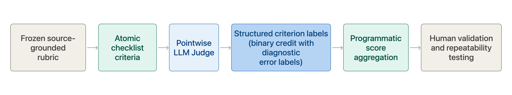

**Figure 3.a. Frozen criterion-level scoring and validation pipeline.** Each assessment question is represented by a frozen, source-grounded rubric decomposed into atomic checklist criteria. A pointwise LLM Judge assigns structured criterion-level labels, which are converted into the final Checklist Score through deterministic programmatic aggregation; human validation and repeatability testing are conducted separately to evaluate the scoring procedure.

Source: `/Users/willow/Documents/Code/[Msc] ADHD Simulation/UCL_Master_s_Thesis_Qingqing/Figures/Chapter3/export/ch03_criterion_scoring_pipeline.png`

In this study, “atomic” is an operational term: each criterion represents one instructional proposition that can be judged independently, rather than a uniquely indivisible linguistic fact. Criteria within the same question were designed to minimise semantic overlap while collectively covering the knowledge required by the reference answer. Each criterion was linked to supporting evidence in the frozen instructional materials, ensuring that the scoring checklist did not introduce requirements beyond the taught source content.

##### 3.2.4.1 Rubric Construction and Deterministic Score Calculation

在评分表示层面，每道题首先由参考答案确定其语义要求，再将其转写为若干可独立评分的criteria，并将每条criterion绑定至冻结教材中的来源证据：

\[
\text{Reference Answer}
\rightarrow
\text{Semantic Propositions}
\rightarrow
\text{Atomic Checklist Criteria}
\rightarrow
\text{Source Evidence}.
\]

这里的“atomic”是本研究中的操作性定义。每条criterion表示一项可以独立评分的教学命题，而不表示语言学上唯一或不可继续拆分的原子事实。同一道题内的criteria应当能够独立理解、尽量避免语义重叠，并在整体上覆盖参考答案要求表达的知识。每条criterion均与冻结教材中的原文证据片段对应。因此，checklist不会引入教材中没有出现的新知识，每项判断也能够追溯到具体的教学来源。

本研究区分三类criterion-level结果：

- **Correct：**学生回答明确陈述或直接蕴含criterion所要求的全部主体、关系、对象、条件、结果、比较和限制词；
- **Absent：**一个或多个必要组成部分缺失、含义不明确、只通过相关主题被间接暗示，或者只被提及但没有作为答案主张；
- **Contradicted：**学生明确陈述了与criterion相冲突的命题。

该区分保留了“没有表达”与“明确表达错误知识”之间的诊断差异。`Absent`和`Contradicted`均不能获得该criterion的分数，但错误类型会保留在评分记录中。部分知识则通过多条criteria的满足情况体现：例如，一个包含三条criteria的问题中，学生满足其中两条而遗漏一条时，系统能够记录其保留了哪两项知识，而不需要由Judge主观选择一个中间Likert等级。

评分量规和checklist在正式学生回答生成与评分之前完成构建、复核并冻结，LLM Judge无权在评分过程中生成或修改评分要求。每道评估题以结构化记录存储，包括唯一问题编号、问题范围、题型、问题文本、参考答案、来源教学轮次、来源句子编号，以及由若干原子化criteria组成的checklist。每条criterion进一步包含唯一的`criterion_id`、需要表达的命题、来源句子编号和支持该命题的原文证据片段。Independent question对应一个冻结教学轮次，integrative question则要求整合多个教学轮次中的知识。七篇教材中的题目均采用相同的数据结构，并在冻结前核对问题、参考答案、checklist、来源编号和证据片段之间的一致性。

评分时，LLM Judge只接收以下信息：

\[
\{
\text{question ID},
\text{question},
\text{reference answer},
\text{checklist criteria},
\text{source-evidence spans},
\text{student answer}
\}.
\]

发送给Judge的payload不包含学生身份、模拟条件、教材标签、demand group、Processing Demand Bits、记忆状态、Attention状态、WM capacity或其他实验元数据。只有当Judge输出通过结构校验后，这些本地元数据才会重新与评分结果连接。该blind evaluation设计避免Judge根据某类模拟学生的预期表现或实验条件推断其应得分数。

Judge不直接生成数值分数，而是独立地为每条criterion输出`Correct`、`Absent`或`Contradicted`。对于`Correct`或`Contradicted`，Judge还必须从学生回答中复制能够支持判断的最短连续原文片段；对于`Absent`，evidence必须为null。输出契约禁止Judge新增、删除、合并、拆分或重新定义criteria。Judge同时被要求忽略回答长度、表达风格、流畅度、语法、词汇、信心水平、格式和重复内容，只判断学生实际主张的语义命题。

Judge返回的criterion identifiers和evidence spans通过本地程序校验后，Python确定性地计算问题分数。对于包含\(K_q\)条criteria的问题\(q\)：

\[
Score_q
=
10
\times
\frac{
\sum_{k=1}^{K_q}
\mathbb{I}(y_{qk}=\mathrm{Correct})
}{K_q},
\]

其中，\(y_{qk}\)表示第\(k\)条criterion的标签，\(\mathbb{I}(\cdot)\)为指示函数。`Absent`与`Contradicted`均贡献0分，但二者的标签被保留用于错误类型分析。该方法在0–10范围内生成标准化问题得分，同时保留学生具体掌握或遗漏了哪些知识组成部分的信息。

具体而言，每个 atomic criterion 均由 Judge 独立判断，而不是直接生成整体分数。Criterion-level 输出采用能够支持 binary credit aggregation 的结构化标签，同时保留 diagnostic error distinction，以区分知识缺失与明确冲突。最终 question score 不由 Judge 自由决定，而是根据冻结的 criterion labels 通过确定性的程序规则进行聚合。由此，LLM 的作用被限制在局部语义判断层面，而评分结构、权重和总分计算均保持显式且可复现。

##### 3.2.4.2 Criterion-Level LLM-as-a-Judge Scoring and Validation

本研究在正式评分前比较了两个候选Judge模型：`qwen3.7-max`与`gpt-5.6-sol`。两个模型接收完全相同的冻结Judge prompt、assessment question、Reference Answer、atomic checklist criteria与student answer，并仅输出每项criterion的`Correct`、`Absent`或`Contradicted`标签。验证数据由同一组49份Pre-Knowledge Baseline answers构成，包括42道Independent Questions、7道Integrative Questions和共计137项atomic criteria。每个模型对全部答案独立评分三次，因此每个模型完成147次question-level calls，两个模型共完成294次calls。

模型选择首先依据结果产生前预先规定的七项重复稳定性标准：output schema、criterion set与evidence spans的有效率必须达到1.00；Criterion-label Unanimity不低于0.95；Pairwise Criterion Agreement不低于0.97；Exact Question-score Invariance不低于0.90；absolute-agreement \(\operatorname{ICC}(A,1)\)不低于0.95；三次重复的overall mean score最大差值不超过0.10分；最低lesson-level Criterion-label Unanimity不低于0.90，这些阈值仅用于评价模型内部的重复测量稳定性。

如Table 3.2.4-1所示，Qwen在三次评分中的Criterion-label Unanimity、Exact Question-score Invariance和\(\operatorname{ICC}(A,1)\)均为1.000，Maximum Replicate-mean Difference为0，并通过全部七项预设标准。GPT的相应结果分别为0.9781、0.9388、0.9700和0.2041，通过六项标准，但其重复均值最大差值超过预设的0.10分上限。GPT三次运行的overall means分别为7.925、8.129和7.925，说明其残余波动集中于少数criterion decisions。该波动在Integrative Questions中更为明显，其Criterion-label Unanimity、Exact Question-score Invariance和\(\operatorname{ICC}(A,1)\)分别下降至0.9524、0.8571和0.9231；Qwen在该scope内仍保持完全一致。

**Table 3.2.4-1. Three-run stability and prespecified-threshold evaluation of the candidate Judge models**

| Stability metric                            | Prespecified criterion | Qwen3.7-max | GPT-5.6-sol | Qwen − GPT |
| ------------------------------------------- | ---------------------: | ----------: | ----------: | ---------: |
| Schema, criterion-set and evidence validity |            \(=1.0000\) |      1.0000 |      1.0000 |     0.0000 |
| Overall criterion-label unanimity           |         \(\geq0.9500\) |      1.0000 |      0.9781 |    +0.0219 |
| Pairwise criterion agreement                |         \(\geq0.9700\) |      1.0000 |      0.9854 |    +0.0146 |
| Exact question-score invariance             |         \(\geq0.9000\) |      1.0000 |      0.9388 |    +0.0612 |
| \(\operatorname{ICC}(A,1)\)                 |         \(\geq0.9500\) |      1.0000 |      0.9700 |    +0.0300 |
| Maximum replicate-mean difference           |         \(\leq0.1000\) |      0.0000 |      0.2041 |    −0.2041 |
| Minimum lesson-level criterion unanimity    |         \(\geq0.9000\) |      1.0000 |      0.9474 |    +0.0526 |
| Prespecified criteria passed                |                      — |         7/7 |         6/7 |          — |

为检验冻结checklist rubric能否由不同评分者一致应用，本研究进一步实施了双人human validation。Human Judge 1是一名取得经济学学士学位的毕业生；Human Judge 2是一名具有计算机专业背景的硕士在读生。两名评分者均未参与question、Reference Answer或checklist criteria的构建，而是在相同的书面评分协议和操作指导下分别使用冻结评分表。对于每项criterion，评分者查看question、criterion description、source evidence与student answer，并从`Correct`、`Absent`和`Contradicted`中选择一个标签。初始评分期间，两名评分者没有相互讨论，也无法查看对方或候选LLM Judge的评分结果。评分者不手动计算题目总分；criterion labels完成后，由程序按照Section 3.2.4.1定义的规则统一汇总criterion credits和normalized question scores。两名评分者在137项criteria中有132项判断一致。如Table 3.2.4-2所示，Criterion-level Agreement为96.35%，Cohen’s \(\kappa\)为0.795，Exact Question-score Agreement为89.80%，Question-score MAE为0.374。Human Judge 1与Human Judge 2的总体平均分分别为9.014和9.116。五项不一致判断分别位于五道不同的问题，且全部发生在`Correct`与`Absent`之间，没有出现涉及`Contradicted`的分歧。

初始评分完成后，本研究对五项分歧进行了structured disagreement audit。该审查比较了对应的question、criterion、source evidence、student answer以及两名评分者分别记录的evidence与justification，但不以强制形成统一标签为目标，也不覆盖评分者的原始判断。逐项审查表明，这些分歧主要涉及semantic entailment boundary：一名评分者接受由近义概念、上下位关系、隐含对照或分散证据形成的meaning-preserving expression，另一名评分者则要求回答更直接、完整地表达criterion中的目标命题。具体而言，五项分歧分别涉及多个必要成分是否必须完整出现、asset allocation是否充分表达diversification、隐含对照是否表达明确否定、具体职位能否满足上位角色类别，以及分散的technical evidence能否组合成完整关系。因此，这些分歧不表明两名评分者对教材事实存在不同理解，而是反映了在判断“相关信息”是否已经达到“充分满足criterion”的程度时仍存在边界差异。Atomic checklist显著缩小了评分空间，但不能完全消除自然语言语义蕴含判断中的不确定性。五项分歧及其分析见Appendix Table A.2。

人工评分同时揭示出验证样本中明显的高分集中现象。Human Judge 1将123/137项criteria判定为`Correct`，并对37/49道题给出满分；Human Judge 2将124/137项criteria判定为`Correct`，并对38/49道题给出满分。两名评分者的满分题比例分别为75.51%和77.55%。因此，较高的raw human agreement部分发生在类别分布不平衡且表现接近ceiling的样本中。为避免raw agreement掩盖这一特征，本研究同时报告chance-corrected Cohen’s \(\kappa\)、Exact Question-score Agreement与MAE，而不将raw agreement单独解释为充分的评分有效性证据。

由于本研究不将任一人工评分者指定为唯一gold standard，模型—人工对齐分别以Human Judge 1和Human Judge 2作为reference计算。如Table 3.2.4-2所示，Qwen与两名评分者的Criterion Agreement为84.67%–85.40%，Cohen’s \(\kappa\)为0.457–0.475，Exact Question-score Agreement为69.39%–73.47%，Question-score MAE为1.429–1.531。GPT的相应范围分别为85.40%–87.59%、0.452–0.541、71.43%–73.47%和1.224–1.327。现有结果没有显示Qwen在模型—人工一致性方面具有明确优势，其主要优势来自更高的重复测量稳定性。

**Table 3.2.4-2. Human–Human and model–human scoring agreement**

| Comparison                     | Criterion agreement | Cohen’s \(\kappa\) | Exact question-score agreement | Question-score MAE |
| ------------------------------ | ------------------: | -----------------: | -----------------------------: | -----------------: |
| Human Judge 1 vs Human Judge 2 |              0.9635 |             0.7946 |                         0.8980 |             0.3741 |
| Qwen3.7-max vs Human Judge 1   |              0.8467 |             0.4569 |                         0.6939 |             1.5306 |
| Qwen3.7-max vs Human Judge 2   |              0.8540 |             0.4753 |                         0.7347 |             1.4286 |
| GPT-5.6-sol vs Human Judge 1   |              0.8759 |             0.5414 |                         0.7347 |             1.2245 |
| GPT-5.6-sol vs Human Judge 2   |              0.8540 |             0.4520 |                         0.7143 |             1.3265 |

*Note.* Human–Human results use all137 criteria and49 questions. Model results use criterion-wise modal labels across three repetitions. Human Judge 1 and Human Judge 2 were treated as two independent references; neither was designated as a definitive gold standard.

模型—人工比较统一使用criterion-wise modal labels。按照这一汇总方式，Qwen与GPT的总体平均分分别为7.823和7.925。Qwen与GPT分别将106/137和108/137项criteria判定为`Correct`，且二者均仅对29/49道题给出满分，低于两名人工评分者的37和38道满分题。这表明自动Judge与人工评分之间不仅存在局部criterion边界差异，也存在系统性的score-level stringency difference。该差异被视为自动评分解释的限制，而不是模型更接近或优于人工评分的证据。

Qwen最终被保留为正式实验的operational Judge，因为它是唯一通过全部七项预设重复稳定性标准的候选模型。Human alignment不作为事后定义的模型选择门槛，现有证据也不支持将Qwen描述为比GPT更接近人工评分。更准确的定位是：Qwen能够更稳定地执行冻结的source-grounded checklist，但其评分边界与两名人工评分者并不等价。因此，后续实验结果应被解释为Qwen在当前材料、问题和回答分布中对冻结评分协议的稳定应用，而不应被视为能够与人工评分普遍互换。The complete operational prompt is provided in Appendix Figure A.3.

### 3.3 Learner Representation: Persona Prompting versus CPB

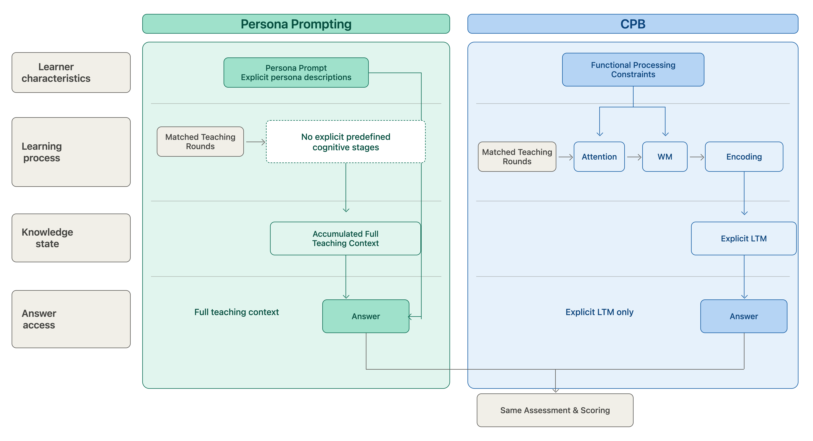

**Figure 3.X. Representation-level comparison of Persona Prompting and the Cognitive-Process-Based (CPB) learner pipeline.** Both representations use matched Teaching Rounds and the same downstream assessment and scoring procedures. Persona Prompting combines an explicit learner description with the accumulated full teaching context during answer generation. CPB instead applies functional Attention and Working-Memory constraints during learning, encodes the remaining Available Input into Explicit LTM, and constrains subsequent answering to that learned knowledge state.

Source: `/Users/willow/Documents/Code/[Msc] ADHD Simulation/UCL_Master_s_Thesis_Qingqing/Figures/Chapter3/export/ch03_persona_cpb_learning_path_comparison.png`

图3.X展示了本研究比较的两种学习者表征流程：Persona Prompting与Cognitive-Process-Based（CPB）框架。两种方法均使用匹配的教学轮次，并采用相同的assessment与scoring procedure，但在learner characteristics的表示方式、learning process、knowledge state以及answer-stage information access上存在系统性差异。

在Persona Prompting中，目标learner characteristics主要通过显式persona descriptions进行表示，教学信息持续保留在accumulated full teaching context中，并在assessment阶段与persona instructions共同参与回答生成。相比之下，CPB将选定的ADHD-related characteristics操作化为作用于learning process的functional constraints，使教学信息经过显式的processing stages后形成Explicit LTM，并在assessment阶段仅依赖这一knowledge state进行回答。

因此，两种方法可以被理解为两条不同的learner-representation pipeline。Persona Prompting主要将learner characteristics表示为直接condition生成行为的显式descriptive instructions，并保留完整累积教学context作为后续回答的信息来源；CPB则将选定的认知特征放置于learning process本身，通过processing constraints改变information availability并形成显式knowledge state，再由该state限制后续response generation。

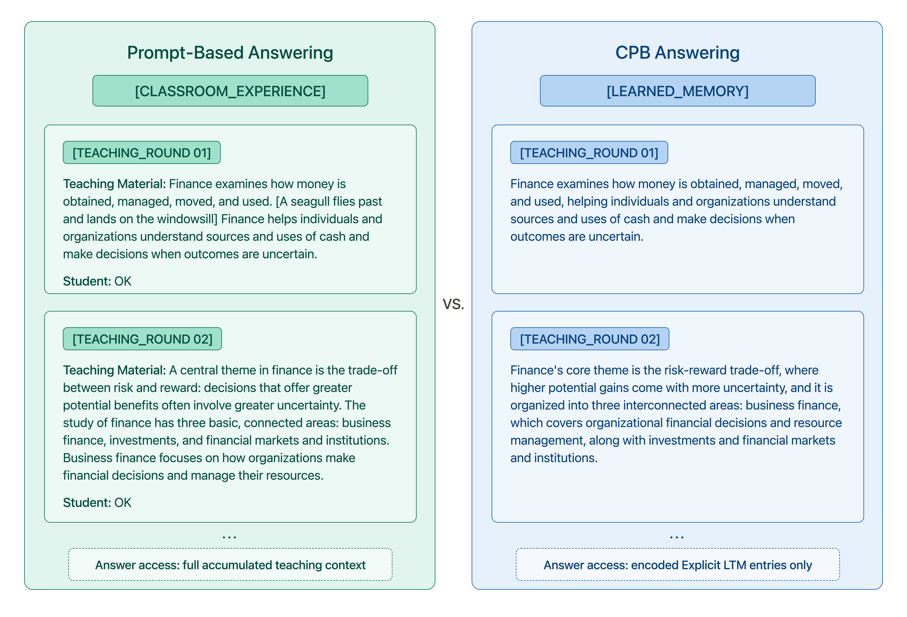

**Figure 3.Y. Comparison of the information sources available to Persona Prompting and CPB during assessment.** The Persona branch retains the accumulated `[CLASSROOM_EXPERIENCE]`, including the original Teaching Rounds and classroom interaction history. The CPB branch instead exposes only `[LEARNED_MEMORY]` entries encoded from information that remained available after Attention and Working-Memory processing. The figure describes the architectures' answer-stage information access and does not imply that either representation is inherently more accurate or psychologically faithful.

Source: `/Users/willow/Documents/Code/[Msc] ADHD Simulation/UCL_Master_s_Thesis_Qingqing/Figures/Chapter3/export/ch03_persona_cpb_answer_information_source_comparison.png`

在这一总体architecture差异之下，首先需要区分的是两种方法在学习后保留和使用教学信息的方式。如图3.Y所示，Persona Prompting以完整的`[CLASSROOM_EXPERIENCE]`作为后续回答的知识来源。随着教学轮次推进，先前的Teaching Material及对应的student turns持续累积在conversation context中，assessment阶段仍可重新访问这些原始课堂信息。因此，该方法并不额外将教学经历转换为一个独立的learner-specific knowledge representation，而是以完整的交互历史承载此前的学习内容。

CPB则在每一教学轮次中显式形成`[LEARNED_MEMORY]`。教学信息经过Attention与Working-Memory processing后，只有当前仍然可用的内容进入Encoding，并被转化为Explicit LTM entries。因而，Explicit LTM并不是原始课堂记录的完整副本，而是由前序processing结果进一步编码形成的显式知识表示。图3.Y中的示例体现了这种区别：Persona branch保留了Teaching Round中的原始教学内容及课堂交互，而CPB branch保存的是经过processing和Encoding后形成的知识性memory entries。

这一差异意味着，两种方法在assessment阶段调用的并不是同一种information source。Persona learner可以基于完整累积的teaching history回答问题，而CPB learner只能访问已经进入Explicit LTM的内容；在前序Attention或WM stages中未继续进入后续处理的信息，不会因为进入assessment阶段而重新出现在其可访问的knowledge state中。因此，从knowledge representation的角度看，两种方法可以分别概括为 **full-context-based answering** 与 **explicit-memory-based answering**：前者通过保留完整课堂历史维持教学信息的持续可访问性，后者则通过一个经过learning process形成的显式memory state连接教学与后续回答。

这里需要强调的是，这一区别描述的是两种simulation architectures对learner knowledge state的不同操作化方式，并不预先假定其中一种方法具有更高的学习真实性或更优的回答表现。

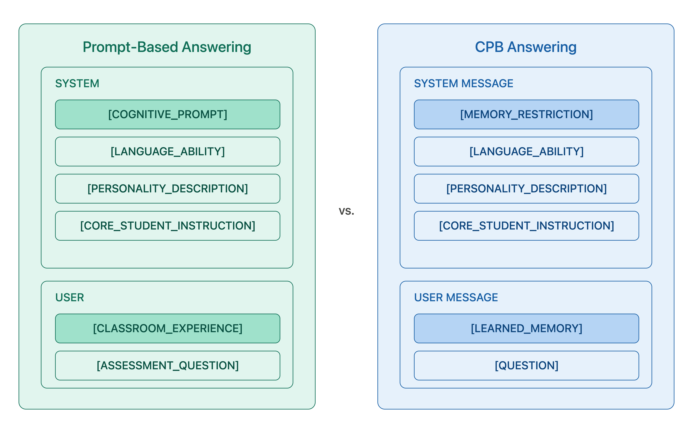

**Figure 3.Z. Comparison of answer-stage prompt composition in Persona Prompting and CPB.** The Persona branch combines an explicit `[COGNITIVE_PROMPT]` with the accumulated `[CLASSROOM_EXPERIENCE]`, whereas the CPB branch replaces these components with a `[MEMORY_RESTRICTION]` and the process-derived `[LEARNED_MEMORY]`. Both branches receive the same assessment question and share the Language Ability, Personality Description and core student-instruction components when these additional profile dimensions are enabled in Study 3.

Source: `/Users/willow/Documents/Code/[Msc] ADHD Simulation/UCL_Master_s_Thesis_Qingqing/Figures/Chapter3/export/ch03_prompt_cpb_answering_prompt_comparison.png`

在assessment阶段，两种方法的Prompt structure进一步体现了不同的learner-representation方式，如图3.Z所示。Prompt-based learner通过System Prompt中的`[COGNITIVE_PROMPT]`显式提供ADHD-related characteristics，这一部分的Prompt来源为 *LLM-Based Educational Simulation: Evaluating Temporal Student Persona Stability Across ADHD Profiles* [gonnermann-muller-etal-2026-adhd-persona]；User Message则包含完整的`[CLASSROOM_EXPERIENCE]`与当前`[ASSESSMENT_QUESTION]`，因此模型在回答时同时受到persona instructions与完整教学上下文的condition。

CPB则不在answer stage显式提供ADHD identity或相关角色扮演指令。其System Message通过`[MEMORY_RESTRICTION]`要求模型仅依据前序processing形成的`[LEARNED_MEMORY]`回答当前`[QUESTION]`。因此，ADHD-related Attention与WM characteristics主要由learning-stage mechanisms表示，而不是再次通过response prompt直接规定。

两种representation所使用的完整student system-prompt examples分别见Appendix Figures A.2和A.3。

图中的`[LANGUAGE_ABILITY]`与`[PERSONALITY_DESCRIPTION]`仅在Study 3中加入，Study 1和Study 2均不包含这两个维度；这两个维度的Prompt来源为 *Personality-aware Student Simulation for Conversational Intelligent Tutoring Systems* [liu-etal-2024-personality]。它们作为response-stage attributes加入两种learner representations，用于检验额外profile dimensions对assessment behaviour及既有CPB patterns的影响。

总体而言，Prompt-based answering主要依赖**显式cognitive persona instructions + full classroom context**，而CPB answering主要依赖**process-derived learned memory + memory-access restriction**；两种方法共享基本student instruction与相同assessment task。

综合上述流程，两种方法的核心区别可以归纳为三个相互关联的层次：**learner characteristics如何被表示、学习后形成何种knowledge state，以及这些信息如何参与最终回答。** Persona Prompting主要通过显式persona descriptions直接condition模型行为，并保留完整教学经历作为回答依据；CPB则将选定的认知特征实现为learning-stage processing constraints，由此形成Explicit LTM，并限制回答只能依赖这一learned knowledge state。

| Comparison level             | Persona Prompting                                            | CPB                                                          |
| ---------------------------- | ------------------------------------------------------------ | ------------------------------------------------------------ |
| **Learner representation**   | 通过显式`[COGNITIVE_PROMPT]`描述目标learner characteristics  | 将Attention与WM characteristics操作化为functional processing constraints |
| **Knowledge representation** | 保留完整的accumulated classroom experience                   | 经过processing与Encoding形成Explicit LTM                     |
| **Answer generation**        | Persona instructions与full teaching context共同condition回答 | 不显式提供ADHD角色信息，仅依据learned memory并受memory restriction约束回答 |

这三层差异共同定义了后续实验中比较的两种learner-representation architectures：前者主要采用**description-conditioned, full-context answering**，后者采用**process-constrained, explicit-memory-based answering**。关于CPB学习过程中的机制实现细节将在下一部分展开。

### 3.4 Cognitive-Process-Based Mechanisms

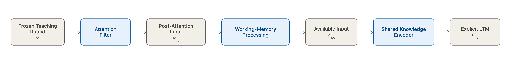

**Figure 3.X. CPB learning-phase information flow from the frozen Teaching Round to Explicit LTM.**

Source: `/Users/willow/Documents/Code/[Msc] ADHD Simulation/UCL_Master_s_Thesis_Qingqing/Figures/Chapter3/export/ch03_cpb_learning_information_flow.png`

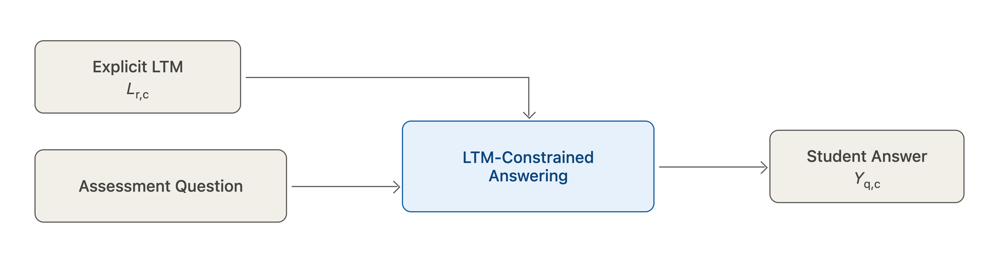

**Figure 3.X. CPB assessment-phase information flow under Explicit-LTM-constrained answering.**

Source: `/Users/willow/Documents/Code/[Msc] ADHD Simulation/UCL_Master_s_Thesis_Qingqing/Figures/Chapter3/export/ch03_cpb_assessment_phase_flow.png`

Throughout the CPB pipeline, \(r\) indexes the frozen Teaching Round and \(c\) indexes the experimental condition. \(S_r\) denotes the condition-invariant instructional Source; \(P_{r,c}\) denotes the post-Attention information state; \(A_{r,c}\) denotes the Available Input remaining after Working-Memory Processing; and \(L_{r,c}\) denotes the Explicit LTM generated by the shared Knowledge Encoder.

如上述learning-与assessment-phase diagrams所示，CPB 将教学过程表示为一系列显式的信息状态转换。对于每个 Teaching Round，冻结的 instructional Source \(S_r\) 首先进入 Attention Filter，产生经过注意阶段后仍保持可用的 post-Attention input \(P_{r,c}\)。该信息随后进入 Working-Memory Processing stage，根据 instructional processing demand 与 condition-specific WM capacity 进一步受到限制，形成可供后续编码的 Available Input \(A_{r,c}\)。Available Input 随后由所有实验条件共享的 Knowledge Encoder 转换为 Explicit LTM \(L_{r,c}\)。在 Assessment Phase，CPB learner 不再访问原始教学材料，而是仅基于 accumulated Explicit LTM 和当前 assessment question 生成回答。由此，CPB 的学习过程可以被表示为 \(S_r\rightarrow P_{r,c}\rightarrow A_{r,c}\rightarrow L_{r,c}\) 的连续信息状态转换，其中 Attention 和 Working Memory 构成主要的 ADHD-related experimental constraints，而 Knowledge Encoding 作为共同的 downstream stage 保持一致。

#### 3.4.1 Attention Filter

##### 3.4.1.1 Attention Filter Implementation

As reviewed in Section 2.4, ADHD-related attentional differences can include increased susceptibility to task-irrelevant distraction, but the effects of distraction vary across learners and task conditions. The present study therefore models **susceptibility to controlled distraction** as a bounded functional abstraction rather than attempting to reproduce human attentional control as a whole. The implementation follows a simple principle: a distractor event is inserted immediately before a predefined assessment-relevant target sentence, and when that distractor triggers the Attention Filter, the target sentence becomes unavailable for subsequent processing. In this way, distraction is represented through its downstream effect on information availability rather than through a persona-level instruction such as “be easily distracted.”

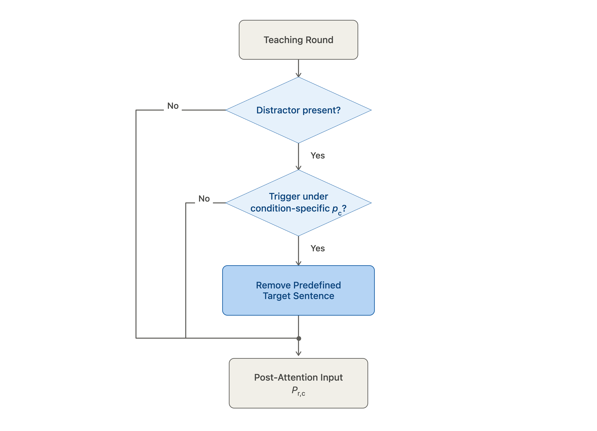

Source: /Users/willow/Documents/Code/[Msc] ADHD Simulation/UCL_Master_s_Thesis_Qingqing/Figures/Chapter3/export/ch03_attention_filter_decision_flow.png

**Figure 3.X. Attention Filter control flow.** For each Teaching Round, the mechanism first checks whether a frozen distractor assignment is present. If present, triggering is determined by the condition-specific Attention probability \(p^A_c\). A triggered distractor makes its predefined target sentence unavailable; otherwise, the instructional content is preserved. All branches produce the post-Attention state \(P_{r,c}\).

The affected instructional information is fixed before student simulation. Each Independent Question is already mapped to its supporting source sentence(s); one of these sentences is selected as the Attention target, and a bracketed distractor event is inserted immediately before it in the distracted version of the teaching material. Each assignment records `linked_question_id`, `distractor_event`, and `target_sentence_id`. Integrative Questions do not receive additional independent distractor assignments. For example:

```text
Finance examines how money is obtained, managed, moved, and used.
[A seagull flies past and lands on the windowsill]
Finance helps individuals and organizations understand sources and uses of cash and make decisions when outcomes are uncertain.
```

Here, the sentence following the bracketed distractor is the frozen target. The associated assessment question is not provided to the student model during learning, and the Attention mechanism does not dynamically select information based on the later question. The term *question-targeted* therefore refers only to the predefined and frozen alignment between the distractor, the affected source evidence, and the subsequent assessment item.

For an eligible distractor in Teaching Round \(r\), repeated run \(j\), and condition \(c\), the trigger decision is sampled as

\[
Z^A_{r,c,j}\sim \operatorname{Bernoulli}(p^A_c),
\]

where \(Z^A_{r,c,j}=1\) indicates that the distractor triggers the Attention Filter and its predefined target sentence becomes unavailable, while \(Z^A_{r,c,j}=0\) leaves the target sentence available. The boundary values \(p^A_c=0\) and \(p^A_c=1\) represent deterministic no-trigger and always-trigger conditions. Run-specific random seeds, draws, trigger decisions, and affected target IDs are retained so that each stochastic Attention trajectory can be reconstructed.

The resulting transformation can be written as

\[
X_r \xrightarrow{\mathrm{Attention}} P_{r,c},
\]

where \(X_r\) is the presented classroom input, including any assigned distractor, and \(P_{r,c}\) is the instructional information that remains available for subsequent Working-Memory processing. The Attention Filter therefore affects only downstream information availability: it does not directly modify Explicit LTM, generate assessment answers, or determine which information is relevant at answer time.

Treating a triggered target sentence as unavailable is a study-specific computational abstraction chosen for controllability and traceability, rather than a claim that human attentional disruption literally deletes information. The hard-deletion choice and its operationalisation sensitivity are examined in next Section, while Study-specific values of \(p^A_c\) are defined in Sections 3.5.1.2 and 3.5.2.2.

##### 3.4.1.2 Operationalisation Sensitivity Check

Direct deletion provides a simple and controllable way to represent instructional information as unavailable, and similar input-removal operations have been used in NLP perturbation studies [feng-etal-2018-pathologies]. However, prior work also shows that different representations of missing information, such as deletion and masking, can produce different downstream model behaviour [lewis-etal-2020-bart]. Therefore, the choice of unavailable-content representation cannot be assumed to be behaviourally neutral.

To test whether the observed CPB effects depend on this implementation choice, the present study compares two representation policies: **hard deletion**, which removes the target sentence entirely, and **explicit masking**, which removes its original semantic content while retaining a visible missingness cue. This sensitivity check is used only to assess whether the main Attention-related results are robust to the surface representation of unavailable information.
\[
g_{\mathrm{delete}}(s)=\varnothing,
\]

\[
g_{\mathrm{mask}}(s)
=
\texttt{[CONTENT UNAVAILABLE: ...]}.
\]

两种实现因此具有不同的 informational implication：hard deletion 仅使目标教学内容不再进入后续 processing，而 explicit masking 在移除原始语义的同时，还向模型显式提供“此处存在缺失信息”的元线索。这里的 character-length matching 仅保证 Python character count 相同，并不意味着 token count等价。

为检验这种 representation choice 是否会影响 downstream processing，本研究在两篇冻结教材（L01–L02）上进行了独立 sensitivity experiment。实验包含三个存在 information unavailability 的 mechanism conditions：

1. Attention ON / WM OFF；
2. Attention OFF / WM ON；
3. Attention ON / WM ON。

其中Attention ON意味着Attention Filter机制被触发的概率为100%。Attention OFF / WM OFF 未纳入比较，因为该条件不存在被标记为 unavailable 的句子，因此两种 representation policies 不产生实际差异。

每个 mechanism condition 分别在 hard deletion 和 explicit masking 的2种representation policies下运行3次，每篇教材包含7道冻结 assessment questions，其中有6道independent questions和1个cross-round integrative question，由此形成252个answers. 在全部paired-round checks 中，Attention trigger、Attention-unavailable sentence IDs等一系列CPB机制变量均保持 100% 一致。主要比较量定义为：

\[
\Delta Score
=
Score_{\mathrm{mask}}
-
Score_{\mathrm{delete}}.
\]

为了判断 masking 是否能够被视为 deletion 的 practically interchangeable implementation，本研究预先设定 \(\pm0.5\) 分的 practical-equivalence margin，并基于 14 个冻结 question clusters 进行 bootstrap，以计算 95% interval。仅当：

\[
CI_{95\%}
\subseteq
[-0.5,+0.5]
\]

时，才认为 practical equivalence 得到支持。

敏感性分析显示，两种实现的大多数 matched outputs 保持一致，但 practical equivalence 未能在上述预设范围内建立。总体 mask-minus-deletion score difference 为：

\[
\Delta=-0.370,
\]

其 95% interval 为：

\[
[-1.005,0.106].
\]

尽管该区间跨越 0，因而没有证据支持稳定的 directional difference，但它并未完全落入预设的 \(\pm0.5\) practical-equivalence margin。与此同时，91.27% 的 paired question scores 完全一致，而少数不一致案例出现了较大的 downstream score shifts，并主要集中于包含 Attention manipulation 的条件。

因此，最终采用 hard deletion 并非因为 sensitivity experiment 证明其在心理学上比 masking 更接近真实 ADHD attention，而是基于 **construct correspondence、minimal intervention 和 sensitivity evidence** 的联合判断。Attention Filter 所要表达的状态是目标 instructional information 不再进入后续 processing；hard deletion 直接实现这一变化，而 explicit mask 在移除目标语义的同时额外引入 explicit missingness cue。因此，hard deletion 被冻结为正式 unavailable-content policy。

需要注意的是，这一选择并不意味着 hard deletion 已被证明是人类 ADHD attentional disruption 的真实心理机制。Direct deletion 同时减少了 target semantics 和 downstream instructional input length，因此它仍然是一种研究特定的 computational operationalisation。当前 sensitivity evidence 仅支持将其作为本研究中更直接、可追踪且较少引入额外 representational signals 的正式实现。

#### 3.4.2 Working-Memory Processing Capacity

##### 3.4.2.1 Working-Memory Mechanism Implementation

As reviewed in Section 2.4, Working Memory (WM) is a limited processing system involved in maintaining and manipulating task-relevant information, and ADHD-related WM differences may become more consequential as processing demands increase. The present study therefore models **sensitivity to instructional processing demand** as a bounded functional abstraction rather than attempting to reproduce human Working Memory as a whole. Within CPB, the WM mechanism operates after Attention: when the frozen processing demand of a Teaching Round exceeds the capacity threshold assigned to the current condition, the earliest instructional sentence still available after Attention is made unavailable before Knowledge Encoding.

Figure 3.X illustrates how the frozen round-level processing demand and condition-specific WM capacity determine whether information is further restricted before Knowledge Encoding.

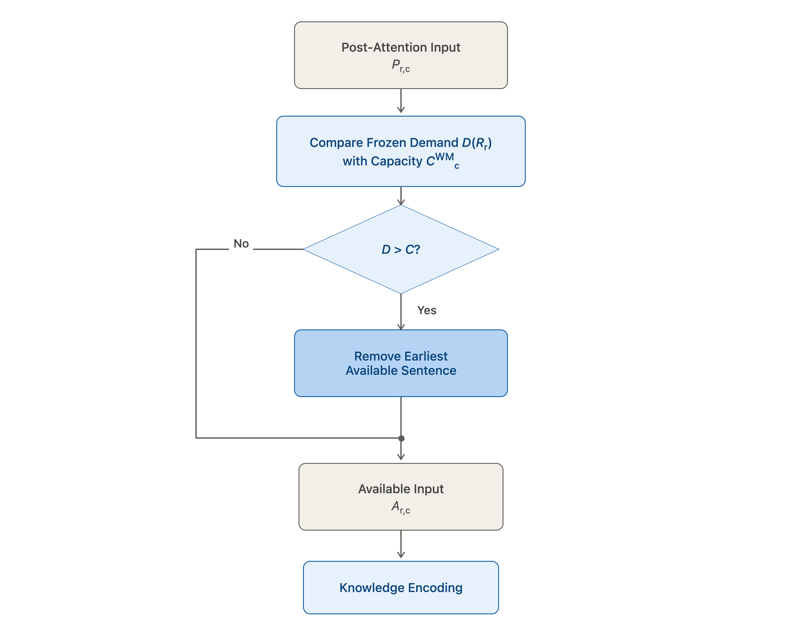

**Figure 3.X. Working-Memory mechanism flow.** Frozen source-round demand \(D(R_r)\) is compared with the condition-specific threshold \(C^{WM}_c\). When demand exceeds capacity, the earliest sentence remaining in \(P_{r,c}\) is removed before the resulting Available Input \(A_{r,c}\) proceeds to Knowledge Encoding.

Source: /Users/willow/Documents/Code/[Msc] ADHD Simulation/UCL_Master_s_Thesis_Qingqing/Figures/Chapter3/export/ch03_working_memory_mechanism_flow.png

For Teaching Round \(R_r\), the WM trigger is determined by

\[
\operatorname{WMOverflow}(R_r,c)
=
\mathbf{1}\left[D(R_r)>C^{WM}_c\right],
\]

where \(D(R_r)\) is the Processing Demand Bits (PDB) value calculated and frozen for the original source round, and \(C^{WM}_c\) is the capacity threshold assigned to condition \(c\). The same \(D(R_r)\) is used across all learner conditions and is not recalculated after Attention, ensuring that instructional demand remains a condition-independent property of the source material. Unlike the probabilistic Attention trigger, the WM rule is deterministic: for a fixed Teaching Round and capacity threshold, the trigger decision is always the same.

When overflow occurs, the mechanism acts only on instructional information that remains available in the post-Attention state \(P_{r,c}\). If at least one sentence remains, the earliest available sentence in the original teaching order is selected for removal:

\[
R^{WM}_{r,c}
=
\{\operatorname{First}(P_{r,c})\},
\]

and the Available Input passed to Knowledge Encoding becomes

\[
A_{r,c}
=
P_{r,c}\setminus R^{WM}_{r,c}.
\]

If WM does not trigger, \(A_{r,c}=P_{r,c}\). Each Teaching Round permits at most one WM-related sentence removal, and information already made unavailable by Attention cannot be removed again. The mechanism is therefore implemented as a **deterministic within-round FIFO-style information-restriction rule**.

The overall WM transformation can thus be represented as

\[
P_{r,c}
\xrightarrow{\mathrm{Working\ Memory}}
A_{r,c},
\]

where Attention determines what information remains available before WM processing, and WM further constrains how much of that remaining information can proceed to the shared Knowledge Encoder under the current demand–capacity condition. The capacity threshold \(C^{WM}_c\) uses the same numerical scale as PDB but does not represent a literal number of human memory slots, sentences, or tokens. It is a study-specific control parameter for manipulating processing constraint strength. WM mechanism 并不试图估计真实学生的生理 working-memory capacity Study-specific thresholds and their experimental roles are reported in Sections 3.5.1.2 and 3.5.2.2.

#### 3.4.3 Knowledge Encoding

##### 3.4.3.1 Knowledge Encoding Implementation

As reviewed in Section 2.5, information that remains available after Attention and Working-Memory processing is conceptually distinct from a persistent learner knowledge state. CPB therefore includes a separate Knowledge-Encoding stage between Available Input and Explicit LTM. Encoding is not manipulated as an additional ADHD-specific mechanism; instead, all learner conditions use the same Encoder procedure so that differences in downstream knowledge state can be interpreted relative to the information that actually reaches Encoding. For Teaching Round \(r\) and condition \(c\), the transformation is represented as \[ A_{r,c} \xrightarrow{\mathrm{Encoding}} L_{r,c}, \] where \(A_{r,c}\) is the Available Input remaining after Attention and Working-Memory processing and \(L_{r,c}\) is the resulting Explicit LTM entry. 

在 CPB方法中，Knowledge Encoding 以每个 Teaching Round 为基本处理单位，并在 Attention 和 Working-Memory processing 完成之后执行。对于条件 \(c\) 下的第 \(r\) 个 Teaching Round，Encoder 的输入仅为前序机制处理后形成的 Available Input \(A_{r,c}\)，而不是原始 instructional source 或完整 Teaching Round。任何已经被 Attention 或 WM 标记为 unavailable 的信息均不会再次提供给 Encoder。该过程可以表示为：
\[
L_{r,c}
=
\operatorname{Encode}(A_{r,c}),
\]

其中 \(L_{r,c}\) 表示该 Teaching Round 经 Encoding 后形成的 round-level Explicit LTM entry。由此，前序机制负责决定 **what information reaches Encoding**，而 Knowledge Encoder 仅对实际到达该阶段的信息进行后续表征转换。

Figure 3.X 展示了正式实验中使用的冻结 Knowledge-Encoding prompt。该 prompt 要求模型仅根据实际收到的 classroom information 生成一个简短的 long-term memory entry，以自己的语言保留主要概念及其关系，同时明确禁止使用 outside knowledge 或补全输入中未提供的信息。输出被限制为单段 plain text，以减少额外格式差异对后续 Explicit LTM representation 的影响。

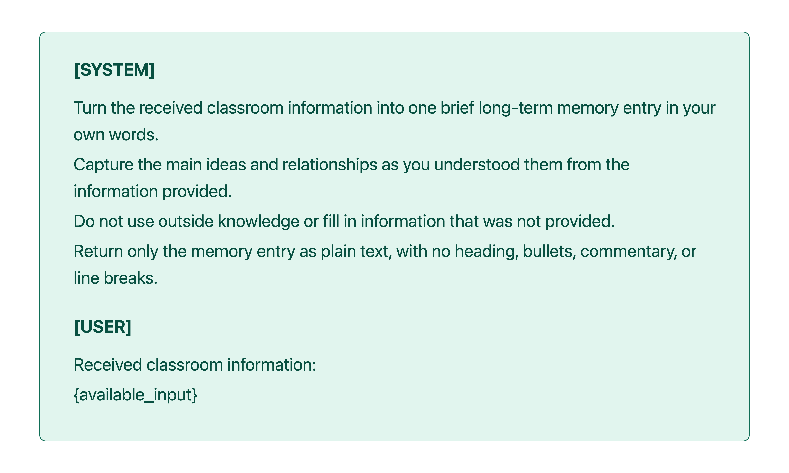

> *Figure 3.X. Frozen prompt template used by the shared Knowledge Encoder.*
>
> /Users/willow/Documents/Code/[Msc] ADHD Simulation/UCL_Master_s_Thesis_Qingqing/Figures/Chapter3/export/ch03_knowledge_encoding_prompt_example.pdf

Knowledge Encoding 的目标并不是逐字复制 Available Input，而是将其转换为一个较为简洁的 semantic knowledge representation。因此，\(A_{r,c}\) 与 \(L_{r,c}\) 在概念上并不被假定为完全相同。Encoder 可以对输入内容进行 paraphrasing、compression 和 information reorganisation，但生成的 memory entry 应受到 \(A_{r,c}\) 所提供信息的约束，而不应恢复此前已经变得 unavailable 的教学内容。Figure 3.Y 给出了一个实际的 Encoding example：左侧为进入 Encoder 的 Available Instructional Input \(A_{r,c}\)，右侧为由相同内容生成的 Encoded LTM Entry \(L_{r,c}\)。该示例表明，主要概念及其关系可以在 Encoding 后得到保留，但其表述形式和信息压缩程度可以与输入文本不同。

>  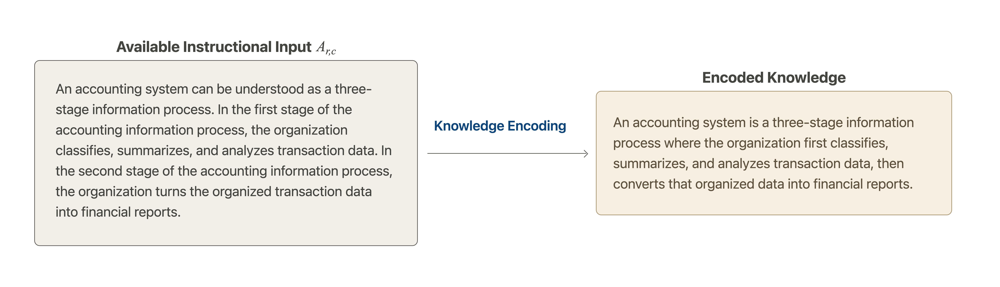
> *Figure 3.Y. Example transformation from Available Instructional Input to an encoded LTM entry.*
>
> /Users/willow/Documents/Code/[Msc] ADHD Simulation/UCL_Master_s_Thesis_Qingqing/Figures/Chapter3/export/ch03_knowledge_encoding_example.pdf

每个 Teaching Round 独立执行上述 Encoding procedure，并最多生成一个对应的 \(L_{r,c}\)。当经过 Attention 和 WM processing 后已经不存在可用于 Encoding 的 instructional information，即 \(A_{r,c}=\varnothing\) 时，该轮不根据 distractor content、prompt context 或模型的 pretrained knowledge 自行生成新的 instructional memory。该规则保证 Explicit LTM 仅来源于经过前序 cognitive-processing stages 后实际仍然 available 的教学信息，并保持从 Available Input 到 encoded knowledge state 的可追踪关系。

本研究不将Knowledge-Encoding作为ADHD特殊的机制，而是使用固定的 shared Knowledge-Encoding procedure。所有条件采用相同的 Encoder model、encoding prompt、input structure 和 generation configuration；Attention、WM constraint level 或其他 learner-condition metadata 均不会改变 Encoding instruction。但这并不意味着真实 ADHD 与 NT learners 具有完全相同 encoding ability 的经验性假设。

##### 3.4.3.2 Pretrained-Knowledge and Memory-Constrained Answering

在正式实验中，CPB 的 Assessment Phase 要求 simulated learner 仅依据教学阶段形成的 Explicit LTM 回答问题。然而，大语言模型本身已经具有预训练知识，因此存在两个需要首先排除的替代解释。第一，student model 可能在完全没有接触课程材料的情况下，就已经能够凭借 pretrained knowledge 回答大部分 assessment questions，从而压缩后续学习操纵的可观察空间。第二，即使向模型提供 Explicit LTM 并通过 prompt 要求其仅依据记忆作答，模型仍可能绕过该限制，利用自身已有的金融知识补全答案。为检验这两个前提，本研究分别进行了 **Question-Only Baseline** 和 **Biology-Memory-Only Control**。

在 Question-Only Baseline 中，DeepSeek V4-Flash 不接收任何课程材料、教学历史或 Explicit LTM，而是直接回答正式 assessment set 中的 49 道金融问题。生成的回答随后使用与正式实验相同的 Qwen3.7-Max Judge 进行评分。该条件的平均得分为：

\[
\bar S_{\mathrm{Baseline}}=7.823.
\]

这一结果表明，DeepSeek V4-Flash 本身已经具有一定的金融领域 pretrained knowledge，因此正式实验不能假设 assessment performance 完全来源于教学阶段。同时，baseline performance 距离满分10分仍有一定上升空间，说明该 question set 仍保留了可观察的 learning headroom。

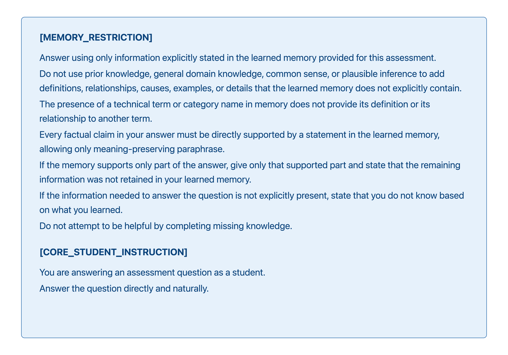

Figure 3.cc Memory Restriction Prompt

/Users/willow/Documents/Code/[Msc] ADHD Simulation/UCL_Master_s_Thesis_Qingqing/Figures/Chapter3/export/ch03_memory_restriction_prompt_example.png

为了进一步检验 Assessment Phase 中的 **Memory Restriction（Figure 3.cc)** 是否能够实际约束模型的信息来源，本研究构造了一个与金融课程内容完全无关但格式与字数相近的 Biology Explicit LTM，并用其替换正式金融课程学习后形成的 Explicit LTM。该 biology memory 内容覆盖细胞、遗传、生理、进化与生态等主题，不包含金融、会计、市场或投资相关知识。随后，DeepSeek V4-Flash 在与正式实验相同的 memory-constrained answering prompt 下回答原有的 49 道金融 assessment questions。

其中，answering prompt 明确要求模型只能依据提供的 learned memory 回答，不得使用未包含在 memory 中的信息。所有回答继续由相同的 Qwen3.7-Max Judge 按冻结的 137 个 atomic criteria 进行评分。

Biology-Memory-Only condition 的结果如Table 3.X所示：

**Table 3.X. Mean Checklist Score comparison between the Question-Only Baseline and Biology-Memory-Only Control**

| Condition | Mean Score |
|---|---:|
| Question-Only Baseline | 7.823 |
| Biology Memory Only | 0.000 |
| Difference | -7.823 |

在 Biology Memory Only 条件下，49/49 道 assessment questions 的最终得分均为 0；全部 137/137 个 rubric criteria 均被 Judge 判定为 `Absent`，其中 `Correct = 0`、`Contradicted = 0`，并且七篇教材对应问题的平均得分均为 0。由此形成了一个清晰的对照：在没有 memory restriction 时，模型能够利用 pretrained knowledge 获得较高的金融问题得分；而当提供的 Explicit LTM 中不包含任何相关金融知识，并要求模型仅依据该 memory 作答时，其金融问题得分降至 0。

这一结果支持 **memory-access restriction 在当前 student-model setting 下具有操作性有效性**。更准确地说，当所提供的 Explicit LTM 缺乏回答 assessment question 所需要的信息时，DeepSeek V4-Flash 在当前 answering prompt 下没有表现出利用 pretrained financial knowledge 补全正确答案的行为。因此，该 control 验证了模型对“仅依据所提供 memory 回答”这一约束的遵守效果符合预期。

基于上述两个 control，后续正式实验中的 assessment procedure 将冻结的 Explicit Knowledge State 作为 simulated learner 的唯一实验性知识来源。对于条件 \(c\)，各 Teaching Rounds 形成的 round-level LTM entries 被累积并冻结为：

\[
\mathcal{L}_c=
\{L_{1,c},L_{2,c},\ldots,L_{R,c}\}.
\]

每一道 assessment question \(Q_q\) 均从相同的 frozen Explicit Knowledge State 独立生成回答：

\[
\mathcal{L}_c + Q_q
\rightarrow
Y_{q,c},
\]

原始 instructional source、完整 teaching history 以及此前被 Attention 或 Working Memory 标记为 unavailable 的信息均不再提供给 answering model。由于 Knowledge Encoding 和 question answering 分别代表同一 simulated learner 的学习形成阶段与知识使用阶段，且相应的 encoding 和 memory-restriction prompts 在 DeepSeek V4-Flash 上表现稳定，后续正式实验中在这两个阶段统一使用 DeepSeek V4-Flash，以避免额外引入 cross-model differences。

综合而言，Question-Only Baseline 表明 assessment set 并未被 student model 在无教学条件下完全掌握，因此仍存在可观察的学习空间；Biology-Memory-Only Control 则表明，在当前 prompt 和 model configuration 下，answer generation 能够被所提供的 Explicit LTM 有效约束。两个 control 共同增强了后续 performance differences 的可归因性，使其更有理由被解释为不同 learning-process manipulations 及其所形成 Explicit Knowledge State 的结果，而不是模型在 Assessment Phase 中不受限制地调用 pretrained financial knowledge。


### 3.5 Research Design and Evaluation Strategy

#### 3.5.1 Study 1 — Mechanistic Validity of CPB

##### 3.5.1.1 Research Question and Subquestions

Study 1 对应 RQ1，检验 CPB processing pipeline 是否能够按照预定义规则产生正确、可归因且可追踪的信息状态变化。RQ1 为：

> **RQ1 — Mechanism:** Does the CPB processing pipeline execute its intended rules and produce traceable transitions from instructional information, through attention, working-memory processing and encoding, to Explicit LTM?

为回答这一问题，Study 1 将 RQ1 拆分为两个 Subquestions。SQ1 检验 Attention 和 Working-Memory mechanisms 是否按照注册规则正确执行；SQ2 进一步检验这些机制是否在预期 processing stages 产生可归因的信息状态变化，并沿 pipeline 传播至最终 Explicit LTM。

Table 3.X summarises the validation focus and evidence sought for the two Study 1 subquestions.

**Table 3.X. Subquestions and validation focus for Study 1**

| Subquestion | Validation Focus                              | Evidence Sought                                              |
| ----------- | --------------------------------------------- | ------------------------------------------------------------ |
| **SQ1**     | Mechanism execution                           | Whether the prespecified Attention and WM rules trigger and execute correctly |
| **SQ2**     | Information-state transitions and propagation | Whether stage-specific changes are attributable and traceable, and whether they propagate through Available Input to Explicit LTM |

**SQ1 — Mechanism Execution**

> **Do the Attention and Working-Memory mechanisms execute their prespecified rules correctly?**

SQ1 examines whether Attention triggering and target removal follow the predefined rules while preserving non-target instructional information, and whether WM overflow and FIFO-style removal occur only when the calibrated and frozen capacity threshold is exceeded.

**SQ2 — Traceable Information-State Transitions and Propagation**

> **Do the implemented mechanisms produce intended and attributable information-state changes, and do these changes propagate through the processing pipeline to Explicit LTM?**

SQ2 examines whether the CPB information flow

\[
S_r
\xrightarrow{\text{Attention Filter}}
P_{r,c}
\xrightarrow{\text{Working-Memory Processing}}
A_{r,c}
\xrightarrow{\text{Shared Knowledge Encoder}}
L_{r,c}
\]

shows the intended stage-specific transitions. The analysis first identifies the local changes introduced by Attention, Working-Memory Processing and Encoding, and then examines how Attention- and WM-related removals jointly produce the Available Input state and whether the resulting information differences remain observable after encoding in Explicit LTM.

As illustrated in Figure 3.X, SQ1 validates the execution of the prespecified Attention and Working-Memory rules, whereas SQ2 traces stage-specific information-state transitions and their cumulative propagation to Explicit LTM; the corresponding evaluation measures are defined in Section 3.5.1.3.


**Figure 3.X. Study 1 validation scope from mechanism execution to information-state propagation.**

Overall, Study 1 distinguishes correct mechanism execution from the resulting traceable information-state changes across the CPB learning pipeline.

##### 3.5.1.2 Experimental Design and Conditions

为回答 SQ1 和 SQ2，Study 1 采用一个 \(2\times2\) factorial ablation design，分别操纵 Attention Filter 和 Working-Memory Processing Capacity 的 OFF / ON 状态：

\[
\text{Attention OFF/ON}
\times
\text{WM OFF/ON}.
\]

该设计产生四个实验条件，如 Table 3.X 所示：A1W0 和 A0W1 分别隔离 Attention 与 WM 的独立作用，A1W1 检验两个机制按照 CPB processing order 连续启用时的累计作用，而 A0W0 则提供不包含 Attention- 或 WM-related information restriction 的 reference condition。其目的不是构造不同程度的 ADHD severity，而是通过明确的机制边界条件最大化 **mechanism identifiability**。

**Table 3.X. Frozen mechanism parameters for the Study 1 factorial conditions**

| Condition | Attention \(p^A_c\) | WM status | WM capacity \(C^{WM}_c\) (bits) | Above capacity in 42-question calibration set | Validation purpose |
|---|---:|---|---:|---:|---|
| **A0W0** | 0.00 | OFF | \(10^{10}\) | 0/42 | Encoding-only reference |
| **A1W0** | 1.00 | OFF | \(10^{10}\) | 0/42 | Attention mechanism validation |
| **A0W1** | 0.00 | ON | 321.9937895 | 21/42 | WM mechanism validation |
| **A1W1** | 1.00 | ON | 321.9937895 | 21/42 | Sequential Attention–WM validation |

Study 1使用确定性的边界参数实现上述OFF/ON操纵。按Sections 3.4.1和3.4.2定义的机制规则，Attention ON采用\(p^A_c=1\)，使所有eligible distractors触发Attention Filter，以便直接检验target localisation与removal；Attention OFF采用\(p^A_c=0\)，不产生Attention-attributed removal。WM ON使用冻结PDB distribution的median boundary \(C^{WM}_c=321.9937895\) bits；在42道Independent Questions对应的校准集合中，有21个source rounds高于该threshold。这里的21/42用于说明threshold calibration，而完整教学流程中的实际WM trigger数量属于SQ1的mechanism-execution结果。WM OFF使用\(10^{10}\) bits作为effectively non-binding implementation sentinel，并关闭WM removal。采用该median boundary使Study 1能够在确定性条件下验证Study 2 Medium condition所使用的同一WM rule，但Study 1本身在Explicit LTM处终止，不分析answer performance。上述参数用于建立mechanism-validation boundary conditions，不表示ADHD severity或真实个体的attention与working-memory capacity。

在 A1W1 条件下，两个机制严格按照 CPB 的既定 processing order 顺序执行：

\[
S_r
\xrightarrow{\text{Attention Filter}}
P_{r,c}
\xrightarrow{\text{Working-Memory Processing}}
A_{r,c}.
\]

Attention 首先决定哪些 instructional sentences 在 distraction 后仍然 available，随后 WM 只能从这些 remaining information 中进行进一步限制。WM trigger 仍依据该 Teaching Round 预先冻结的 \(D(R_r)\) 判断，PDB 不会因为前序 Attention removal 而重新计算。因此，A1W1 检验的是两个已注册机制在固定顺序下的累计信息限制，而不是一个新的 joint mechanism。

除 Attention 和 WM 状态外，四个条件的其余学习阶段组成均保持一致。所有 conditions 使用相同的 frozen Teaching Rounds、distractor assignments、student-model configuration 和 Knowledge Encoder。特别地，A0W0 虽然关闭 Attention 和 WM constraints，但仍然经过正常的 Knowledge Encoding，因此被定义为 **encoding-only reference**，而不是 perfect-memory condition。

通过这一 \(2\times2\) design，Study 1 可以在保持教学材料与 Encoding configuration 不变的情况下，分别观察 Attention、WM 以及二者顺序联合作用所产生的信息状态差异。

Study 1 使用七篇冻结教学材料，四个 \(2\times2\) conditions 各执行一次 canonical learning-stage run。每个 condition 均保留 mechanism execution logs、stage-specific sentence IDs 与 word counts、Available Input 以及最终 Explicit LTM；Study 1 在该知识状态处终止，不生成 assessment answers，也不进行 Judge scoring。

##### 3.5.1.3 Evaluation Measures

为回答 SQ1 和 SQ2，Study 1 采用两个相互衔接的 validation domains。SQ1 使用 implementation-fidelity measures 检查 Attention 和 Working Memory 是否按照预先注册的规则正确触发和执行；SQ2 进一步结合 stage-specific transition measures 与 cumulative-propagation measures，检验这些机制产生的信息状态变化能否被定位、归因，并在最终Explicit LTM与Source之间的embedding-based semantic correspondence中得到反映。

基于文本数量的 availability measures 均使用确定性的 \(\operatorname{WordCount}(X)\) 计算，其中仅统计 instructional content，不包括 distractor labels、control markers 或其他实验性提示文本。该计数用于描述不同 processing stages 前后仍然可用的教学信息量，而不被解释为真实人类的 attention level、working-memory capacity 或 knowledge-retention percentage。

**SQ1 — Mechanism Execution**

SQ1 首先检查两个 manipulated mechanisms 是否按照 Section 3.4 中注册的规则实际运行。在 Study 1 中，Attention ON 对应 \(p^A_c=1\)，因此所有包含 eligible distractor assignment 的 Teaching Rounds 都应触发 Attention Filter，并使其预先映射的 target sentence unavailable；Attention OFF 对应 \(p^A_c=0\)，因此不应产生任何 Attention-attributed removal。Working Memory 则采用确定性的 capacity rule：当

\[
D(R_r)>C^{WM}_c
\]

时触发 WM overflow，并从 Attention 后仍然 available 的 instructional sentences 中移除最早的一句；当 demand 未超过 capacity 时，不应发生 WM-attributed removal。因此，SQ1 的指标首先回答两个问题：**该触发的时候是否正确触发，以及触发以后是否执行了正确的信息选择规则。**

Attention execution 通过两个互补指标检查。**Attention Target-Removal Fidelity (ATRF)** 衡量按照冻结配置应被 Attention 移除的 target sentences 中，有多少实际上被正确移除：

\[
ATRF_c=
\frac{
\sum_r
\left|
T^{expected}_{r,c}
\cap
T^{removed}_{r,c}
\right|
}{
\sum_r
\left|
T^{expected}_{r,c}
\right|
}.
\]

其中，\(T^{expected}_{r,c}\) 表示条件 \(c\) 下根据 distractor mapping 和 trigger setting 应被移除的 sentence IDs，\(T^{removed}_{r,c}\) 表示 execution log 中实际被 Attention 移除的 IDs。ATRF 越接近 1，表示预定 target removal 的执行越完整；\(ATRF=1\) 表示所有应被 Attention 移除的目标信息均被正确处理。由于 Attention OFF 条件不存在 expected target removal，ATRF 主要用于存在预期 removal 的 Attention-ON rounds。

与之配套的 **Non-Target Preservation Rate (NTPR)** 检查不应该因 Attention 而被移除的信息是否被正确保留。若 \(N^{expected}_{r,c}\) 表示在 Attention stage 后应保持 available 的 instructional sentences，\(N^{preserved}_{r,c}\) 表示实际被保留的 sentences，则：

\[
NTPR_c=
\frac{
\sum_r
\left|
N^{expected}_{r,c}
\cap
N^{preserved}_{r,c}
\right|
}{
\sum_r
\left|
N^{expected}_{r,c}
\right|
}.
\]

NTPR 越接近 1，表示 unintended Attention removal 越少；\(NTPR=1\) 表示所有不应被 Attention 移除的信息均得到正确保留。因此，ATRF 与 NTPR 分别检查 **correct removal** 和 **correct preservation**，避免仅确认“删掉了目标句”而忽略非目标信息是否被误删。

Working-Memory execution 同样使用两个互补指标。**Working-Memory Trigger Agreement (WMTA)** 衡量日志中的实际 WM trigger 是否与注册的 capacity rule 完全一致：

\[
WMTA_c
=
\frac{1}{R}
\sum_r
\mathbf 1
\left[
z^{WM}_{r,c}
=
\mathbf 1
\left[
D(R_r)>C^{WM}_c
\right]
\right],
\]

其中 \(z^{WM}_{r,c}\) 表示实际记录的 WM trigger status。WMTA 越接近 1，表示实际触发结果与注册 threshold rule 的一致性越高；\(WMTA=1\) 表示所有 Teaching Rounds 均在应该触发时触发，并在不应触发时保持关闭。

在 WM 已触发且 post-Attention input 中仍存在可移除 instructional information 的轮次中，进一步计算 **FIFO Rule Fidelity (FRF)**。设 \(\mathcal E_c\) 为这些 eligible rounds，则：

\[
FRF_c=
\frac{1}{|\mathcal E_c|}
\sum_{r\in\mathcal E_c}
\mathbf 1
\left[
R^{WM}_{r,c}
=
\{\operatorname{First}(P_{r,c})\}
\right].
\]

FRF 越接近 1，表示 WM overflow 后越一致地执行了预定义的 within-round FIFO-style information-restriction rule；\(FRF=1\) 表示所有 eligible overflow rounds 均正确移除了 Attention 后最早仍可用的 instructional sentence。ATRF、NTPR、WMTA 和 FRF 均为本研究根据冻结机制规则与 execution logs 定义的 implementation-fidelity measures，其作用是验证程序是否按照注册设计运行，而不是衡量真实 ADHD cognitive fidelity。

---

**SQ2 — Traceable Information-State Transitions and Propagation**

**Stage-specific transition measures**

在确认机制执行正确后，SQ2 检验各 processing stages 是否在其对应位置产生了可追踪的信息状态变化。具体对应：

\[
S_r
\xrightarrow{\text{Attention}}
P_{r,c}
\xrightarrow{\text{WM}}
A_{r,c}
\xrightarrow{\text{Encoding}}
L_{r,c}.
\]

Attention stage 使用 **Attention-stage Availability Ratio (AAR)** 衡量原始 instructional information 经过 Attention Filter 后仍然 available 的比例。对于 lesson \(l\) 和 condition \(c\)：

\[
AAR_{l,c}
=
\frac{
\sum_{r\in l}\operatorname{WordCount}(P_{r,c})
}{
\sum_{r\in l}\operatorname{WordCount}(S_r)
}.
\]

AAR 回答的是：**原始 Source 中有多少 instructional information 在 Attention stage 后仍然能够继续进入 Working-Memory Processing？** \(AAR=1\) 表示该 lesson 没有发生 Attention-attributed instructional-information loss；AAR 越低，则表示越多 source information 在 Attention stage 后变得 unavailable。需要强调的是，AAR 不是“attention percentage”，而是根据显式 processing trace 计算的信息可用性比例。

Working-Memory stage 使用 **Working-Memory-stage Availability Ratio (WMAR)** 衡量已经通过 Attention 的信息中，有多少进一步通过 WM constraint 并到达 Knowledge Encoder：

\[
WMAR_{l,c}
=
\frac{
\sum_{r\in l}\operatorname{WordCount}(A_{r,c})
}{
\sum_{r\in l}\operatorname{WordCount}(P_{r,c})
}.
\]

WMAR 的分母使用 \(P_{r,c}\) 而不是原始 Source，这使其能够将 WM-attributed information restriction 与此前已经发生的 Attention loss 分离。\(WMAR=1\) 表示 WM stage 没有进一步减少 post-Attention information；WMAR 越低，则表示在已经通过 Attention 的信息中，有越大比例受到 WM capacity constraint 的进一步限制。因此，AAR 和 WMAR 分别定位 Attention 与 WM 对 information availability 的局部影响。

Knowledge Encoding 与前两个阶段不同，它在所有 conditions 中保持共享，因此该阶段关注的不是额外的 ADHD manipulation，而是 Available Input 与生成的 Explicit LTM 之间的 semantic correspondence。本研究使用 **Encoding Semantic Recall (ESR)** 作为 shared-Encoder diagnostic：

\[
ESR_{l,c}
=
\frac{1}{|\mathcal R^+_{l,c}|}
\sum_{r\in\mathcal R^+_{l,c}}
B_R(A_{r,c},L_{r,c}),
\]

其中：

\[
\mathcal R^+_{l,c}
=
\left\{
r\in l:
\operatorname{WordCount}(A_{r,c})>0
\right\},
\]

\(B_R(A_{r,c},L_{r,c})\) 表示以 Available Input 为 reference、Explicit LTM 为 candidate 计算的 BERTScore Recall。BERTScore 使用预训练语言模型的 contextual embeddings 对 candidate 与 reference token 进行语义匹配，因此相比依赖 exact lexical overlap 的指标，更能够识别 paraphrasing 和语义近似表达 [zhang2019bertscore]。本研究冻结使用 deberta-xlarge-mnli，采用 Recall、`idf=False` 和 `rescale_with_baseline=True` 的配置。

选择 Recall 而不是单纯的 lexical similarity 或整体 F1，主要是因为 CPB Encoder 被明确要求将 Available Input 压缩和改写为简短的 LTM entry。本研究在此关注的问题是：**实际到达 Encoder 的语义内容有多少能够在生成的 LTM 中找到对应表征**，而不是要求 LTM 与输入保持逐字或等长一致。ESR 越高、通常越接近 1，表示 \(L_{r,c}\) 对其实际 received Available Input 具有更强的语义覆盖；较低 ESR 则表示在 Encoding transformation 中有更多输入语义未能在 LTM 中得到对应。由于使用了 baseline rescaling，ESR 不应被解释为严格的 0–1 retention probability 或“记住了多少百分比知识”，而仅作为不同 conditions 下 shared Encoder semantic correspondence 的诊断指标。空的 \(A_{r,c}\) 不进入 ESR 计算，因为这些轮次没有实际 instructional content 可供 Encoder 转换。

---

**Cumulative-propagation measures**

SQ2 的 cumulative-propagation component 进一步从局部 transitions 转向完整 learning pipeline，检验 Attention 和 WM 引起的信息变化是否能够累计传播到进入 Encoder 的 Available Input 和最终 Explicit LTM。

首先，**Source-Word Availability Ratio (SWAR)** 衡量从原始 Source 出发，在依次经过 Attention 和 WM 后最终仍能够进入 Encoder 的 instructional information 比例：

\[
SWAR_{l,c}
=
\frac{
\sum_{r\in l}\operatorname{WordCount}(A_{r,c})
}{
\sum_{r\in l}\operatorname{WordCount}(S_r)
}.
\]

SWAR 越接近 1，表示原始 instructional information 中有越大比例最终到达 Shared Knowledge Encoder；SWAR 越低，则表示 Attention 与 WM 的累计上游限制越强。在相同的 lesson-level aggregation 下：

\[
SWAR_{l,c}
=
AAR_{l,c}
\times
WMAR_{l,c}.
\]

因此，SWAR 不是一个新的 cognitive mechanism measure，而是 Attention 和 WM 两个 upstream stages 的 cumulative information-availability outcome。

为辅助解释 SWAR 所反映的累计信息可用性结果，本研究进一步使用一个绝对词数分解视图，对四个 Study 1 conditions 下的冻结源词总量进行组成展示。对于任一条件 \(c\)，全语料的冻结 source-word count 被分解为最终仍可进入 Encoder 的 Available Input、被 Attention 移除的词数以及被 WM 移除的词数，即：

\[
W_{\text{source},c}
=
W_{\text{available},c}
+
W_{\text{attention-loss},c}
+
W_{\text{WM-loss},c}.
\]

其中，\(W_{\text{available},c}\) 对应所有 Teaching Rounds 中 \(A_{r,c}\) 的词数总和，\(W_{\text{attention-loss},c}\) 和 \(W_{\text{WM-loss},c}\) 则分别对应两种机制造成的累计 source-word loss。该分解作为对 SWAR 的补充性可视化分析，用于直观展示不同条件下 upstream information restriction 的组成及其归因来源。

其次，本研究使用 **End-to-End Semantic Recall (E2ESR)** 描述完整 instructional source 与最终 Explicit LTM 之间的semantic correspondence。尽管沿用E2ESR这一指标名称，其实际操作化是基于BERTScore contextual embeddings的Source-to-LTM correspondence，而不是字面意义上的知识召回率：

\[
E2ESR_{l,c}
=
\frac{1}{R_l}
\sum_{r\in l}
B_R(S_r,L_{r,c}),
\]

其中 \(R_l\) 表示 lesson \(l\) 中的 Teaching Round 数量。与 ESR 相同，\(B_R\) 使用冻结的 BERTScore Recall configuration [zhang2019bertscore]；但两者的比较对象和解释不同。ESR 比较：

\[
A_{r,c}\rightarrow L_{r,c},
\]

用于诊断 **Encoder 如何处理实际收到的信息**；E2ESR 则比较：

\[
S_r\rightarrow L_{r,c},
\]

用于描述 **从完整 Source 经过 Attention、WM 和 Encoding 后，Source与Explicit LTM在contextual-embedding space中的整体语义对应程度**。对于最终没有形成 LTM entry 的 Teaching Round，该轮 E2ESR contribution 按冻结规则记为 0，从而使上游完全 information loss 能够体现在 cumulative semantic-correspondence measure 中。E2ESR 越高，表示最终 Explicit LTM 与原始教学内容具有更强的embedding-based semantic correspondence；越低则表示两者的整体语义对应减弱。

E2ESR不执行proposition extraction、entailment checking或criterion-level fact matching。因此，即使E2ESR较高，也不能证明Source中的每一条命题、否定状态、关系方向、因果结构或限定条件均被Explicit LTM保留；相反，较低E2ESR也只表示整体embedding correspondence下降，不能直接确定具体缺失了哪些命题。由于该指标使用Recall component，它主要检查Source内容能否在LTM中找到embedding match，并不会直接识别LTM中额外加入的不受支持内容。该指标既不是人类知识保持百分比，也不是proposition-level knowledge-retention measure，只用于诊断完整learning pipeline的文本语义对应变化。这里的“end-to-end”仅指Study 1中从Source到Explicit LTM的learning pipeline，不包含answer generation或Judge scoring。

AAR、WMAR、ESR、SWAR 和 E2ESR 均先在 lesson level 计算。每个 condition 的 overall estimate 为七篇冻结 teaching materials 的非加权平均，使每篇教材具有相同权重。其 95% confidence interval 通过以 lesson 为重抽样单位的 non-parametric bootstrap 计算：从七篇教材中有放回抽取七个 lessons，重新计算非加权均值，重复 10,000 次，并以 bootstrap distribution 的 2.5th 和 97.5th percentiles 作为区间边界。分析使用固定 random seed，以保证在冻结输入和分析环境下能够复现。该区间描述结果对七篇冻结教材组成的 descriptive robustness，不表示 human ADHD population uncertainty。

上述两个 validation domains 及 SQ2 内部的 stage-specific and cumulative evidence levels 总结于 Table 3.X。

**Table 3.X. Evaluation measures for Study 1**

| Subquestion | Evidence Level            | Validation Target               | Measure     | Interpretation                                               |
| ----------- | ------------------------- | ------------------------------- | ----------- | ------------------------------------------------------------ |
| **SQ1**     | Mechanism execution       | Attention execution             | ATRF / NTPR | Whether intended Attention targets are removed while non-target information is preserved |
| **SQ1**     | Mechanism execution       | WM execution                    | WMTA / FRF  | Whether WM triggers at the calibrated and frozen threshold and applies the correct within-round removal rule |
| **SQ2**     | Stage-specific transition | \(S_r \rightarrow P_{r,c}\)     | AAR         | Proportion of Source information remaining available after Attention |
| **SQ2**     | Stage-specific transition | \(P_{r,c} \rightarrow A_{r,c}\) | WMAR        | Proportion of post-Attention information remaining available after WM |
| **SQ2**     | Stage-specific transition | \(A_{r,c} \rightarrow L_{r,c}\) | ESR         | Semantic correspondence between actual Encoder input and generated Explicit LTM |
| **SQ2**     | Cumulative propagation    | \(S_r \rightarrow A_{r,c}\)     | SWAR        | Cumulative proportion of Source information reaching the Encoder |
| **SQ2**     | Cumulative propagation    | \(S_r \rightarrow L_{r,c}\)     | E2ESR       | Embedding-based Source-to-LTM semantic correspondence; not proposition-level knowledge retention |

#### 3.5.2 Study 2 — Comparative Representational Validity

##### 3.5.2.1 Research Question and Subquestions

Study 2 对应 RQ2，比较 persona prompting 与 CPB 两种 learner representation 是否对 controlled distraction 和 instructional processing demand 表现出不同且理论一致的 behavioural sensitivity。RQ2 为：

> **RQ2 — Representation:** Compared with persona prompting, does CPB produce learning behaviour that shows more theoretically consistent sensitivity to controlled distraction and instructional processing demand?

为回答这一问题，Study 2 将 RQ2 拆分为两个相互递进的 Subquestions。SQ1 仅检验 persona prompting 与 CPB 在各自 representation 内部是否形成系统性的 assessment-performance differentiation；SQ2 再检验两种 representation 是否表现出与目标 ADHD-related Attention 和 Working-Memory hypotheses 方向一致的 process sensitivity。

**SQ1 — Within-Representation Performance Differentiation**

> **Under distracted materials, do the manipulated learner conditions produce systematic within-representation differences in assessment performance under Prompt-based and CPB-based simulation?**

SQ1 在共同的 distracted-material condition 下包含两个平行的 representation-internal branches。Prompt branch 检验 Prompt-NT、Moderate-Intensity Prompt-ADHD 和 High-Intensity Prompt-ADHD 是否形成与 persona intensity 对应的 performance ordering；CPB branch 检验 CPB Zero、Low、Medium 和 High 是否随 frozen constraint-severity level 增强形成 graded performance response。该 Subquestion 只回答得分表现、run-to-run variability 和 response length 是否随各自 manipulation 系统变化，不把较低绝对分数直接解释为更符合 ADHD cognitive mechanisms，也不依据 Prompt 与 CPB 的绝对得分高低进行跨 representation 判断。Clean-material results 保留用于 SQ2 的 material-condition comparison 与主要 processing-demand analysis，不作为 SQ1 的独立 differentiation evidence。

**SQ2 — ADHD-Theory-Consistent Process Sensitivity**

> **Which representation more consistently exhibits performance sensitivity to controlled distraction and instructional processing demand in the directions predicted by the targeted ADHD-related mechanisms?**

SQ2 包含两个互补的 process-sensitive components。Controlled-distraction component 比较同一 learner condition 在 clean 与 distracted materials 下的 performance change，并相对于 Prompt-NT 或 CPB Zero reference condition 解释该变化。Processing-demand component 检验 question performance 是否随 source-round Processing Demand Bits (PDB) 增加而下降。

Overall, Study 2 distinguishes representation-internal performance differentiation from task-specific, ADHD-theory-consistent process sensitivity. The following section describes the experimental design and conditions used for these comparisons.
##### 3.5.2.2 Experimental Design and Conditions

Study 2 采用 **learner-condition × material-condition fully crossed design**。Learner condition 由三种 persona-prompted learners 和四种 CPB learners 构成；每种 learner condition 均分别接受 clean materials 和 distracted materials，并在每个组合下独立运行5次。

每篇教材包含六道 Independent Questions 和一道 cross-round Integrative Question，因此七篇教材共包含42道Independent Questions和7道Integrative Questions。42道Independent Questions能够分别映射到唯一的source Teaching Round，并构成下述WM threshold calibration所使用的assessment-relevant source-round集合。

Persona-prompted branch 包含 Prompt-NT、Moderate-Intensity Prompt-ADHD 和 High-Intensity Prompt-ADHD 三种 learner conditions。其中，两种 Prompt-ADHD conditions 的 persona descriptions 采用 Gonnermann-Müller et al. 在教育情境中提供的 text-based ADHD intensity prompts [gonnermann-muller-etal-2026-adhd-persona]。两种 descriptions 使用相同的 ADHD-related behavioural content，并通过频率副词调整描述强度：Moderate-Intensity condition 主要使用 *sometimes*、*occasionally* 和 *somewhat*，而 High-Intensity condition 主要使用 *often*、*frequently* 和 *regularly*。Prompt-NT 不包含 ADHD-specific cognitive description，作为 persona-prompted reference condition。

CPB branch 包含 Zero、Low、Medium 和 High 四种 conditions。CPB Zero 保留 Teaching Round processing、shared Knowledge Encoding、Explicit LTM accumulation 和 memory-constrained answering，但关闭两种 information-loss mechanisms，因此作为 **zero-constraint CPB reference**。该条件不产生 Attention- 或 WM-attributed information loss，但仍然保留完整的 CPB architecture。Low、Medium 和 High conditions 则同时改变 Attention trigger probability 与 WM capacity threshold，以形成逐步增强的 processing constraints。以下校准图与condition table分别说明WM thresholds的选择依据及全部learner conditions的注册参数。

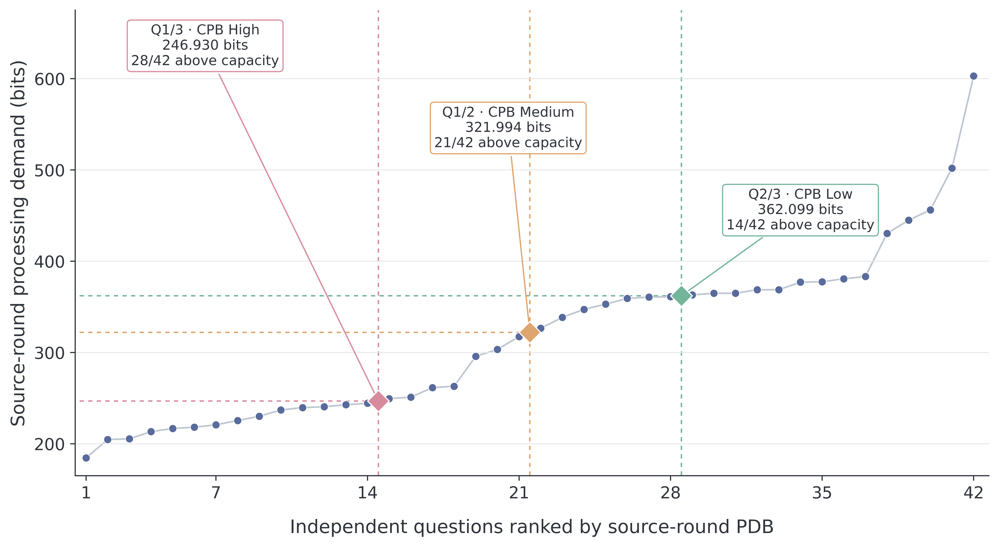

**Figure 3.X. Calibration of Study 2 Working-Memory capacity thresholds against the frozen source-round PDB distribution.** The 42 Independent Questions are ordered by the PDB of their corresponding source Teaching Rounds. CPB High, Medium and Low use the lower-tertile, median and upper-tertile boundaries, respectively, such that 28/42, 21/42 and 14/42 source rounds exceed capacity.

Source: `/Users/willow/Documents/Code/[Msc] ADHD Simulation/UCL_Master_s_Thesis_Qingqing/Figures/Chapter3/export/Design_Figure_WM_capacity_threshold_calibration.png`

Figure 3.X展示了Study 2 WM capacity thresholds在42道Independent Questions所对应source Teaching Rounds的冻结PDB distribution上的校准方式。CPB High、Medium和Low分别采用lower-tertile、median和upper-tertile boundaries，因此依次有28/42、21/42和14/42个source rounds超过相应capacity。该设计在保持instructional materials不变的情况下，使更强的constraint condition覆盖更多assessment-relevant source rounds，从而建立递进增强的WM-restriction exposure。图中校准决定的是各condition中有多少source rounds满足WM restriction的触发条件，而不是预先假定这些限制必然造成相同比例的得分下降；其对Explicit LTM和assessment performance的实际影响由后续实验结果检验。

**Table 3.X. Learner conditions and frozen CPB process parameters in Study 2**

| Learner condition | Representation | Representation-specific manipulation | Attention \(p^A_c\) | WM capacity \(C^{WM}_c\) (bits) | Above capacity in 42-question calibration set |
|---|---|---|---:|---:|---:|
| **Prompt-NT** | Persona prompting | No ADHD-specific description | — | — | — |
| **Prompt-ADHD — Moderate** | Persona prompting | Moderate-intensity ADHD description | — | — | — |
| **Prompt-ADHD — High** | Persona prompting | High-intensity ADHD description | — | — | — |
| **CPB Zero** | CPB | Attention and WM restrictions disabled | 0.00 | \(10^{10}\) | 0/42 |
| **CPB Low** | CPB | Low joint processing constraint | 0.20 | 362.0988065 (\(Q_{2/3}\)) | 14/42 |
| **CPB Medium** | CPB | Medium joint processing constraint | 0.50 | 321.9937895 (\(Q_{1/2}\)) | 21/42 |
| **CPB High** | CPB | High joint processing constraint | 0.80 | 246.9297100 (\(Q_{1/3}\)) | 28/42 |

For CPB Zero, \(10^{10}\) bits is an effectively non-binding implementation sentinel used while WM removal is disabled, rather than a meaningful capacity estimate. For the constrained conditions, progressively stronger frozen constraint levels combine a higher Attention trigger probability with a lower WM capacity:

\[
C^{WM}_{\mathrm{Low}}
>
C^{WM}_{\mathrm{Medium}}
>
C^{WM}_{\mathrm{High}}.
\]

CPB Low、Medium和High因此是由Attention与WM参数联合构成的registered experimental constraint levels，而不是经过临床校准的ADHD severity categories。由于两个参数随severity同时变化，Study 2检验其共同形成的behavioural consequences，不估计Attention或WM各自独立的因果贡献。

两种 material conditions 均来自同一套冻结的七篇 teaching materials，分别为clean condition和distracted condition。Clean condition 使用不包含 distractor events 的 instructional text，distracted condition 使用在预先映射位置包含冻结 distractor events 的instructional text。两种模拟学生均使用 DeepSeek V4 Flash 作为 student model，并共享相同的 frozen teaching materials、assessment questions 和 scoring framework。其回答阶段则遵循各自的 representation architecture：Prompt learners 基于冻结的完整 post-exposure conversation context 回答，而 CPB learners 仅基于冻结的 Explicit LTM 回答。

七个 learner conditions 分别与两种 material conditions 交叉，并在每个 condition–material cell 中运行五次：

\[
7\ \text{learner conditions}
\times
2\ \text{material conditions}
\times
5\ \text{runs}
=
70\ \text{simulated-learner runs}.
\]

由于每次 run 覆盖七篇教材和全部 49 道问题，Study 2 共形成 \(70\times7=490\) 个 lesson-level learning sessions，以及 \(70\times49=3{,}430\) 份 assessment answers。All realised Attention and WM processing records, Available Inputs, Encoding outputs, and Explicit LTM states were retained for downstream matched analyses in Study 3. Prompt conditions 则保存完整的 round-wise classroom history 和各问题的独立 answer record。

所有 3,430 份 answers 最终使用同一个冻结的 `qwen3.7-max` criterion-level LLM Judge 进行评分。

##### 3.5.2.3 Evaluation Measures

Study 2 的两个 Subquestions 共用同一组基础 outcome measures。本研究将每一道 assessment question 在同一 learner condition 和 material condition 下的 5 次独立运行作为重复观测，并首先在 question level 计算平均 Checklist Score、run-to-run standard deviation (SD) 和平均回答词数。Checklist Score 是 assessment performance outcome，SD 描述重复运行稳定性；response word count 仅作为描述性的回答特征，用于判断不同条件是否伴随系统性的回答长度变化，而不被解释为 learning performance 本身。

对于问题 \(q\)、learner condition \(c\)、material condition \(m\) 和第 \(j\) 次运行，记 Checklist Score 为 \(S_{q,c,m,j}\)。题目级平均得分定义为：

\[
\bar S_{q,c,m}
=
\frac{1}{5}
\sum_{j=1}^{5}
S_{q,c,m,j}.
\]

\(\bar S_{q,c,m}\) 表示给定 learner 和 material condition 下，对问题 \(q\) 的平均 assessment performance。所有更高层级的汇总均以该 question-level mean 为基础，包括全部 49 道题的 overall mean、按七篇教材计算的 lesson-level mean、42 道 independent questions 的平均得分，以及 7 道 cross-round integrative questions 的平均得分。由此，Study 2 保持统一的聚合顺序：

\[
\text{Run-level Score}
\rightarrow
\text{Question-level Mean}
\rightarrow
\text{Lesson / Question-Type / Overall Summary}.
\]

同一道题五次独立运行之间的稳定性使用 question-level run-to-run SD 表示：

\[
SD_{q,c,m}
=
\sqrt{
\frac{
\sum_{j=1}^{5}
\left(
S_{q,c,m,j}-\bar S_{q,c,m}
\right)^2
}{
5-1
}
}.
\]

该计算使用 sample standard deviation，即自由度为 \(5-1=4\)。SD 与 Checklist Score 使用相同量纲，因此能够直接表示同一 experimental condition 下重复生成结果的波动程度。较低的 SD 表示同一道题在五次运行中的 performance 较稳定，较高的 SD 则表示更大的 run-to-run variability。Question-level SD仅作为计算中间量；本研究唯一报告的SD summary为全部49道题等权汇总的 **Overall Mean Question-Level Run SD**：

\[
\overline{SD}_{c,m}
=
\frac{1}{Q}
\sum_{q=1}^{Q}
SD_{q,c,m},
\qquad Q=49.
\]

令 \(\mathcal Q_\ell\) 表示 Lesson \(\ell\) 对应的七道 assessment questions，包括六道 Independent Questions 和一道 Integrative Question。为保持 question-level quantities 等权，lesson-level Mean Checklist Score 定义为：

\[
\bar S_{\ell,c,m}
=
\frac{1}{|\mathcal Q_\ell|}
\sum_{q\in\mathcal Q_\ell}
\bar S_{q,c,m},
\qquad
|\mathcal Q_\ell|=7,
\]

因此，lesson-level Mean Checklist Score 仍遵循 Run → Question → Lesson 的聚合顺序，而不是直接合并原始 run-level observations。Run-to-run stability仅通过全部questions等权汇总的Overall Mean Question-Level Run SD报告，不另行计算或报告lesson-level SD。

除 performance 和 stability 外，本研究还记录 student answer 的 word count 作为 descriptive response characteristic。记第 \(j\) 次运行的回答词数为 \(W_{q,c,m,j}\)，则 question-level Mean Answer Words 定义为：

\[
\bar W_{q,c,m}
=
\frac{1}{5}
\sum_{j=1}^{5}W_{q,c,m,j}.
\]

Lesson-level 与 overall Mean Answer Words 分别为：

\[
\bar W_{\ell,c,m}
=
\frac{1}{|\mathcal Q_\ell|}
\sum_{q\in\mathcal Q_\ell}\bar W_{q,c,m},
\qquad
\overline W_{c,m}
=
\frac{1}{Q}
\sum_{q=1}^{Q}\bar W_{q,c,m}.
\]

这些指标用于辅助检查不同 persona 或 CPB conditions 是否系统地产生更长或更短的回答，以及某些 score differences 是否伴随 response verbosity 的变化；它们不被解释为 retained knowledge、learning effectiveness 或 cognitive load 的直接指标。

---

**SQ1 — Within-Representation Performance Differentiation**

SQ1固定使用distracted materials，并在每种representation内部检验learner-condition manipulation是否形成systematic performance differentiation。Prompt与CPB的预期有序condition sequences分别定义为：

\[
\mathcal C_{\mathrm{Prompt}}
=
(\mathrm{NT},\mathrm{Moderate},\mathrm{High}),
\]

\[
\mathcal C_{\mathrm{CPB}}
=
(\mathrm{Zero},\mathrm{Low},\mathrm{Medium},\mathrm{High}).
\]

两种representations使用相同的基础outcome measures，分别报告Overall Mean Checklist Score、Overall Mean Question-Level Run SD和Mean Answer Words，并报告L01–L07、Independent Questions及Integrative Questions的Mean Checklist Score与Mean Answer Words。Run SD仅报告全部49道题等权汇总的Overall Mean Question-Level Run SD，不在lesson或question-type层级重复报告。Mean Answer Words只描述response form，不用于判断learning effectiveness。

由于Lesson是具有明确内容边界的instructional unit，且每个lesson-level mean汇总该教材七道题的question-level means，SQ1将Lesson OCR作为主要ordering measure。令representation \(g\in\{\mathrm{Prompt},\mathrm{CPB}\}\)的有序condition sequence为：

\[
\mathcal C_g
=
(c_{g,1},c_{g,2},\ldots,c_{g,K_g}).
\]

其Lesson-level Ordering Consistency Rate定义为：

\[
OCR^{\mathrm{Lesson}}_{g,m}
=
\frac{1}{7}
\sum_{\ell=1}^{7}
\mathbb I
\left(
\bar S_{\ell,c_{g,1},m}
\ge
\bar S_{\ell,c_{g,2},m}
\ge
\cdots
\ge
\bar S_{\ell,c_{g,K_g},m}
\right).
\]

该指标表示七篇教材中lesson-level Mean Checklist Scores满足representation-specific预期顺序的比例。较高Lesson OCR表示ordering在更多教材中得到保持。由于该指标仅包含七个lessons，其取值以\(1/7=14.29\) percentage-point increments变化，因此必须结合实际score differences解释，而不单独作为统计显著性证据。

由于non-strict ordering会将完全相等的means计为满足排序，本研究同时报告Lesson-level Complete Equality Rate：

\[
ER^{\mathrm{Lesson}}_{g,m}
=
\frac{1}{7}
\sum_{\ell=1}^{7}
\mathbb I
\left(
\max_{c\in\mathcal C_g}\bar S_{\ell,c,m}
-
\min_{c\in\mathcal C_g}\bar S_{\ell,c,m}
\le \epsilon
\right),
\]

其中固定numerical tolerance为\(\epsilon=10^{-9}\)。高OCR与低ER更符合具有实际score separation的ordered differentiation；高OCR与高ER则表示observed ordering可能主要由完全同分构成。

为检查lesson-level aggregation是否掩盖item-level heterogeneity，本研究以相同方式计算Question OCR与Question ER：

\[
OCR^{\mathrm{Question}}_{g,m}
=
\frac{1}{Q}
\sum_{q=1}^{Q}
\mathbb I
\left(
\bar S_{q,c_{g,1},m}
\ge
\bar S_{q,c_{g,2},m}
\ge
\cdots
\ge
\bar S_{q,c_{g,K_g},m}
\right),
\qquad Q=49,
\]

\[
ER^{\mathrm{Question}}_{g,m}
=
\frac{1}{Q}
\sum_{q=1}^{Q}
\mathbb I
\left(
\max_{c\in\mathcal C_g}\bar S_{q,c,m}
-
\min_{c\in\mathcal C_g}\bar S_{q,c,m}
\le \epsilon
\right).
\]

Question OCR与ER仅作为supporting measures，用于描述教材内部的item-level ordering、ties和局部reversals，不替代Lesson OCR与ER的主要判断。Independent与Integrative Questions仍分别报告Mean Checklist Score和Mean Answer Words，用于描述performance与response form是否随question structure变化；题型层级不另行报告run SD。

为量化ordering所对应的实际得分差异，SQ1进一步报告lesson-level paired score contrasts。对于同一material condition \(m\) 下severity较低的condition \(a\) 与severity较高的condition \(b\)，先计算每篇教材的配对差值：

\[
d_{\ell,a,b,m}
=
\bar S_{\ell,a,m}
-
\bar S_{\ell,b,m},
\]

再对七篇教材等权汇总：

\[
\Delta_{a,b,m}
=
\frac{1}{7}
\sum_{\ell=1}^{7}
d_{\ell,a,b,m}.
\]

七个lesson-specific differences \(d_{\ell,a,b,m}\) 作为计算总体contrast与paired lesson bootstrap的配对分析单位，不在Results中逐项制表。各教材的实际均值与跨教材ordering分别由lesson-level score figure和Lesson OCR/ER报告；Table 4.6仅报告七篇教材等权汇总的总体contrast \(\Delta_{a,b,m}\) 及其95% confidence interval，用于量化condition differences的总体幅度与不确定性。

正值表示severity较高的condition具有较低的lesson-level Mean Checklist Score。Prompt branch报告\(\Delta_{\mathrm{NT-Mod}}\)、\(\Delta_{\mathrm{Mod-High}}\)和\(\Delta_{\mathrm{NT-High}}\)；CPB branch报告\(\Delta_{\mathrm{Zero-Low}}\)、\(\Delta_{\mathrm{Low-Medium}}\)、\(\Delta_{\mathrm{Medium-High}}\)和\(\Delta_{\mathrm{Zero-High}}\)。所有 SQ1 contrasts 仅在 distracted materials 下计算，并报告raw Checklist Score difference及95% confidence interval，不转换为相对于baseline的百分比。

95% confidence intervals使用paired lesson bootstrap计算：每次有放回抽取七篇Lessons，并在被抽中的Lesson内保持所有learner conditions配对，重新计算\(\Delta_{a,b,m}\)；重复10,000次后，以bootstrap distribution的2.5th和97.5th percentiles作为区间端点。该方法用于表达七篇教材之间的contrast uncertainty；由于Lesson数量有限，区间与Lesson OCR/ER及各教材实际均值联合解释，而不单独依据CI作mechanistic conclusion。

SQ1 的结论仅判断两种 representations 是否分别形成 systematic performance differentiation。Prompt 与 CPB 的绝对得分不用于直接判断 comparative representational validity；与 ADHD-related cognitive hypotheses 的一致性由 SQ2 的 process-sensitive measures 单独评估。

---

**SQ2 — ADHD-Theory-Consistent Process Sensitivity**

**Controlled-distraction component**

该component使用七种learner conditions在clean和distracted materials下的配对表现，检验加入task-irrelevant distractors后是否产生distraction-associated performance change。对于问题 \(q\) 和learner condition \(c\)，question-level **Raw distraction cost**定义为：

\[
\Delta D_{q,c}
=
\bar S_{q,c,\mathrm{clean}}
-
\bar S_{q,c,\mathrm{distracted}}.
\]

因此，\(\Delta D_{q,c}>0\) 表示该问题在distracted condition下得分下降；接近0表示两种material conditions之间变化较小；负值表示distracted condition下得分反而更高。

对于material condition \(m\)，learner condition \(c\) 的overall Mean Checklist Score为：

\[
\bar S_{c,m}
=
\frac{1}{Q}
\sum_{q=1}^{Q}
\bar S_{q,c,m}.
\]

Overall Raw distraction cost为全部eligible questions的等权平均，亦等于overall clean与distracted mean scores之差：

\[
\overline{\Delta D}_{c}
=
\frac{1}{Q}
\sum_{q=1}^{Q}
\Delta D_{q,c}
=
\bar S_{c,\mathrm{clean}}
-
\bar S_{c,\mathrm{distracted}}.
\]

Raw distraction cost的95% confidence interval基于49道matched questions的question-level clean-minus-distracted differences，使用two-sided \(t\)-interval计算：

\[
\overline{\Delta D}_{c}
\;\pm\;
t_{0.975,Q-1}
\frac{s_{\Delta D_c}}{\sqrt{Q}},
\qquad Q=49,
\]

其中，\(s_{\Delta D_c}\)为learner condition \(c\)的question-level Raw distraction costs之sample SD。

Results首先使用Raw distraction cost figure展示七种learner conditions的实际clean-minus-distracted performance change。柱形表示各condition在49道questions上的overall Raw distraction cost，黑色误差线表示上述95% confidence interval，灰色点表示L01–L07的lesson-level Raw distraction costs。Prompt与CPB分别置于两个panels，并使用适合各自数据范围的horizontal scale，以避免Prompt接近0的变化被CPB较大的costs压缩。正式的representation-relative comparison由下述Additional distraction cost完成。

为避免将两种representations共有的material-condition change误解为ADHD-related process sensitivity，本研究在每种representation内部设置reference condition。Prompt ADHD — Moderate与Prompt ADHD — High为Prompt branch的target conditions，并以Prompt NT为reference；CPB Low、Medium和High为CPB branch的target conditions，并以CPB Zero为reference。

对于任一target condition \(t\) 及其对应reference \(r\)，question-level **Additional distraction cost versus reference**定义为：

\[
C^D_{q,t}
=
\Delta D_{q,t}
-
\Delta D_{q,r}.
\]

因此，\(C^D_{q,t}>0\) 表示target condition的distraction-associated performance loss大于其representation-specific reference；接近0表示两者的distraction sensitivity相近；负值表示target condition的Raw distraction cost低于reference。Overall Additional distraction cost为：

\[
\overline{C^D}_{t}
=
\frac{1}{Q}
\sum_{q=1}^{Q}
C^D_{q,t}.
\]

其95% confidence interval使用配对question-level \(C^D_{q,t}\) values的two-sided \(t\)-interval计算：

\[
\overline{C^D}_{t}
\;\pm\;
t_{0.975,Q-1}
\frac{s_{C^D_t}}{\sqrt{Q}}.
\]

其中，\(s_{C^D_t}\) 表示target与reference之间question-level Additional costs的sample SD。Prompt NT和CPB Zero作为各representation的reference conditions，不在Additional distraction cost table中单独列为target contrasts，也不报告其Additional cost confidence interval或lesson coverage。

为检验Additional distraction cost是否跨教材保持相同方向，首先计算每篇教材的Raw distraction cost：

\[
\Delta D_{\ell,c}
=
\bar S_{\ell,c,\mathrm{clean}}
-
\bar S_{\ell,c,\mathrm{distracted}}
=
\frac{1}{|\mathcal Q_\ell|}
\sum_{q\in\mathcal Q_\ell}
\Delta D_{q,c},
\]

再计算target相对于reference的lesson-level Additional cost：

\[
C^D_{\ell,t}
=
\Delta D_{\ell,t}
-
\Delta D_{\ell,r},
\]

\[
\mathrm{Coverage}_{t}
=
\frac{
\#\left\{\ell:C^D_{\ell,t}>0\right\}
}{7}.
\]

Coverage表示七篇教材中target condition的Additional distraction cost为正的教材数量或比例。较高coverage表示额外干扰敏感性在更多教材中保持预期方向，而不是主要由少数教材驱动。Coverage用于描述跨教材方向一致性，不替代overall Additional cost及其95% confidence interval。

---

**Processing-demand component**

该 component 检验 question performance 是否随着 instructional processing demand 增加而系统变化。主要分析限定于 42 道 independent questions，因为每一道 independent question 均能够映射到一个明确的 source Teaching Round 及其冻结的 Processing Demand Bits (PDB)；cross-round integrative questions 涉及多个 Teaching Rounds，因此不存在唯一的 single-round PDB，不纳入主要 continuous-demand analysis。

PDB analysis 主要使用 clean-material performance。Clean condition 不包含 distractor-triggered information loss，因此能够减少 Attention-related loss 对 PDB–score relationship 的混杂，更直接地检验与 instructional processing demand 相关的 behavioural sensitivity。Distracted-material performance profiles 仅作为描述性的方向检查，用于观察该关系在 distractor-triggered与processing-demand constraints共同存在时是否仍然可见。

首先，将 42 道 independent questions 按其 source-round PDB 从低到高排序，并绘制不同 learner conditions 的 question-level mean Checklist Score 随 PDB 变化的 performance profile。该可视化用于直观检查 higher processing demand 是否伴随 systematic performance decline，以及这种关系是否随 persona intensity 或 CPB constraint severity 而改变。

Processing-demand sensitivity 的主要 association measure 为 PDB–score slope及其95% confidence interval。对于每个 learner condition，在 clean materials 下拟合下式：

\[
\bar S_q
=
\alpha
+
\beta_{\mathrm{PDB},100}
\left(
\frac{PDB_q}{100}
\right)
+
\varepsilon_q.
\]

其中，\(PDB_q/100\) 将 source-round processing demand 缩放为 100-bit units，\(\beta_{\mathrm{PDB},100}\) 因而表示 PDB 每增加 100 bits 时 Mean Checklist Score 的估计变化，而不是每增加 1 bit 的未缩放变化。若 \(\beta_{\mathrm{PDB},100}\) 接近 0，表示 performance 与 PDB 之间缺乏明显线性关系；若 \(\beta_{\mathrm{PDB},100}<0\)，表示 higher-demand source rounds 与较低 question performance 相关；数值越负，则表示对 processing demand 的 performance sensitivity 越强。

与 controlled-distraction component 相同，representation-relative interpretation 使用内部 reference-adjusted slope contrasts。下式均指 clean-material estimates：

\[
C^{\beta}_{s}
=
\beta_{\mathrm{Prompt}\text{-}\mathrm{ADHD}\ s,\mathrm{PDB},100}
-
\beta_{\mathrm{Prompt}\text{-}\mathrm{NT},\mathrm{PDB},100},
\]

\[
C^{\beta}_{k}
=
\beta_{\mathrm{CPB}\ k,\mathrm{PDB},100}
-
\beta_{\mathrm{CPB\ Zero},\mathrm{PDB},100}.
\]

更负的 \(C^{\beta}\) 表示 ADHD-related或constrained condition相对于本representation reference形成了更强的negative PDB–performance relationship。

Raw PDB–score slope的95% confidence interval根据ordinary least-squares slope standard error计算：

\[
\hat\beta_{\mathrm{PDB},100}
\;\pm\;
t_{0.975,Q-2}\,
SE\!\left(\hat\beta_{\mathrm{PDB},100}\right),
\]

其中主要分析的\(Q=42\)。Reference-adjusted slope contrast的95% confidence interval采用paired question-level bootstrap计算：以42道matched Independent Questions为配对单位进行10,000次有放回重抽样，每次重新估计target与reference的PDB slopes及其差值，并以bootstrap distribution的2.5th和97.5th percentiles作为区间边界。该过程使用固定random seed，以保证结果可复现。

Clean-material PDB–score slope及其95% confidence interval首先量化各condition中PDB–performance relationship的方向、幅度与不确定性。Reference-adjusted slope contrast及其95% confidence interval进一步检验target condition的PDB relationship是否超过同一representation reference的基础趋势。Spearman rank correlation \(\rho\)作为supporting association measure，用于检查观察到的关系是否同时具有不依赖线性假设的monotonic direction；负向\(\rho\)表示PDB越高时performance整体倾向越低，越接近\(-1\)表示这种negative monotonic relationship越稳定。本研究不另外定义reference-adjusted \(\rho\)。

上述以49道或42道matched questions为分析单位的confidence intervals描述冻结任务题目集合中的estimate uncertainty，不表示对更广泛教材总体或human ADHD population的推断。Controlled-distraction analysis同时报告expected-direction lesson coverage，SQ1则使用lesson-level contrasts，以补充说明观察到的方向是否跨七篇冻结教材保持。

CPB Low、Medium和High同时改变Attention trigger probability与WM capacity。因此，Study 2检验的是两类约束共同启用后是否形成方向一致的process-sensitive behavioural evidence，而不估计Attention与WM各自独立的因果贡献。

Independent与Integrative question performance保留为SQ1的question-structure summaries。Controlled-distraction component使用全部49道题的等权汇总，不在主要分析中进一步拆分question type。由于Integrative Questions无法唯一映射至单个source-round PDB，所以不进入processing-demand component的continuous analysis。

Table 3.X 总结了 Study 2 两个 Subquestions 与其主要评估方式之间的对应关系。

**Table 3.X. Evaluation framework for Study 2**

| Subquestion | Analytical focus | Primary evidence | Supporting or descriptive evidence | Analysis scope |
|---|---|---|---|---|
| **SQ1 — Within-representation performance differentiation** | Whether Prompt-NT → Moderate → High and CPB Zero → Low → Medium → High produce systematic outcome differentiation within each representation under distracted materials | L01–L07 Mean Checklist Scores; Lesson OCR/ER; overall paired lesson contrasts \(\Delta_{a,b}\) with 95% CIs | Overall Mean Checklist Score; Overall Mean Question-Level Run SD; Mean Answer Words; Question OCR/ER; Independent/Integrative summaries | All 49 questions; distracted materials only |
| **SQ2 — ADHD-theory-consistent process sensitivity** | Whether behavioural outcomes show representation-relative sensitivity to controlled distraction and instructional processing demand | Additional distraction costs with 95% CIs; clean-material PDB–score slopes with 95% CIs; reference-adjusted slope contrasts with 95% CIs | Raw distraction costs with 95% CIs; expected-direction lesson coverage; Spearman \(\rho\); clean and distracted Mean Checklist Scores; descriptive distracted-material PDB profiles | Distraction analysis: all 49 questions; continuous PDB analysis: 42 Independent Questions, with clean primary and distracted descriptive |

#### 3.5.3 Study 3 — Multidimensional Representation Performance

##### 3.5.3.1 Research Question and Subquestions

Study 3 对应 RQ3，并在 Study 2 learner conditions 的response stage加入Language Ability和Big-Five prompt dimensions。现实中的learner characteristics并非彼此孤立，但本研究中的A1–B2只作为受控的attribute-prompt additions，而不是对Big-Five characteristics或完整multidimensional learner fidelity的独立验证。Study 3因此描述这些prompt additions如何改变assessment outcomes，并检查CPB在Study 2中已经建立的constraint-related aggregate patterns是否仍可观察。RQ3 为：

> **RQ3 — Constraint-Pattern Retention under Attribute Additions:** When Language Ability and Big-Five prompt dimensions are added at the response stage, how do assessment outcomes change, and do CPB's previously established constraint-related aggregate patterns remain observable?

RQ3 包含两个相互衔接的分析层面。SQ1 描述A1–B2 prompt additions相对于Study 2 baseline造成的assessment-outcome changes；SQ2检查Study 2中观察到的distraction-和processing-demand-related aggregate patterns在这些additions后是否仍然可见。两者均不用于验证完整multidimensional fidelity，也不单独检验Big-Five characteristics是否得到忠实表达。

**SQ1 — Baseline-Relative Behavioural Change**

> **How do the assessment-performance patterns of the Study 2 learner conditions change after Language Ability and Big-Five profile dimensions are introduced?**

Language Ability 和 Big-Five characteristics 的加入可以合理改变回答表达、内容组织与最终得分，因此，任何 behavioural change 本身都不被预先视为 representation failure。SQ1 更关注新增 profile dimensions 是否导致了原有回答表现的变化，以及 Study 2 中识别出的 within-representation performance structure 在更复杂的 learner descriptions 下是否仍然可辨识。

**SQ2 — Retention of Constraint-Related Process Patterns**

> **Do the distraction- and processing-demand-related aggregate patterns established in Study 2 remain observable after response-stage attribute prompts are added?**

SQ2将A1–B2视为response-stage prompt perturbations，并检查加入这些提示后，distraction-和processing-demand-related performance patterns是否仍然可观察。这里的pattern retention不等同于对新增attributes本身的psychological fidelity验证。

Overall, Study 3 first describes how response-stage attribute additions change assessment outcomes and then checks whether CPB's previously established constraint-related aggregate patterns remain observable.

##### 3.5.3.2 Experimental Design and Conditions

Study 3 采用 **learner-type × attribute-profile × material-condition fully crossed design**，检验加入 Language Ability 与 Big-Five characteristics 后，Prompt-based 与 CPB-based ADHD representations 的 assessment-performance patterns 和 process sensitivity。实验对象包括两种 Prompt-ADHD learners 和三种 CPB learners，如 Table 3.X 所示。

**Table 3.X. Learner types included in Study 3**

| Representation | Learner type |
|---|---|
| **Prompt** | Moderate-Intensity Prompt-ADHD |
| **Prompt** | High-Intensity Prompt-ADHD |
| **CPB** | CPB Low constraint |
| **CPB** | CPB Medium constraint |
| **CPB** | CPB High constraint |

为控制 Study 3 的实验范围，本研究不对全部 Big-Five 维度及其高低组合进行穷举，而是在 Liu et al. (2024) 的 personality-aware student simulation framework 基础上 [liu-etal-2024-personality]，选取三个在当前学习情境中具有较明确解释意义的维度：Openness(O)、Conscientiousness(C) 和 Neuroticism(N)。 Language Ability prompt  同样取自 Liu et al. (2024) [liu-etal-2024-personality]。Language Ability 分为 High 与 Low：High Language Ability 主要表现为较完整、语法规范的句子组织，而 Low Language Ability 则允许较零散的表达及一定程度的语法不完整。这两类属性主要用于控制回答层面的语言组织与表达形式，而不直接表示 learner 所获得的 knowledge quantity。本研究将两种 Big-Five composite profiles 与 High/Low Language Ability 交叉组合，形成 A1–B2 四种受控 attribute profiles，其中 A1/A2 是两个方向一致的 configurations，B1/B2 是两个方向冲突的 configurations，具体组合见Table 3.Y。

$$
\begin{array}{c|cc}
 & BF_{\mathrm{congruent}} & BF_{\mathrm{challenging}}\\
\hline
Language_{\mathrm{High}} & A1 & B1\\
Language_{\mathrm{Low}} & B2 & A2
\end{array}
$$

**Table 3.Y. Contrastive Language Ability and Big-Five profiles in Study 3**

| Group | Profile | Language Ability | Big-Five composite | Attribute relationship | Experimental role |
|---|---|---|---|---|---|
| **A — Aligned** | **A1 — Learning-Congruent Alignment** | High | High O, High C, Low N | Both components are directionally learning-congruent | Learning-congruent aligned configuration |
| **A — Aligned** | **A2 — Learning-Challenging Alignment** | Low | Low O, Low C, High N | Both components are directionally learning-challenging | Learning-challenging aligned configuration |
| **B — Conflicting** | **B1 — High Language / Learning-Challenging BF** | High | Low O, Low C, High N | Language and BF cues point in different directions | Cross-attribute separability test |
| **B — Conflicting** | **B2 — Low Language / Learning-Congruent BF** | Low | High O, High C, Low N | Language and BF cues point in different directions | Cross-attribute separability test |

Study 3 将4种 Language Ability–Big-Five attribute profiles（A1、A2、B1和B2）与5种 learner types 交叉组合，使用与 Study 2 相同的七篇冻结 teaching materials。所有 Prompt-ADHD 和 CPB learners 均分别在 clean 与 distracted materials 下运行，并在每个 learner-type × profile × material-condition cell 中重复5次。Prompt branch 因此形成 \(2\times4\times2\times5=80\) 个 runs，CPB branch 形成 \(3\times4\times2\times5=120\) 个 runs。Study 3 共包含200个 simulated-learner runs、1,400个 lesson-level learning sessions，以及9,800份 answers and Judge scores；其中，clean与distracted arms各包含100个 runs、700个lesson-level learning sessions和4,900份answers。除加入 Language Ability 与 Big-Five dimensions 外，Study 3 的实验流程、冻结教学材料和Judge procedure均与Study 2一致。

对于CPB branch，Study 3保留Section 3.5.2.2中注册的CPB参数，并按对应material condition、constraint level和run逐一匹配，复用Study 2中已冻结的Attention、WM、Encoding与Explicit LTM trajectory，而不重新抽样learning-stage mechanisms。因此，匹配conditions不仅具有相同的Attention trigger probability、WM capacity和random seed，也具有相同的实际Attention/WM触发结果及被保留或移除的信息；这些结果以sentence IDs和processing logs保留。A1–B2 profiles仅在memory-constrained answer-generation stage加入，从而在保持既有CPB learning state不变的条件下检验新增profile dimensions对回答层行为的影响。

##### 3.5.3.3 Evaluation Measures

Study 3直接沿用Study 2（Section 3.5.2.3）定义的五次运行question-level aggregation procedure，以及Checklist Score、sample SD、Mean Answer Words、OCR、ER和continuous PDB measures，不在本节重复定义。SQ1固定使用distracted materials，以匹配Study 2 SQ1的分析范围；SQ2使用clean与distracted materials进行controlled-distraction comparison，并以clean materials开展主要continuous PDB analysis。

**SQ1 — Baseline-Relative Behavioural Change**

SQ1仅使用distracted materials，并在两个层级报告结果。第一层保留每个learner-condition × profile cell的Mean Checklist Score、Overall Mean Question-Level Run SD和Mean Answer Words，用于识别A1–B2对具体learner conditions的影响。第二层在每个A1–B2 profile内分别对Prompt Moderate/High与CPB Low/Medium/High等权汇总，形成representation × profile summaries。Profile-grouped Overall Mean Checklist Score及其matched Study 2 change提供profile-level overall summary；learner-condition-specific score changes用于定位总体结果是否由特定condition驱动。Lesson-specific score changes are retained in the experimental outputs as diagnostic records and are not separately reported in the main results. Profile-grouped run SD和Mean Answer Words及其changes作为支持性或描述性证据。

每个Study 3 distracted-material cell与相同learner condition及相同aggregation level下的Study 2 distracted-material result匹配，并采用与Study 3完全相同的aggregation order。以下SQ1公式中的material condition固定为\(m=\mathrm{distracted}\)。对于 \(X\in\{\bar S,\overline W\}\)，lesson-specific baseline-relative change定义为：

\[
\Delta X_{\ell,c,p,m}
=
X^{(3)}_{\ell,c,p,m}
-
X^{(2)}_{\ell,c,m}.
\]

Overall delta是七篇lesson-specific deltas的等权平均：

\[
\Delta X_{c,p,m}
=
\frac{1}{7}
\sum_{\ell=1}^{7}
\Delta X_{\ell,c,p,m}.
\]

其中，\(\Delta\bar S_{c,p,m}\)描述具体learner condition在profile \(p\)下的overall score change，\(\Delta\bar S_{\ell,c,p,m}\)进一步描述该变化在L01–L07之间的分布；二者均作为解释profile-grouped结果的支持指标。

Run-to-run stability不计算lesson-specific delta，而直接比较两个studies在全部questions上的Overall Mean Question-Level Run SD：

\[
\Delta\overline{SD}_{c,p,m}
=
\overline{SD}^{(3)}_{c,p,m}
-
\overline{SD}^{(2)}_{c,m}.
\]

因此，正向的 \(\Delta\bar S\) 表示加入profile dimensions后，Study 3 Mean Checklist Score高于matched Study 2 condition，负值表示得分低于baseline。该指标描述performance change的方向与幅度，但得分升高或降低本身均不直接表示representation更好或更差。正向的 \(\Delta\overline{SD}\) 表示相同condition在五次运行之间的得分波动增加，即run-to-run stability降低，负值表示重复运行结果更集中、stability提高。正向的 \(\Delta\overline W\) 表示回答总体变长，负值表示回答变短，它只反映response length与表达形式的变化，不被解释为knowledge gain、learning effectiveness或profile fidelity。

为将A1–B2作为主要profile-grouping factor，令：

\[
\mathcal C_{\mathrm{Prompt}}
=
\{\mathrm{Moderate},\mathrm{High}\},
\qquad
\mathcal C_{\mathrm{CPB}}
=
\{\mathrm{Low},\mathrm{Medium},\mathrm{High}\}.
\]

对于overall outcome \(Y\in\{\bar S,\overline{SD},\overline W\}\)，representation × profile summary、matched Study 2 representation baseline及其delta分别定义为：

\[
Y^{(3)}_{r,p,m}
=
\frac{1}{|\mathcal C_r|}
\sum_{c\in\mathcal C_r}
Y^{(3)}_{c,p,m},
\]

\[
Y^{(2)}_{r,m}
=
\frac{1}{|\mathcal C_r|}
\sum_{c\in\mathcal C_r}
Y^{(2)}_{c,m},
\]

\[
\Delta Y_{r,p,m}
=
Y^{(3)}_{r,p,m}
-
Y^{(2)}_{r,m}
=
\frac{1}{|\mathcal C_r|}
\sum_{c\in\mathcal C_r}
\Delta Y_{c,p,m}.
\]

由此，每个A1–B2 profile分别产生一个Prompt summary和一个CPB summary。对于\(Y=\overline{SD}\)，该summary是各learner condition之Overall Mean Question-Level Run SD的等权平均，不是将不同conditions的runs合并后重新计算的pooled SD。Profile-grouped absolute outcome与delta联合报告：前者描述加入profile后的总体水平，后者描述相对于matched Study 2 representation baseline的变化。

Within-representation performance structure同样直接沿用Study 2的OCR和ER定义，但OCR和ER不在learner conditions之间取平均，而是直接在每个representation × profile中根据相关conditions的ordering与equality计算。Prompt检验Moderate \(\ge\) High；CPB检验Low \(\ge\) Medium \(\ge\) High。Lesson OCR/ER是主要structure evidence，Question OCR/ER用于描述item-level heterogeneity。Study 2 baselines使用相同learner subsets并固定为distracted materials重新计算，以保证与每个A1–B2 profile直接对应。

Profile-specific OCR和ER changes以percentage points报告：

\[
\Delta OCR^{a}_{r,p,m}
=
100\left(
OCR^{(3),a}_{r,p,m}
-
OCR^{(2),a}_{r,m}
\right),
\]

\[
\Delta ER^{a}_{r,p,m}
=
100\left(
ER^{(3),a}_{r,p,m}
-
ER^{(2),a}_{r,m}
\right).
\]

OCR需要与ER及实际Mean Checklist Scores联合解释：高OCR若同时伴随高ER，说明预期的non-increasing ordering在较大程度上由相同得分构成，而不是来自清晰的condition separation。Profile-specific score separation沿用Study 2的lesson-level contrast procedure，用于检验OCR所对应的ordering是否具有实际得分幅度。

SQ1因此同时报告20个learner-condition × profile baseline-relative deltas，以及8个representation × profile总体summaries。前者用于定位具体learner condition的变化，后者用于比较A1–B2对Prompt与CPB总体outcomes的影响。Clean与distracted materials之间的performance change仅在SQ2的controlled-distraction component中分析。

---

**SQ2 — Retention of Constraint-Related Process Patterns**

SQ2沿用Study 2（Section 3.5.2.3）中controlled-distraction和continuous PDB analyses的定义、question-level aggregation procedure及分析范围，并分别对每个learner condition × A1–B2 profile计算。Controlled-distraction component使用全部49道题，报告clean与distracted materials之间的Raw distraction cost、95% CI及positive-direction lesson coverage；processing-demand component使用42道Independent Questions，以clean-material PDB–score slope及95% CI为主要指标，并以Spearman \(\rho\)和distracted-material profiles作为支持性证据。

Study 3不包含Prompt NT或CPB Zero reference conditions，因此不计算Additional distraction cost或reference-adjusted PDB slope contrast。其分析重点是检验各multidimensional learner profiles自身是否仍呈现系统性的distraction sensitivity及负向PDB–performance relationship，而不是进行representation-specific reference adjustment。


Table 3.X总结了Study 3两个Subquestions与其评估指标之间的对应关系。

In Table 3.X, \(\Delta\) denotes the Study 3 distracted-material value minus the matched Study 2 distracted-material value for the same learner condition or the corresponding representation summary. Positive values indicate higher Study 3 outcomes, whereas negative values indicate lower outcomes; OCR and ER changes are reported in percentage points.

**Table 3.X. Evaluation framework for Study 3**

| Subquestion | Analytical focus | Primary evidence | Supporting or descriptive evidence | Analysis scope |
|---|---|---|---|---|
| **SQ1 — Baseline-relative behavioural change** | How A1–B2 profile additions alter Study 2 distracted-material assessment-performance patterns and within-representation structure | Representation × profile Overall Mean Checklist Score and matched Study 2 change \((\bar S_{r,p},\Delta\bar S_{r,p})\); Lesson OCR/ER and their percentage-point changes | Learner-condition-specific baseline-relative deltas; representation × profile Mean Overall Question-Level Run SD and Mean Answer Words with their matched Study 2 changes; Question OCR/ER and their changes | Five learner types × four profiles; distracted materials only; all 49 questions |
| **SQ2 — retention of constraint-related process patterns** | Whether the distraction- and processing-demand-related aggregate patterns established in Study 2 remain observable after response-stage attribute additions | Raw distraction costs with 95% CIs; clean-material PDB–score slopes with 95% CIs | Positive-direction lesson coverage; Spearman \(\rho\); descriptive distracted-material PDB profiles | Distraction analysis: all 49 questions; continuous PDB analysis: 42 Independent Questions |

### 3.6 Implementation, Reproducibility and Ethical Scope

#### 3.6.1 Models and Generation Settings

本研究将模拟学生生成、知识编码、教学材料处理负担测量、语义对应分析与答案评价分配给不同的模型组件。这样设计的目的是避免同一个模型在同一实验链中同时承担 learner simulation、mechanism measurement 和 outcome evaluation。具体而言，DeepSeek V4-Flash 用于模拟学生回答及 CPB Knowledge Encoding；GPT-2 small 用于离线计算 Processing-Demand Bits（PDB）；`microsoft/deberta-xlarge-mnli` 作为 BERTScore 的 contextual-embedding backbone，用于计算 Explicit LTM 与 instructional information 之间的语义对应；`qwen3.7-max` 则作为冻结的 criterion-level LLM Judge，对所有正式实验答案进行盲法评分。各组件的主要配置如 Table 3.X 所示。

**Table 3.X. Models, roles, and frozen generation settings**

| Component                     | Model or requested identifier               | Primary role                                                 | Frozen settings                                              |
| ----------------------------- | ------------------------------------------- | ------------------------------------------------------------ | ------------------------------------------------------------ |
| Simulated-student answering   | DeepSeek V4-Flash through `deepseek-chat`   | Generate Prompt-learner and CPB-learner assessment answers   | Non-thinking mode; temperature = 0.0; maximum output = 1,200 tokens |
| Shared Knowledge Encoder      | DeepSeek V4-Flash through `deepseek-chat`   | Convert one round of Available Input into one Explicit LTM entry | Non-thinking mode; temperature = 0.0; maximum output = 500 tokens |
| Processing-demand estimator   | GPT-2 small, Hugging Face identifier `gpt2` | Compute round-reset cumulative token surprisal in bits       | Frozen model and tokenizer revision; local evaluation        |
| Semantic-correspondence model | `microsoft/deberta-xlarge-mnli`             | Provide contextual embeddings for BERTScore Recall           | `idf=False`; baseline rescaling enabled                      |
| Criterion-level LLM Judge     | `qwen3.7-max`                               | Assign criterion-level Correct, Absent, or Contradicted labels | Temperature = 0.0; maximum output = 2,400 tokens; structured JSON output |

为便于全文理解与保持命名一致，本文将用于模拟学生回答和知识编码的 DeepSeek 模型统一称为 **DeepSeek V4-Flash**。在实际实现中，所有请求均通过 DeepSeek 官方 API 发出，并使用兼容模型标识 `deepseek-chat`。模型产品名称与 API 请求标识并不属于同一命名层级：DeepSeek V4-Flash 表示本文采用的模型版本，而 `deepseek-chat` 是由服务提供方维护的兼容 API alias。DeepSeek 的官方更新记录表明，该 alias 的底层模型会随服务版本更新而变化；在 DeepSeek V4 的 API 迁移说明中，`deepseek-chat` 被映射至 DeepSeek V4-Flash 的 non-thinking mode。因此，正文使用“DeepSeek V4-Flash”作为便于阅读的统一名称，同时在模型配置和可复现性记录中保留实际请求标识 `deepseek-chat` [deepseek2026api]。

DeepSeek V4-Flash 在本研究中承担两个相互区分但模型配置一致的角色。第一，它作为 student model 生成所有 Prompt 与 CPB learner 的 assessment answers。Prompt learners 根据冻结的完整 post-exposure classroom context 回答问题，而 CPB learners 只能根据学习阶段生成的 Explicit LTM 回答。第二，它作为所有 CPB conditions 共享的 Knowledge Encoder，将一个 Teaching Round 中最终到达 Encoder 的 Available Input 转换为一条简短的 round-level Explicit LTM entry。两个角色使用相同的基础模型，是为了避免将跨模型能力差异误解释为 Prompt 与 CPB representations 的差异；但两个阶段使用各自冻结的 system prompt 和输入边界，因此 Knowledge Encoding 与 assessment answering 不属于同一次模型调用。

模拟学生回答的 DeepSeek 请求统一设置为 `temperature=0.0`，最大输出长度为1,200 tokens；Knowledge Encoder 同样设置为 `temperature=0.0`，但最大输出长度限制为500 tokens。所有请求均采用非流式生成、180秒超时和最多三次请求重试。Encoder 被要求仅总结实际收到的 classroom information，不得补充外部知识，并仅返回一条不包含标题、列表或附加说明的纯文本 memory entry。当某个 Teaching Round 在 Attention 和 WM processing 后没有剩余 Available Input 时，该轮不调用 Encoder，也不生成 LTM entry。对于完全相同的 Available Input、Encoder prompt 和模型配置，系统使用 content-addressed cache 复用已生成的 encoding result，以避免同一输入因重复生成而在不同 CPB conditions 中产生额外差异。

`temperature=0.0` 用于减少与实验操纵无关的生成变化，但不被视为模型输出具有数学确定性的保证。DeepSeek请求没有传递固定生成 seed，而且远程 API 服务仍可能受到后端实现和推理环境变化的影响。因此，Studies 2 and 3 对每个 learner condition 执行五次独立运行，并基于已保存的运行结果估计 Mean Checklist Score、sample SD 和其他 run-to-run variability measures。重复运行和统计不确定性的具体处理在 Section 3.6.2 中说明。

除生成模型外，本研究使用 GPT-2 small 作为 PDB 的冻结离线概率估计器。本研究使用 Hugging Face 发布的 OpenAI GPT-2 small 模型及其配套 tokenizer。模型权重、tokenizer和推理配置在全部 PDB 计算中保持固定。GPT-2 不参与学生回答或 LTM 生成，而是以 measurement instrument 的形式对每个 Teaching Round 独立计算 cumulative surprisal。模型上下文在每个 Teaching Round 开始时重置，并使用不计分的边界 token 初始化；round 内的两至三句话则共享连续上下文。该配置确保 PDB 是冻结的材料级 annotation，而不是由特定模拟学生运行动态产生的变量。PDB 的 measurement basis 与 round-level operationalisation 分别在 Sections 3.2.2.1 和 3.2.2.2 中说明，estimator-sensitivity analysis 则见 Section 3.2.2.3。

Study 1 中的 Encoding Semantic Recall（ESR）与E2ESR Source-to-LTM semantic correspondence使用BERTScore的官方实现，并采用`microsoft/deberta-xlarge-mnli`作为contextual-embedding model [zhang2019bertscore]。所有比较均报告Recall component，关闭inverse-document-frequency weighting（`idf=False`），并启用baseline rescaling。该模型仅用于对已保存文本开展离线embedding-based semantic-correspondence analysis，不参与Attention、WM、Knowledge Encoding或assessment answering，也不执行proposition-level knowledge-retention判断。具体的reference–candidate direction和指标解释已在Study 1的Evaluation Measures中定义。

所有正式学生答案最终由冻结的 `qwen3.7-max` criterion-level LLM Judge 评分。Judge 使用 `temperature=0.0` 和2,400-token最大输出限制，并通过结构化 JSON 输出每项 atomic checklist criterion 的 `Correct`、`Absent` 或 `Contradicted` 标签。发送给 Judge 的内容仅包括冻结的问题、reference answer、atomic checklist criteria、source evidence 和学生答案；student identity、representation condition、material condition、Attention/WM processing logs、PDB、Explicit LTM 和运行编号均不进入评价请求。模型只负责产生 criterion-level semantic labels，输出结构验证和0–10 Checklist Score aggregation均由本地确定性程序完成。由于前置模型比较与三轮稳定性检验支持 `qwen3.7-max` 的重复测量稳定性，正式 Studies 2–3 对每份学生答案采用一次冻结 Judge 调用；Study 1 不生成 assessment answers，因此不进行 Judge scoring。Judge的选择、稳定性和人类一致性验证已在 Section 3.2.4.2 中报告。

GPT-2、BERTScore和Qwen Judge均不向 simulated student 提供任何信息，其输出也不会反馈至学生生成过程。同样，DeepSeek生成学生答案时不能访问 reference answers、checklist criteria或Judge outputs。由此，整个实验 pipeline 保持了 student generation、processing-demand annotation、semantic analysis 和 outcome evaluation 之间的功能分离。

#### 3.6.2 Experiment Reproducibility

Reproducibility was addressed through frozen experimental inputs, controlled stochastic mechanisms, persistent model outputs, and repeatable downstream analysis. Because the experiments relied on remotely hosted LLM APIs, the study does not assume exact-output reproducibility. Instead, the goal was to ensure that each reported result could be traced to a fixed experimental configuration and reproduced analytically from the stored outputs.

All formal experiments used the same frozen instructional and assessment resources, including the seven lessons, 83 Teaching Rounds, 49 assessment questions, source mappings, reference answers, checklist criteria, prompts, and Study-specific configurations. Relevant files and configurations were versioned and recorded with content hashes. Learner conditions, material conditions, repetition counts, Attention probabilities, Working-Memory capacities, and run-specific seeds were fixed before execution, allowing every output to be linked to its corresponding Study, condition, run, and input version.

Three sources of stochasticity were treated separately. CPB Attention triggering was part of the experimental manipulation and used frozen run seeds, so the same frozen experimental configuration reproduced the same Attention trajectory. Student answering and Knowledge Encoding used fixed generation settings, including `temperature = 0`, but no claim of deterministic regeneration is made because remote API execution remains outside experimental control; repeated runs were therefore used to characterise run-to-run variation. Bootstrap seeds were independent of both processes and controlled only offline statistical resampling.

Accordingly, persisted outputs rather than repeated API calls formed the primary reproducibility record. Each run retained the relevant classroom context or CPB processing logs, Available Input, Explicit LTM, assessment answers, criterion-level Judge outputs, question-level scores, and associated metadata. Identical CPB Encoding inputs reused the same cached Encoding result, preventing equivalent learning states from diverging through repeated API calls. Run manifests, output hashes, and integrity audits were used to verify that the prespecified runs, answers, processing records, memory states, and Judge results were complete before inclusion in analysis. Study 3 additionally verified the correspondence between matched CPB trajectories and their Study 2 baselines.

All statistical analyses were performed on these frozen outputs using fixed analysis configurations and version-recorded software dependencies. Bootstrap procedures used prespecified resampling units and fixed analysis seeds, allowing reported confidence intervals and derived statistics to be recomputed from the same stored data. Reproducibility in this study therefore refers to **reconstructing the experimental procedure, tracing results to frozen inputs and persisted outputs, and repeating downstream analyses**, rather than guaranteeing that future calls to the same remote LLM API will reproduce identical text.

#### 3.6.3 Ethical Scope and Interpretation

This study used only simulated learners and did not involve real students with ADHD or any other neurodivergent condition. The experimental conditions should therefore be interpreted as computational models for controlled hypothesis testing rather than representations of individual learners or clinically valid models of ADHD. The selected Attention- and Working-Memory-related mechanisms were motivated by group-level evidence reviewed in Section 2.4, but neither mechanism is assumed to characterise all individuals with ADHD.

The CPB learners were not provided with an ADHD label, diagnostic description, or instruction to behave as an ADHD student. ADHD-related differences were instead operationalised through predefined information-processing constraints. This design reduces direct reliance on label-conditioned or stereotype-based role playing when testing the CPB mechanisms. It does not, however, eliminate all possible bias: the underlying LLM may still reflect biases from pretraining, and the selected mechanisms remain study-specific abstractions of a much more heterogeneous condition. Persona-prompted ADHD learners were retained only as a comparison representation and should likewise not be interpreted as clinically representative profiles.

Accordingly, behavioural outcomes in this thesis are used only to evaluate the experimental representation mechanisms under controlled conditions. Lower assessment scores, greater distraction sensitivity, or stronger processing-demand effects are not treated as diagnostic markers or as evidence that a learner is “more ADHD-like”. The simulations are not intended for diagnosis, learner classification, or direct educational decision-making. Claims are therefore limited to the computational behaviour, traceability, and theory-consistent patterns observed within the frozen experimental setting.

## 4  Results

### 4.1 RQ1 — CPB Mechanism Validation

#### 4.1.1 SQ1 — Mechanism Execution

SQ1 用于检验 Attention 和 Working-Memory mechanisms 是否严格按照预先注册的规则执行。本研究使用了四个 implementation-fidelity measures。Attention Target-Removal Fidelity (ATRF) 检查应被 Attention 移除的 target sentences 是否被正确删除；Non-Target Preservation Rate (NTPR) 检查不应被 Attention 影响的 instructional information 是否被正确保留。Working-Memory Trigger Agreement (WMTA) 检查实际 WM trigger 是否与冻结的 processing-demand–capacity rule 一致；FIFO Rule Fidelity (FRF) 则检查 WM 在触发后是否按照预定义的 within-round FIFO-style rule 移除了 Attention 后最早仍然可用的 instructional sentence。Table 4.RQ1-1 汇总了四个 Study 1 conditions 的 implementation-fidelity results 及 observed violations。

**Table 4.RQ1-1. Mechanism execution fidelity across Study 1 conditions**

| Condition |  ATRF |  NTPR |  WMTA |   FRF | Violations |
| --------- | ----: | ----: | ----: | ----: | ---------: |
| **A0W0**  |   N/A | 1.000 | 1.000 |   N/A |          0 |
| **A1W0**  | 1.000 | 1.000 | 1.000 |   N/A |          0 |
| **A0W1**  |   N/A | 1.000 | 1.000 | 1.000 |          0 |
| **A1W1**  | 1.000 | 1.000 | 1.000 | 1.000 |          0 |

Table 4.RQ1-1显示，所有适用的implementation-fidelity measures均为1.000，且未发现任何implementation violation。在每个Attention-ON condition中，冻结的42个eligible targets均被正确移除，且没有non-target information被误删；在每个WM-ON condition中，相同的32个high-demand Teaching Rounds均按照注册规则触发WM restriction并正确执行FIFO-style removal。Attention或WM关闭时也未发生相应的非预期移除。因此，SQ1得到支持：Attention和WM mechanisms均按照冻结规则正确执行，为后续information-state analysis提供了可靠的implementation基础。

#### 4.1.2 SQ2 — Traceable Information-State Transitions and Propagation

**Stage-specific transition evidence**

SQ2 首先检验 information changes 是否出现在预期的 processing stages。Table 4.RQ1-2 报告七篇 teaching materials 的非加权均值及 95% lesson-bootstrap confidence intervals，Figure 4.RQ1-1 展示 lesson-level observations 及其总体估计。

**Table 4.RQ1-2. Stage-specific information-state measures across Study 1 conditions**

| Condition | AAR, Mean [95% CI] | WMAR, Mean [95% CI] | ESR, Mean [95% CI] |
| --------- | ------------------: | -------------------: | -----------------: |
| **A0W0**  | 1.000 [1.000, 1.000] | 1.000 [1.000, 1.000] | 0.798 [0.772, 0.818] |
| **A1W0**  | 0.768 [0.749, 0.784] | 1.000 [1.000, 1.000] | 0.817 [0.797, 0.837] |
| **A0W1**  | 1.000 [1.000, 1.000] | 0.806 [0.754, 0.857] | 0.812 [0.776, 0.843] |
| **A1W1**  | 0.768 [0.750, 0.784] | 0.783 [0.699, 0.853] | 0.831 [0.806, 0.851] |

/Users/willow/Documents/Code/[Msc] ADHD Simulation/UCL_Master_s_Thesis_Qingqing/Figures/Chapter4/Figure_4_Study1_Stage_Specific_Transitions.pdf


**Figure 4.RQ1-1. Stage-specific information-state transitions across the four Study 1 mechanism conditions.** Points represent individual teaching materials, diamonds represent unweighted means across the seven materials, and vertical intervals represent 95% lesson-bootstrap confidence intervals. Panel A reports Attention-stage Availability Ratio, Panel B reports Working-Memory-stage Availability Ratio, and Panel C reports Encoding Semantic Recall.

Stage-specific results 呈现出清晰的 localisation pattern。Attention OFF 时 AAR 均为 1.000，Attention ON 时均降至 0.768，且不随 WM setting 改变，说明 Attention-related loss 被稳定定位于 \(S_r\rightarrow P_{r,c}\)。相应地，WM OFF 时 WMAR 均为 1.000；WM ON 后，A0W1 和 A1W1 的 WMAR 分别降至 0.806 和 0.783，说明额外限制只出现在 \(P_{r,c}\rightarrow A_{r,c}\) transition。

四个 conditions 的 ESR 介于 0.798–0.831，confidence intervals 高度重叠。ESR means remained descriptively close across conditions, and no dedicated between-condition Encoding contrast was prespecified. The results therefore provide no evidence of a large condition-specific divergence, rather than demonstrating statistical equivalence. 因此，SQ2 的 stage-specific evidence 表明，Attention 与 WM 造成的信息变化分别出现在其预期阶段，而 shared Encoder 对实际收到的 Available Input 保持了描述上相近的 semantic correspondence。下一部分进一步检验这些局部变化是否传播至最终 Explicit LTM。

**Cumulative-propagation evidence**

SQ2 的 cumulative-propagation component 检验上述局部changes是否继续反映在Available Input，以及Source与最终Explicit LTM之间的embedding-based semantic correspondence中。Table 4.RQ1-3报告SWAR与E2ESR的七篇教材非加权均值及95% lesson-bootstrap confidence intervals，Figure 4.RQ1-2展示对应的lesson-level observations。

**Table 4.RQ1-3. Cumulative information-state outcomes across Study 1 conditions**

| Condition | SWAR, Mean [95% CI] | E2ESR, Mean [95% CI] |
| --------- | -------------------: | --------------------: |
| **A0W0**  | 1.000 [1.000, 1.000] | 0.798 [0.771, 0.818] |
| **A1W0**  | 0.768 [0.750, 0.784] | 0.638 [0.623, 0.652] |
| **A0W1**  | 0.806 [0.754, 0.859] | 0.679 [0.653, 0.708] |
| **A1W1**  | 0.601 [0.534, 0.660] | 0.522 [0.483, 0.558] |

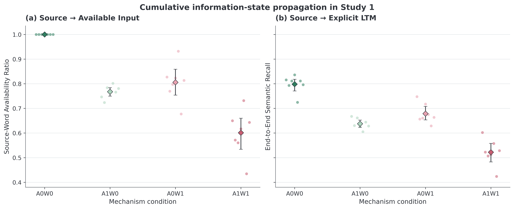

**Figure 4.RQ1-2. Cumulative information-state outcomes across the four Study 1 mechanism conditions.** Points represent individual teaching materials, diamonds represent unweighted means across the seven materials, and vertical intervals represent 95% lesson-bootstrap confidence intervals. Panel A reports Source-Word Availability Ratio and Panel B reports E2ESR, the embedding-based Source-to-LTM semantic-correspondence measure.

/Users/willow/Documents/Code/[Msc] ADHD Simulation/UCL_Master_s_Thesis_Qingqing/Figures/Chapter4/Figure_4_Study1_Cumulative_Knowledge_State_Outcomes.png

SWAR 显示出逐步累计的信息限制：A0W0 为 1.000，单独启用 Attention 或 WM 后分别降至 0.768 和 0.806，两个 mechanisms 同时启用时进一步降至 0.601。每篇教材均在数值精度范围内满足 \(SWAR=AAR\times WMAR\)，说明前一部分定位的 Attention 和 WM changes 按照既定顺序共同决定最终 Available Input。

Figure 4.RQ1-3 以绝对词数核验同一过程。四个 conditions 均从 3,719 个 frozen Source words 开始；A1W1 依次由 Attention 和 WM 移除 868 和 603 词，最终保留 2,248 词，且所有 conditions 的 available words 与两类 attributed losses 均能完整还原 source total。A1W1 的 pooled availability 为 60.4%，与 Table 4.RQ1-3 的 lesson-level mean SWAR 0.601 之间的轻微差异仅来自 aggregation level。


**Figure 4.RQ1-3. Absolute decomposition of frozen Source words across Study 1 mechanism conditions.** Each stacked bar represents the same 3,719 Source words and partitions them into words remaining in Available Input, words removed at the Attention stage, and words subsequently removed by the Working-Memory constraint. Labels report both absolute word counts and their proportions of the complete frozen Source.

/Users/willow/Documents/Code/[Msc] ADHD Simulation/UCL_Master_s_Thesis_Qingqing/Figures/Chapter4/Figure_4_Study1_Absolute_Source_Word_Decomposition.png

这一累计变化也反映在embedding-based Source-to-LTM correspondence中：E2ESR从A0W0的0.798降至A1W0的0.638、A0W1的0.679，并在A1W1中进一步降至0.522。结合前述ESR在四个conditions中描述上相近的结果，该E2ESR decline与upstream information availability减少的解释一致；但由于未进行专门的between-condition Encoding contrast，该结果不用于证明Encoder behaviour在不同conditions下具有统计等效性。E2ESR也未进行proposition extraction或entailment checking，因此这些数值不能证明具体命题、关系方向或限定条件在Explicit LTM中得到保留，只能表明整体contextual-embedding correspondence随上游restriction共同下降。

因此，SQ2 得到支持：Attention、WM 和 Encoding transitions 能够被分别定位，Attention 与 WM 造成的局部 information changes 又能够累计传播至 Available Input，并继续反映在最终 Explicit LTM 与完整 Source 的embedding-based semantic correspondence中。该结论不扩展为proposition-level knowledge-retention claim。

Taken together, RQ1 shows that the CPB processing pipeline executed according to its predefined rules and produced stage-localised information-state changes that propagated to the final Explicit LTM representation. This supports the mechanistic traceability of the implemented pipeline, while not implying proposition-level knowledge retention or equivalence with human ADHD cognitive processes.

### 4.2 RQ2 — CPB versus Persona-Prompted ADHD Simulation

#### 4.2.1 SQ1 — Within-Representation Performance Differentiation

SQ1仅使用distracted materials，分别检验Prompt与CPB两种representations内部的learner levels是否形成系统性的assessment-performance differentiation。Prompt branch比较Prompt-NT、Moderate-Intensity Prompt-ADHD和High-Intensity Prompt-ADHD；CPB branch比较CPB Zero、Low、Medium和High。结果按照“performance level, run-to-run stability, response form, cross-lesson ordering, score-difference magnitude”的顺序展开。

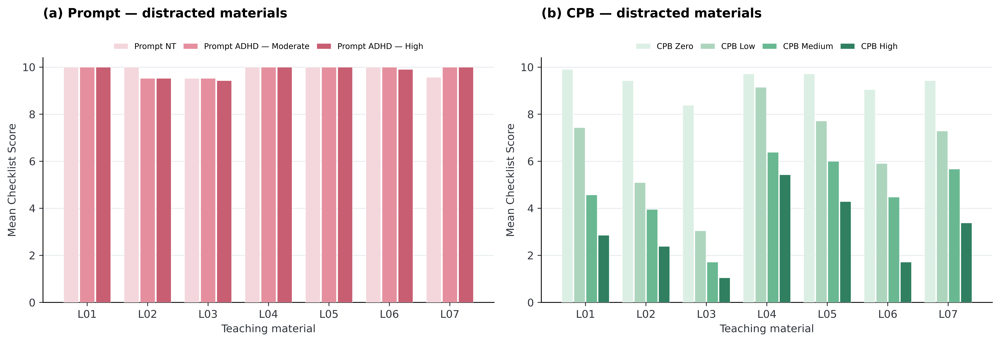

**Figure 4.RQ2-1. Within-representation lesson-level performance differentiation under distracted materials.** Panel A compares Prompt-NT, Moderate-Intensity Prompt-ADHD and High-Intensity Prompt-ADHD across L01–L07. Panel B compares CPB Zero, Low, Medium and High across the same teaching materials. Bars report the five-run Mean Checklist Score; both panels display the same 0–10 score scale.

Source: `/Users/willow/Documents/Code/[Msc] ADHD Simulation/UCL_Master_s_Thesis_Qingqing/Figures/Chapter4/Study2_v2_Figure_1_SQ1_distracted_grouped_scores.png`

**Table 4.RQ2-1. Mean Checklist Scores and Run SD under distracted materials**

| Learner condition | Overall Mean Checklist Score | Independent Mean Score | Integrative Mean Score | Overall Mean Question-Level Run SD |
|---|---:|---:|---:|---:|
| Prompt NT | 9.871 | 9.865 | 9.905 | 0.161 |
| Prompt ADHD — Moderate | 9.864 | 10.000 | 9.048 | 0.000 |
| Prompt ADHD — High | 9.837 | 9.984 | 8.952 | 0.129 |
| CPB Zero | 9.374 | 9.730 | 7.238 | 0.262 |
| CPB Low | 6.517 | 6.635 | 5.810 | 1.967 |
| CPB Medium | 4.680 | 4.476 | 5.905 | 2.388 |
| CPB High | 3.014 | 2.770 | 4.476 | 1.853 |

Figure 4.RQ2-1与Table 4.RQ2-1共同显示，两种representations形成了不同的组内得分模式。Prompt-NT、Moderate-Intensity Prompt-ADHD和High-Intensity Prompt-ADHD在L01–L07中的柱形几乎重叠，各教材均值均介于9.429和10.000之间；其Overall Mean Checklist Scores分别为9.871、9.864和9.837，最高与最低条件仅相差0.034分。因此，Prompt learners普遍接近量表上限，persona intensity未形成具有明显幅度且跨教材一致的performance differentiation。相比之下，CPB Zero、Low、Medium和High在每篇教材中均保持逐级下降，其Overall means也依次由9.374降至6.517、4.680和3.014，Zero与High相差约6.36分，显示constraint severity对应了清晰且跨教材一致的graded performance pattern。

两种方法的绝对得分还受到answer information source差异的影响：Prompt learners回答时能够访问完整的累积课堂上下文，而CPB learners只能依赖经过Attention、WM与Encoding stages后形成的显式记忆，未被处理或保留的信息不能在回答阶段重新访问。因此，Prompt的ceiling pattern可能部分反映完整上下文的持续可用性，CPB得分则同时反映显式记忆表示及不同constraint levels造成的信息损失。

Table 4.RQ2-1同时显示，三个Prompt conditions在五次运行中均具有较低的Overall Mean Question-Level Run SD：Prompt-NT、Moderate-Intensity Prompt-ADHD和High-Intensity Prompt-ADHD分别为0.161、0.000和0.129。然而，这种低波动应与Prompt conditions的ceiling pattern联合解释：三个conditions的Mean Checklist Scores均接近10分，留给分数变化的空间有限。Prompt learners较低的Overall Mean Question-Level Run SD据此说明其观测得分高度重复，但不能单独证明persona simulation具有更强的行为稳定性。

CPB Zero的Overall Mean Question-Level Run SD同样较低，为0.262；加入processing constraints后，CPB Low、Medium和High则分别上升至1.967、2.388和1.853，表明受约束conditions产生了更明显的run-to-run score variability。该指标并不随constraint severity严格单调增加，Medium最高而High低于Low和Medium。Medium较高的SD与Attention trigger在\(p=0.50\)时具有最大的Bernoulli variance，以及其居中的WM capacity threshold一致；但当前分析没有分离两项机制对variability的独立贡献，也不将这一描述性对应解释为Medium最高SD的已验证因果机制。总体而言，SD在此仅描述重复运行稳定性，不作为performance ordering或ADHD-mechanism fidelity的直接指标。

Figure 4.RQ2-2 reports Mean Answer Words across lessons and question scopes to examine whether the observed score patterns were accompanied by systematic differences in response length.


**Figure 4.RQ2-2. Mean Answer Words under distracted materials.** Panel A presents Prompt NT, Moderate-Intensity Prompt-ADHD and High-Intensity Prompt-ADHD; Panel B presents CPB Zero, Low, Medium and High. Bars report Mean Answer Words for L01–L07, the overall 49-question set, and the Independent and Integrative Question subsets. Numerical labels report the corresponding means, and the vertical dashed line separates lesson-level results from summary scopes.

Source: `/Users/willow/Documents/Code/[Msc] ADHD Simulation/UCL_Master_s_Thesis_Qingqing/Figures/Chapter4/Study2_v2_Figure_SQ1_mean_answer_words_bars.png`

Figure 4.RQ2-2显示，Prompt learners的回答总体明显长于CPB learners：三个Prompt conditions的Overall Mean Answer Words介于80.84和86.07之间，而四个CPB conditions介于33.46和43.43之间。两个representation内部均呈现随实验强度增加而回答变长的总体趋势。Prompt-NT、Moderate-Intensity Prompt-ADHD和High-Intensity Prompt-ADHD的Overall means依次为80.84、81.41和86.07，说明较高persona intensity主要伴随更长的语言输出，但NT与Moderate之间的差异很小。CPB Zero、Low、Medium和High的Overall means则依次为33.46、39.88、42.91和43.43；随着constraint severity增强，回答并未因可用记忆减少而变得更短，反而总体有所增加。

将Table 4.RQ2-1的题型得分与Figure 4.RQ2-2的回答词数联合观察，Prompt在Independent Questions中的Mean Checklist Scores为9.865、10.000和9.984，对应Mean Answer Words为68.83、74.46和79.75；回答随persona intensity变长，但得分仍集中于ceiling，未形成预期的performance gradient。Prompt在Integrative Questions中的得分为9.905、9.048和8.952，对应词数为152.86、123.11和124.00，呈现出较大的描述性得分分离。CPB在Independent Questions中的得分由9.730依次下降至6.635、4.476和2.770，而词数由27.57增加至35.12、40.02和42.05，保持了清晰的constraint-related performance gradient；Integrative Questions中的得分为7.238、5.810、5.905和4.476，词数为68.80、68.43、60.23和51.69，其中Low与Medium出现轻微得分反转。总体上，Integrative answers通常长于Independent answers，但其condition ordering较不稳定；鉴于Integrative Questions仅有7道，这些题型结果作为描述性补充，不替代lesson-level主要判断。

Table 4.RQ2-1与Figure 4.RQ2-2的联合结果不支持“回答越长便自动获得越高Checklist Score”的简单解释。CPB Zero平均仅回答33.46词，约为Prompt-NT的80.84词的41%，但其Mean Checklist Score达到9.374，与Prompt learners的9.837至9.871较为接近，说明较短回答仍可能覆盖大部分checklist criteria。与此同时，CPB从Zero到High的平均回答词数由33.46增加至43.43，而得分却由9.374下降至3.014，词数与得分的变化方向相反。这些描述性结果削弱了response verbosity能够单独解释condition-level score differences的可能性；但由于本研究未在控制回答内容后直接估计word count对Judge score的独立影响，因此不据此声称Judge对回答长度完全不敏感或已证明词数维度上的统计公平性。

Cross-material differentiation was evaluated from two complementary perspectives. Table 4.RQ2-2 reports whether the expected condition ordering was preserved and whether apparent ordering was driven by complete ties. Table 4.6 then quantifies the magnitude and uncertainty of the corresponding paired lesson-level differences.

**Table 4.RQ2-2. Lesson- and question-level OCR and Complete Equality Rate under distracted materials**

| Representation | Lesson OCR | Lesson ER | Question OCR | Question ER |
|---|---:|---:|---:|---:|
| Prompt | 71.43% (5/7) | 42.86% (3/7) | 95.92% (47/49) | 87.76% (43/49) |
| CPB | 100.00% (7/7) | 0.00% (0/7) | 77.55% (38/49) | 6.12% (3/49) |

**Table 4.6. Overall paired lesson contrasts under distracted materials**

| Representation | Contrast | Overall \(\Delta\) | 95% CI |
|---|---|---:|---:|
| Prompt | NT − Moderate | 0.007 | [−0.184, 0.204] |
| Prompt | Moderate − High | 0.027 | [0.000, 0.054] |
| Prompt | NT − High | 0.034 | [−0.156, 0.218] |
| CPB | Zero − Low | 2.857 | [1.782, 3.966] |
| CPB | Low − Medium | 1.837 | [1.401, 2.340] |
| CPB | Medium − High | 1.667 | [1.177, 2.163] |
| CPB | Zero − High | 6.361 | [5.510, 7.068] |

Table 4.RQ2-2显示，CPB在全部7篇教材中均保持Zero ≥ Low ≥ Medium ≥ High的预期顺序，Lesson OCR达到100%，说明constraint severity对应的得分方向在所有教材中一致保持；同时，Lesson ER为0，说明没有任何一篇教材的四个CPB levels完全同分。因此，CPB的高OCR并非由non-strict ordering中的ties造成，而是不同constraint levels实际拉开了得分差距，形成稳定且清晰的跨教材梯度结构。相比之下，Prompt的Lesson OCR仅为71.43%，且Lesson ER达到42.86%，即3/7篇教材中的三个Prompt conditions完全同分，表明persona intensity既未在全部教材中保持预期顺序，也不能稳定形成可辨识的等级分离。

Question-level results进一步揭示了两种方法的不同模式：CPB有38/49道题满足预期排序，Question OCR为77.55%，意味着其余11道题存在局部次序偏离，因此High constraint学生在每一道题上的得分并不必然低于较低constraint levels。不过，这些单题波动在lesson aggregation后仍形成100%的跨教材梯度。Prompt则有47/49道题满足non-increasing ordering，表面上具有更高的Question OCR，然而其中87.76%的题目在三个conditions上完全同分，因此这种高question-level ordering并未转化为lesson-level或overall performance上的明显等级差异。换言之，CPB虽然在单题层面存在stochastic reversals，聚合后却形成了实际分离的稳定梯度；Prompt虽然在单题层面呈现较高的ordering consistency，但该结果主要由完全同分构成，聚合后仍未形成可辨识的等级分离。

Table 4.6进一步量化了ordering所对应的总体得分幅度。Prompt的三个overall paired lesson contrasts仅为0.007至0.034分，实际幅度接近于零；NT–Moderate和NT–High的95% CIs均跨越零，Moderate–High的区间下界也为零，因此没有形成清晰的等级分离。相比之下，CPB的三个相邻等级差分别为2.857、1.837和1.667分，Zero–High差异达到6.361分，所有95% CIs均完全高于零，表明不同constraint levels之间具有明确的总体得分差异。结合Table 4.RQ2-2中100%的CPB Lesson OCR和0%的Lesson ER，这一contrast pattern同时具有跨教材一致性与实际分离幅度；Prompt则未形成同等清晰的等级结构。

总体而言，SQ1显示两种representations形成了不同的组内表现模式。Prompt learners的得分普遍偏高接近满分，且不同persona intensities之间主要表现为完全同分或幅度很小且缺乏跨教材一致性的差异，没有形成清晰、稳定的assessment-performance differentiation。相比之下，CPB constraint levels在所有教材中形成了方向一致、实际分离且幅度明确的graded performance structure。尽管受约束conditions在单题和重复运行层面存在stochastic variability，但在Lesson层面汇总后表现出了清晰明显的梯度和固定模式。因此，对于SQ1的直接回答是：在distracted materials下，CPB形成了系统且可辨识的组内performance differentiation，而persona prompting未形成同等清晰的等级分离。

#### 4.2.2 SQ2 — ADHD-Theory-Consistent Process Sensitivity

SQ2从两个process-sensitive components检验两种representations是否呈现与目标ADHD-related cognitive hypotheses一致的performance pattern。Controlled-distraction component评估各learner conditions的distraction sensitivity。Processing-demand component检验42道Independent Questions的得分与source-round PDB之间的关系。

**Controlled-distraction component**

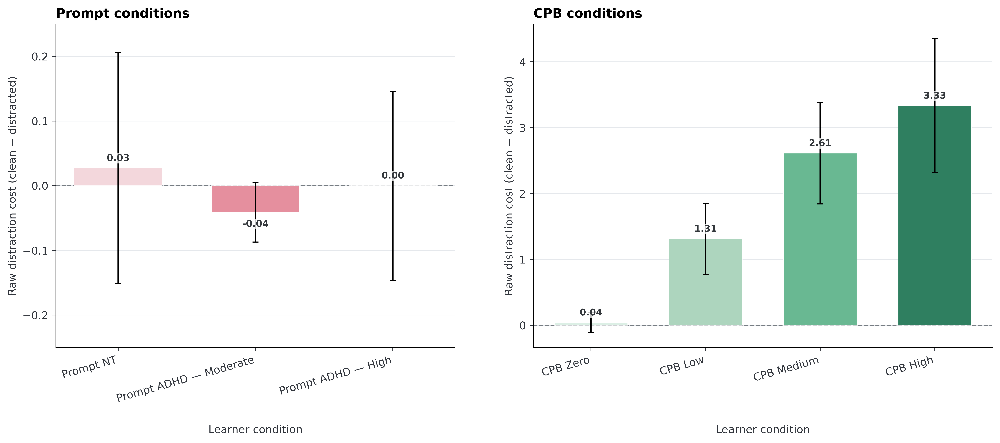

**Figure 4.RQ2-3. Raw distraction costs across Study 2 learner conditions.** Panel A presents Prompt NT, Moderate-Intensity Prompt-ADHD and High-Intensity Prompt-ADHD; Panel B presents CPB Zero, Low, Medium and High. Coloured bars report the overall question-level Raw distraction cost, black intervals show 95% confidence intervals, and grey points show L01–L07 lesson-level Raw costs. Positive values indicate lower performance under distracted materials. The two panels use different horizontal scales to preserve the visibility of the near-zero Prompt estimates.

Source: `/Users/willow/Documents/Code/[Msc] ADHD Simulation/UCL_Master_s_Thesis_Qingqing/Figures/Chapter4/Study2_v2_Figure_2A_SQ2_raw_distraction_costs.png`

Raw distraction cost表示每个learner condition自身从clean到distracted materials的实际得分变化，即clean mean减去distracted mean；Additional distraction cost则进一步用target condition的Raw cost减去同一representation reference的Raw cost，用于判断target是否产生超过Prompt NT或CPB Zero的额外干扰成本。因此，Figure 4.RQ2-3描述实际的clean-to-distracted变化，Table 4.RQ2-4提供主要的representation-relative comparison。

**Table 4.RQ2-4. Representation-Relative Additional Distraction Costs**

| Representation | Target versus reference | Additional distraction cost [95% CI] | Expected-direction lesson coverage |
|---|---|---:|---:|
| Prompt | Moderate − NT | −0.068 [−0.248, 0.112] | 1/7 |
| Prompt | High − NT | −0.027 [−0.301, 0.246] | 3/7 |
| CPB | Low − Zero | 1.272 [0.713, 1.831] | 7/7 |
| CPB | Medium − Zero | 2.571 [1.789, 3.353] | 7/7 |
| CPB | High − Zero | 3.293 [2.272, 4.313] | 7/7 |

Figure 4.RQ2-3显示，Prompt NT、Moderate和High的Raw distraction costs分别为0.027、−0.041和0.000，均接近0；其confidence intervals均跨越0，且lesson-level points分布于0的两侧。Table 4.RQ2-4进一步显示，Moderate与High相对Prompt NT的Additional costs分别为−0.068和−0.027，两个95% CIs同样跨越0。这些负值表明两个Prompt ADHD conditions的得分损失并未超过Prompt NT：Moderate在distracted materials下得分轻微上升，High则几乎不变。在7篇教材中，Moderate只有1篇、High只有3篇呈现比Prompt NT更大的distraction cost。因此，在冻结题目与教材集合中，Prompt ADHD conditions既未表现出额外的distraction-associated performance loss，也没有形成跨教材一致的干扰敏感性模式。

CPB Zero的Raw distraction cost仅为0.041，其confidence interval跨越0，说明关闭processing constraints时，material condition变化几乎没有降低performance。CPB Low、Medium和High的Raw costs则分别为1.313、2.612和3.333分，且对应lesson-level points均位于正向，表明受约束conditions在distracted materials下出现了随constraint severity扩大的performance decline。相对于CPB Zero，三个conditions的Additional costs仍依次达到1.272、2.571和3.293分，95% CIs在冻结题目集合中均完全高于0，并在全部7篇教材中保持预期方向。因此，这一pattern并非基础模型对material condition变化的共同反应，而是与CPB constraints的联合启用及强度相关。CPB由此形成了幅度明确、随severity增强且跨教材一致的distraction-associated performance pattern，而Prompt persona intensity没有形成相应模式；该结果不用于分离Attention与WM各自的独立因果贡献。完整的clean/distracted means与Raw costs见Appendix Table A.6。

**Processing-demand component**

Figure 4.RQ2-4 visualises the relationship between source-round PDB and question performance under clean and distracted materials, with the clean-material relationships providing the primary evidence.


**Figure 4.RQ2-4. Clean- and distracted-material PDB–performance profiles.** Points report five-run question-level Mean Checklist Scores for the 42 Independent Questions; lines show fitted linear relationships between source-round Processing Demand Bits and performance. Panels A and B present the Prompt conditions under clean and distracted materials, respectively; Panels C and D present the corresponding CPB conditions.

Source: `/Users/willow/Documents/Code/[Msc] ADHD Simulation/UCL_Master_s_Thesis_Qingqing/Figures/Chapter4/Study2_v2_Figure_4_SQ2_combined_pdb_profiles.png`

Figure 4.RQ2-4检验performance是否随source-round PDB增加而下降。Clean-material Panels A和C构成主要证据：三个Prompt conditions均接近ceiling且拟合线近似水平，CPB Zero也未呈现明显关系，而CPB Low、Medium和High均表现为PDB越高、得分越低。因此，清晰的负向PDB–performance relationship只在启用processing constraints后出现。

Distracted-material Panels B和D呈现相同的方向性对照：Prompt拟合线仍近似水平，受约束CPB conditions仍呈负向关系，但question-level scores更加分散。Table 4.RQ2-5 subsequently quantifies the primary clean-material relationships using fitted slopes, reference-adjusted contrasts, confidence intervals, and Spearman correlations.

**Table 4.RQ2-5. Primary clean-material PDB–performance estimates**

| Learner | Slope per 100 bits | Slope 95% CI | Reference-adjusted slope contrast | Reference-adjusted 95% CI | Spearman \(\rho\) |
|---|---:|---:|---:|---:|---:|
| Prompt NT | 0.135 | [−0.011, 0.281] | 0.000 (reference) | — | 0.360 |
| Prompt ADHD — Moderate | 0.023 | [−0.026, 0.073] | −0.112 | [−0.368, 0.049] | 0.166 |
| Prompt ADHD — High | 0.018 | [−0.132, 0.169] | −0.116 | [−0.421, 0.116] | −0.007 |
| CPB Zero | −0.022 | [−0.293, 0.249] | 0.000 (reference) | — | −0.050 |
| CPB Low | −2.217 | [−3.272, −1.163] | −2.196 | [−3.024, −1.023] | −0.441 |
| CPB Medium | −2.748 | [−3.949, −1.548] | −2.727 | [−3.832, −1.642] | −0.499 |
| CPB High | −2.355 | [−3.753, −0.958] | −2.333 | [−3.495, −1.115] | −0.410 |

Table 4.RQ2-5首先通过clean-material PDB–score slopes及其95% confidence intervals量化各learner condition的processing-demand sensitivity。Prompt NT、Moderate和High的slopes分别为0.135、0.023和0.018分/100 bits，三个intervals均包含0，因此未观察到明确的负向关系。CPB Zero的slope同样接近0，为−0.022，且interval包含0。相比之下，CPB Low、Medium和High的slopes分别为−2.217、−2.748和−2.355分/100 bits，三个intervals均完全低于0，表明启用processing constraints后，higher PDB与较低performance之间形成了清晰的负向关系。三种受约束conditions均表现出该sensitivity，但slope幅度没有随Low至High严格单调增强，Medium的负向estimate最大。

Reference-adjusted slope contrasts进一步检验上述关系是否超过同representation reference的基础趋势。Prompt Moderate和High相对Prompt NT的contrasts为−0.112和−0.116分/100 bits，但两个95% CIs均包含0，说明其轻微的负向偏移无法与无额外效应清晰区分。CPB Low、Medium和High相对CPB Zero的contrasts分别为−2.196、−2.727和−2.333，且相应CIs均完全低于0，确认其负向PDB–performance relationships并非CPB Zero或基础模型的共同趋势。

Spearman \(\rho\)提供了不依赖线性假设的支持性检查。Prompt conditions与CPB Zero未呈现一致的负向单调关系，而CPB Low、Medium和High的\(\rho\)分别为−0.441、−0.499和−0.410，与raw slopes的方向一致。结合Figure 4.RQ2-4，clean-material结果因此表明，CPB而非Prompt在该冻结任务中形成了可辨识且超过representation-specific reference的processing-demand sensitivity。

综合两类证据，SQ2显示Prompt ADHD conditions既未相对Prompt NT形成额外且跨教材一致的distraction cost，也未呈现明确的负向PDB–performance relationship。相比之下，三种受约束CPB conditions均相对CPB Zero产生了额外distraction cost，并在clean materials下随PDB增加呈现明确的performance decline。因此，在本研究的冻结任务中，CPB比persona prompting更一致地表现出与目标ADHD-related Attention和Working-Memory hypotheses方向相符的behavioural process sensitivity。

Taken together, RQ2 shows that, within the frozen task setting, CPB produced more theory-direction-consistent task sensitivity than persona prompting. As established in Section 2.4, the relevant literature supports two bounded functional patterns rather than a universal ADHD profile: differential susceptibility to controlled distraction and increasing performance constraint as instructional processing demand exceeds available WM resources. Constrained CPB learners showed systematic sensitivity with respect to both functional relationships, whereas Prompt ADHD learners did not show comparable patterns relative to Prompt NT. The accompanying graded performance structure therefore supports task-specific behavioural consistency, but the experimental constraint levels should not be interpreted as clinically calibrated ADHD severity or as evidence of human behavioural fidelity.

### 4.3 RQ3 — Multidimensional Representation Performance

#### 4.3.1 SQ1 — Baseline-Relative Behavioural Change

SQ1仅使用distracted materials，检验A1–B2 profile dimensions加入后，各learner conditions相对于matched Study 2 baselines的behavioural outcomes如何变化，以及两种representations原有的within-representation performance structure是否仍然能够识别。本节首先使用具体learner-condition结果定位overall score changes的来源。run SD和Mean Answer Words用于补充描述stability与response form，最后结合Lesson/Question OCR、ER和实际score separation判断performance structure的保持情况。按representation与profile汇总的Mean Checklist Score、Overall Mean Question-Level Run SD和Mean Answer Words，以及各指标的matched Study 2 baseline和delta，集中报告于Appendix Table A.7。

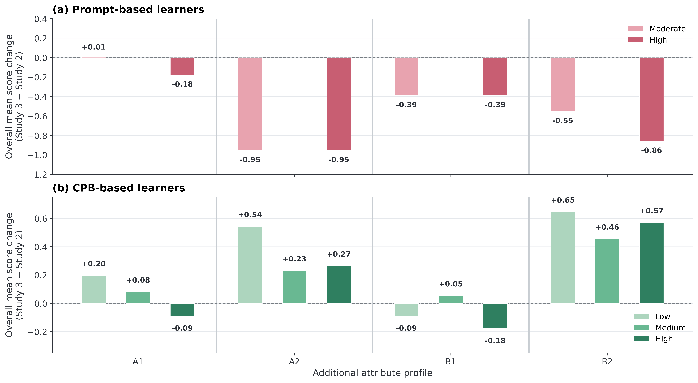

**Figure 4.RQ3-1. Learner-condition-specific Mean Checklist Score change relative to matched Study 2 distracted-material baselines.** Panel A presents Moderate- and High-Intensity Prompt-ADHD learners; Panel B presents CPB Low, Medium and High. A1–B2 define the four additional attribute profiles. Each bar reports the Overall Mean Checklist Score delta, calculated as Study 3 minus the matched Study 2 learner-condition value. Positive values indicate higher Study 3 performance and negative values indicate lower performance. The panels use profile-appropriate y-axis ranges; exact deltas are labelled on the bars.

Source: `/Users/willow/Documents/Code/[Msc] ADHD Simulation/UCL_Master_s_Thesis_Qingqing/Figures/Chapter4/Study3_v3_Figure_1_SQ1_distracted_mean_score_delta.png`

Figure 4.RQ3-1比较两种Prompt-ADHD conditions和三种CPB constraint conditions分别加入A1、A2、B1与B2四种attribute profiles后，相对于matched Study 2 distracted-material baselines的Overall Mean Checklist Score变化，并用于判断同一profile的影响是否跨learner conditions共同出现，或主要来自某个具体condition。相应的representation-level profile summaries见Appendix Table A.7。总体来看，新增profile dimensions对Prompt与CPB并未产生一致影响；即使加入完全相同的A1–B2属性组合，两种representations也可能呈现方向不同的score displacement，其中A2和B2的差异最为明显。

A组由Language Ability与Big-Five composite方向一致的两个aligned profiles组成。**A1 — Learning-Congruent Alignment**结合High Language Ability与High O、High C、Low N。该profile对两种representations的影响均较有限：Prompt Moderate基本不变（+0.014），Prompt High轻微下降（−0.177）；CPB Low和Medium轻微提高（+0.197和+0.082），CPB High轻微下降（−0.088）。在representation层级，Prompt与CPB的平均变化分别仅为−0.082和+0.063，整体均接近matched Study 2 baselines。相比之下，**A2 — Learning-Challenging Alignment**结合Low Language Ability与Low O、Low C、High N，并在两种representations中产生了明显不同的结果。Prompt Moderate和High均下降约0.952分，呈现高度一致的负向变化；CPB Low、Medium和High则分别提高0.544、0.231和0.265分，representation-level平均变化为+0.347。由此，aligned profiles并未形成跨representation一致的performance effect：Learning-Congruent Alignment仅引起有限变化，而Learning-Challenging Alignment在Prompt中产生了最明显的performance decline，却没有在CPB中产生相应下降。这表明相同的challenging profile cues如何进入最终assessment performance，取决于其与基础learner representation的结合方式。

B组由Language Ability与Big-Five composite方向冲突的两个profiles组成。**B1 — High Language / Learning-Challenging BF**结合High Language Ability与Low O、Low C、High N。Prompt Moderate和High均下降约0.388分；CPB Low、Medium和High分别变化−0.088、+0.054和−0.177，整体更接近matched baseline。相应的representation-level平均变化为Prompt −0.388和CPB −0.070。**B2 — Low Language / Learning-Congruent BF**结合Low Language Ability与High O、High C、Low N。该profile下，Prompt Moderate和High分别下降0.551和0.857分，而CPB Low、Medium和High分别提高0.646、0.456和0.571分，形成Prompt −0.704与CPB +0.558的representation-level反向变化。交叉比较进一步显示，A1与B2具有相同的Learning-Congruent BF但采用不同Language Ability，Prompt由接近baseline转为明显下降；A2与B1具有相同的Learning-Challenging BF，High Language Ability则对应较小的Prompt下降幅度。因此，Prompt branch的Mean Checklist Score变化更明显地随Language Ability方向改变。CPB没有呈现相同模式：两个Low Language profiles A2和B2均产生正向score displacement，说明Language Ability对得分的影响并非跨representation通用，而受到representation architecture及其与新增profile cues交互方式的调节。

总体而言，A1–B2 additions确实改变了assessment performance，但两种representations呈现不同的变化模式。Prompt的score displacement总体以负向为主，且A2和B2两个Low Language profiles下降最明显；CPB则多为接近baseline或正向变化。然而，Mean Checklist Score delta仅描述performance displacement，不能单独判断原有within-representation structure是否保持，也不能说明变化是否来自run-to-run stability或response form。Figure 4.RQ3-2和Figure 4.RQ3-3因此进一步考察Overall Mean Question-Level Run SD与Mean Answer Words的baseline-relative changes，随后再通过OCR/ER和score separation判断原有performance structure是否仍然可识别。


**Figure 4.RQ3-2. Change in Overall Mean Question-Level Run SD relative to matched Study 2 distracted-material baselines.** Bars report Study 3 minus Study 2 run-SD values for each learner-condition × profile cell. Positive values indicate greater run-to-run score variability after profile addition, whereas negative values indicate more concentrated repeated-run outcomes. Panel-specific y-axis ranges are used to keep the within-representation differences legible.

Source: `/Users/willow/Documents/Code/[Msc] ADHD Simulation/UCL_Master_s_Thesis_Qingqing/Figures/Chapter4/Study3_v3_Figure_2_SQ1_distracted_run_sd_delta.png`

Figure 4.RQ3-2比较两种Prompt-ADHD conditions和三种CPB constraint conditions分别加入A1–B2后，Overall Mean Question-Level Run SD相对于matched Study 2 baselines的变化。Prompt的八个condition × profile combinations均呈正向SD delta，说明profile additions普遍增加了重复运行的得分波动；CPB则以正向变化为主，但A1和B1下的High condition略有下降。不同profiles的影响也不相同：A2对Prompt的variability影响最大，而B2在CPB中产生了最一致的SD increase。

在aligned A组中，**A1 — Learning-Congruent Alignment**仅引起较小变化，Prompt的representation-level SD增加0.082，CPB基本不变（−0.004）。**A2 — Learning-Challenging Alignment**则使Prompt Moderate和High的SD分别增加0.553和0.492，并使CPB Medium和High分别增加0.353和0.265，表明该challenging configuration明显降低了重复运行结果的集中程度。在conflicting B组中，B1的总体变化较小；**B2 — Low Language / Learning-Congruent BF**则使五种learner conditions的SD全部上升，其中CPB的representation-level增幅达到0.298。结合A1与B2、A2与B1的对应比较，Low Language Ability profiles总体伴随更大的run-to-run variability，但具体幅度仍受到Big-Five组合与representation architecture的共同影响。


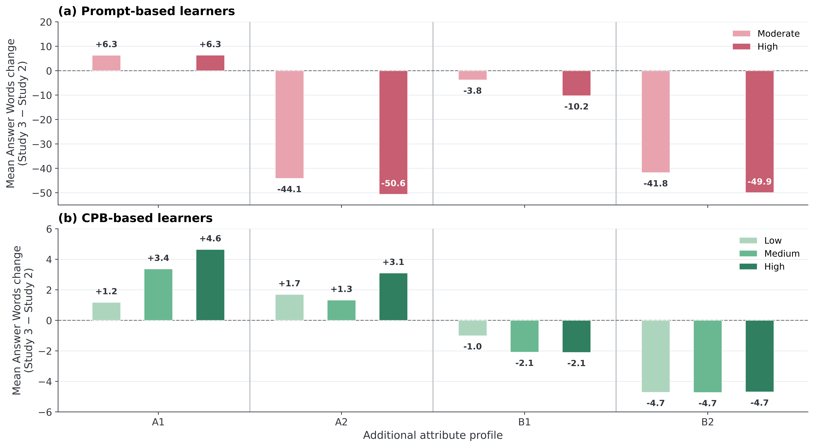

**Figure 4.RQ3-3. Change in Mean Answer Words relative to matched Study 2 distracted-material baselines.** Bars report Study 3 minus Study 2 Mean Answer Words for each learner-condition × profile cell. Positive values indicate longer Study 3 responses and negative values indicate shorter responses. Panel-specific y-axis ranges are used because Prompt and CPB changes differ substantially in magnitude.

Source: `/Users/willow/Documents/Code/[Msc] ADHD Simulation/UCL_Master_s_Thesis_Qingqing/Figures/Chapter4/Study3_v3_Figure_3_SQ1_distracted_answer_words_delta.png`

Figure 4.RQ3-3比较两种Prompt-ADHD conditions和三种CPB constraint conditions分别加入A1–B2后，Mean Answer Words相对于matched Study 2 baselines的变化。新增profiles对Prompt回答长度产生了幅度更大且方向更明确的影响：各cell的变化约介于增加6.3词至减少50.6词之间，其中两个Low Language profiles均导致回答大幅缩短。相比之下，CPB各cell始终保持在约−5至+5词的较窄范围内。由此可见，A1–B2对response length的影响主要集中于Prompt branch，并主要随Language Ability方向变化；相同profile cues对memory-constrained CPB回答长度的影响明显较弱。

在aligned A组中，**A1 — Learning-Congruent Alignment**使两个Prompt conditions均增加约6.3词，CPB三个conditions平均增加3.1词；**A2 — Learning-Challenging Alignment**则使Prompt Moderate和High分别减少44.1和50.6词，而CPB平均仍增加2.0词，形成明显的representation-specific divergence。在conflicting B组中，High Language的B1仅使回答小幅缩短；Low Language的**B2 — Low Language / Learning-Congruent BF**则使Prompt Moderate和High分别减少41.8和49.9词，而CPB三个conditions平均仅减少约4.7词。跨profile比较显示，无论Big-Five composite是Learning-Challenging还是Learning-Congruent，A2与B2两个Low Language profiles均使Prompt回答缩短约46–47词；A1与B1两个High Language profiles则只产生有限变化。因此，Prompt回答长度主要响应显式Language Ability cue，而CPB回答受Explicit LTM及memory-restricted answering procedure约束，对相同cue的长度变化明显收窄。

将Figure 4.RQ3-3与得分结果联合观察，Prompt A2和B2的明显缩短同时伴随Mean Checklist Score下降，但回答长度并不能单独解释全部performance change：Prompt A1在回答变长后得分基本不变，而CPB B2在回答缩短的同时得分反而提高。因此，Mean Answer Words在此仅用于说明新增profiles如何改变response form，不被解释为knowledge gain、learning effectiveness或profile fidelity。完整representation-level absolute values与deltas见Appendix Table A.7。

Table 4.RQ3-1 reports profile-specific lesson- and question-level OCR and Complete Equality Rate, together with their changes from the matched Study 2 baselines.

**Table 4.RQ3-1. Profile-specific Lesson/Question OCR and Complete Equality Rate under distracted materials**

| Representation | Profile | Lesson OCR | Δ Lesson OCR | Lesson ER | Δ Lesson ER | Question OCR | Δ Question OCR | Question ER | Δ Question ER |
|:---|:---|:---|---:|:---|---:|:---|---:|:---|---:|
| Prompt | A1 | 85.71% (6/7) | −14.29 pp | 42.86% (3/7) | −28.57 pp | 97.96% (48/49) | −2.04 pp | 87.76% (43/49) | −6.12 pp |
| Prompt | A2 | 57.14% (4/7) | −42.86 pp | 0.00% (0/7) | −71.43 pp | 83.67% (41/49) | −16.33 pp | 57.14% (28/49) | −36.73 pp |
| Prompt | B1 | 71.43% (5/7) | −28.57 pp | 14.29% (1/7) | −57.14 pp | 95.92% (47/49) | −4.08 pp | 85.71% (42/49) | −8.16 pp |
| Prompt | B2 | 100.00% (7/7) | +0.00 pp | 14.29% (1/7) | −57.14 pp | 97.96% (48/49) | −2.04 pp | 81.63% (40/49) | −12.24 pp |
| CPB | A1 | 100.00% (7/7) | +0.00 pp | 0.00% (0/7) | +0.00 pp | 83.67% (41/49) | +4.08 pp | 22.45% (11/49) | +0.00 pp |
| CPB | A2 | 100.00% (7/7) | +0.00 pp | 0.00% (0/7) | +0.00 pp | 71.43% (35/49) | −8.16 pp | 12.24% (6/49) | −10.20 pp |
| CPB | B1 | 100.00% (7/7) | +0.00 pp | 0.00% (0/7) | +0.00 pp | 73.47% (36/49) | −6.12 pp | 20.41% (10/49) | −2.04 pp |
| CPB | B2 | 100.00% (7/7) | +0.00 pp | 0.00% (0/7) | +0.00 pp | 71.43% (35/49) | −8.16 pp | 14.29% (7/49) | −8.16 pp |

Table 4.RQ3-1以Lesson OCR/ER作为主要performance-structure evidence。CPB在A1–B2四种profiles下均有7/7篇教材保持Low \(\ge\) Medium \(\ge\) High的预期顺序，Lesson OCR均为100%，且Lesson ER均为0。两项指标相对于matched Study 2 baseline均没有变化，说明新增Language Ability与Big-Five profiles后，CPB仍在全部教材上保持实际拉开差距的graded structure，而不是依靠完全同分满足non-strict ordering。Prompt的Lesson OCR则随profile变化：A1、A2和B1分别只有6/7、4/7和5/7篇教材保持Moderate \(\ge\) High，B2达到7/7；其中A2的Lesson OCR下降至57.14%，表明新增profiles后Prompt ordering在宏观教材层面并不稳定。Prompt Lesson ER虽然普遍低于Study 2 baseline，但这不自动代表形成了更清晰的预期分离。例如A2的Lesson ER降至0时，Lesson OCR也同时降至57.14%，说明原有ties的一部分被打破后形成的是directional reversals，而非一致的Moderate–High separation。

Question-level results进一步揭示了lesson aggregation内部的差异。Prompt在四种profiles下仍有41–48/49道题满足non-increasing ordering，Question OCR为83.67%–97.96%，表面上比CPB的71.43%–83.67%更稳定；但Prompt同时有28–43/49道题在Moderate与High下完全同分，Question ER高达57.14%–87.76%。因此，其较高Question OCR在很大程度上表示两个Prompt conditions在单题上没有产生可辨识的performance difference，而不代表更强的persona-intensity differentiation。CPB的Question OCR相对较低，说明High constraint在个别题目上并不总是稳定低于Medium或Low；但其Question ER仅为12.24%–22.45%，且这些item-level stochastic reversals在按教材聚合后均转化为100% Lesson OCR和0 Lesson ER。

换言之，Prompt在单题层面具有更高的表面ordering coverage，却主要由大量完全同分构成，并且这种pattern未稳定转化为跨教材的Moderate–High separation。CPB在微观题目层面存在更多局部波动，但在宏观lesson level保持了跨四种profiles一致且具有实际分离的constraint gradient。Appendix Table A.8进一步量化了对应的实际分差：Prompt Moderate–High separation在四种profiles下仅为0.027–0.333分；CPB所有相邻等级分差均保持为正，介于1.551–2.150分，Low–High separation则保持在3.578–3.789分。因此，CPB的100% Lesson OCR和0 Lesson ER对应了幅度明确的graded separation，而Prompt ordering仍主要表现为有限的performance differentiation。

To sum up，A1–B2 profile additions改变了两种representations的assessment behaviour，但影响方式不同。Prompt的得分总体下降，尤其集中于A2和B2两个Low Language profiles，并伴随更高的run-to-run variability及明显缩短的回答。其原有limited differentiation仍然存在，且Moderate–High ordering随profile变化并继续包含大量question-level ties。CPB的总体得分则多为接近或高于matched baseline，response-length变化相对有限。尽管单题层面仍有局部reversals，Low、Medium和High在四种profiles下均保持100% Lesson OCR、0 Lesson ER及幅度明确的score separation。因此，SQ1的结果表明，新增Language Ability与Big-Five dimensions能够显著改变具体outcomes和response form，但没有消除CPB在Study 2中形成的graded within-representation performance structure。相比之下，Prompt branch仍主要表现为较弱且更受profile组合影响的performance differentiation。

#### 4.3.2 SQ2 — Retention of Constraint-Related Process Patterns

SQ2沿用Study 2的两个process-sensitive components。Controlled-distraction component使用全部49道题，检验A1–B2下各learner condition从clean到distracted materials的Raw distraction cost；processing-demand component使用42道Independent Questions，以clean-material PDB–performance relationship为主要证据，并以distracted-material profiles作方向性检查。

**Controlled-distraction component**

Figure 4.RQ3-4 shows whether the controlled-distraction patterns established in Study 2 remained observable after the response-stage profiles were added.


**Figure 4.RQ3-4. Raw distraction costs across multidimensional Study 3 learner profiles.** Panel A presents Moderate- and High-Intensity Prompt-ADHD learners; Panel B presents CPB Low, Medium and High. A1–B2 define the four additional attribute profiles. Coloured bars report the overall question-level Raw distraction cost and black intervals show 95% confidence intervals. Positive values indicate lower performance under distracted materials. Panel-specific vertical scales preserve the visibility of the near-zero Prompt estimates.

Source: `/Users/willow/Documents/Code/[Msc] ADHD Simulation/UCL_Master_s_Thesis_Qingqing/Figures/Chapter4/Study3_v3_Figure_5_SQ2_raw_distraction_costs_bars_only.png`

Figure 4.RQ3-4显示，八个Prompt condition × profile cells的Raw distraction costs介于−0.299至0.231分。这里的正值表示distracted得分低于clean，而负值则表示加入干扰后得分反而提高。具体而言，A2 Moderate、A2 High和B1 Moderate的Raw costs分别为−0.027、−0.299和−0.177分，即这三组Prompt-ADHD learners在distracted materials下的平均得分略高于clean materials；其余组合的得分下降也仅为0.041–0.231分。所有95% confidence intervals均跨越0，说明无论是轻微下降还是反向提高，现有数据都不能将这些变化与0清晰区分。Appendix Table A.9进一步显示，每个cell仅有2–3篇教材呈现正向cost。因此，在加入Language Ability与Big-Five dimensions后，Prompt-ADHD不仅没有表现出稳定的distraction-associated performance loss，部分profile组合还出现了“有干扰反而得分更高”的反向结果，且整体方向在不同教材间不一致。

CPB呈现了明显不同的pattern。四种profiles下，Low的Raw costs为0.912–1.347分，Medium为2.129–2.531分，High为2.810–3.286分，意味着全部12个CPB condition × profile组合在加入干扰后都出现了明确的得分下降。这些95% confidence intervals均完全高于0，且每个组合在全7篇教材中均呈现正向cost，说明该下降既能与0清晰区分，也不是由少数教材驱动。更重要的是，A1–B2的所有profiles都保持Low < Medium < High的distraction-cost梯度：constraint severity越高，distracted materials造成的performance loss越大。因此，额外profile dimensions虽然改变了具体effect magnitude，却没有消除CPB在Study 2中观察到的controlled-distraction sensitivity；这与Prompt branch中接近0、方向不稳定且部分反转的结果形成了清晰对照。完整估计值、confidence intervals及lesson coverage见Appendix Table A.9。

**Processing-demand component**

Figure 4.RQ3-5 shows the clean-material PDB–performance relationships for each Study 3 profile and learner condition.


**Figure 4.RQ3-5. Clean-material PDB–performance profiles across multidimensional Study 3 learners.** Points report five-run question-level Mean Checklist Scores for the 42 Independent Questions; lines show fitted linear relationships between source-round Processing Demand Bits and performance. Panels A–D present Prompt Moderate and High under A1–B2; Panels E–H present CPB Low, Medium and High under the same profiles. Clean materials constitute the primary PDB analysis.

Source: `/Users/willow/Documents/Code/[Msc] ADHD Simulation/UCL_Master_s_Thesis_Qingqing/Figures/Chapter4/Study3_v3_Figure_6_SQ2_clean_pdb_profiles.png`

Figure 4.RQ3-5显示，Prompt conditions在A1–B2下仍主要集中于较高得分区间，拟合线近似水平或向上，没有呈现PDB越高、performance越低的系统性关系。CPB Low、Medium和High则在四种profiles下均呈负向拟合线，表明higher source-round PDB仍与lower question performance相关。该representation-level对照在所有A1–B2 profiles中均可辨识，但不同profile下的负向幅度有所变化。

Appendix Table A.10量化了Figure 4.RQ3-5中的主要clean-material relationships。Prompt的八个slopes介于−0.052至0.627分/100 bits，没有任何condition呈现95% CI完全低于0的negative slope；相应Spearman \(\rho\)也除A1 Moderate外均为正。因此，新增profiles没有使Prompt learners形成与higher processing demand相关的系统性performance decline，A2 Moderate和B2 High反而呈现明确的正向slope。

CPB的12个slopes全部为负，介于−2.713至−1.103分/100 bits，其中9个95% CIs完全低于0；A2 Low、A2 High和B2 High的intervals跨越0，但其point estimates及Spearman \(\rho\)仍保持负向。四种profiles下的全部CPB \(\rho\)均为负，范围为−0.484至−0.205，与linear slopes的总体方向一致。A1与B1的负向关系整体强于A2与B2，说明新增profile dimensions能够改变processing-demand effect magnitude，但没有反转CPB的representation-wide negative association。

在Appendix Figure A.11中，Distracted-material profiles提供了相同方向的支持性检查：Prompt的八个slopes均为正，仍未呈现PDB越高、performance越低的系统性关系；CPB的12个condition × profile slopes则全部保持负向。与对应的clean-material estimates相比，其中11/12个CPB slopes的绝对值减小，只有A2 Medium的负向slope略微增强，说明加入外部干扰后该relationship的幅度通常减弱，但方向没有反转。

To sum up，SQ2在两类process-sensitive evidence上呈现一致的描述性结果。A1–B2 Prompt learners既未表现出明确且跨教材一致的Raw distraction cost，也未形成negative PDB–performance relationship；CPB learners则在全部profiles和constraint levels下保持正向且跨7篇教材一致的distraction cost，并在clean materials下普遍呈现PDB越高、performance越低的关系。这些结果表明，加入response-stage attribute prompts后，Study 2中观察到的CPB constraint-related aggregate patterns仍然可见；它们不验证完整multidimensional fidelity，也不证明Big-Five attributes本身得到忠实表达。

Taken together, RQ3 shows that adding Language Ability and Big-Five response-stage attributes changed individual assessment outcomes and response characteristics without eliminating the constraint-related aggregate patterns previously established by CPB. The result therefore supports pattern retention under attribute additions, rather than complete multidimensional learner fidelity or independent validation of the added attributes themselves.

### 4.4 Summary of Findings and Discussion

The three studies collectively examine a learner-representation question rather than simply whether one simulation architecture produces larger score differences than another. As argued in Chapter 2, the central issue is whether learner characteristics that are expected to affect learning processes can be represented in a way that produces corresponding changes in learner state and downstream behaviour, rather than being expressed only through persona-level descriptions. The findings are therefore interpreted in relation to the process–state distinction, the functional boundary of persona prompting, and the claim-matched validation requirements developed in Sections 2.2–2.7. Throughout this discussion, implementation fidelity, rule-consistent propagation, task-bounded behavioural sensitivity, and external human validity are treated as distinct levels of evidence. Accordingly, the comparison is interpreted conditionally rather than as a general competition between persona- and process-based representation.

#### 4.4.1 Interpretation of the Main Findings

Study 1 provides evidence primarily for the process- and learner-state principles motivated in Section 2.5 and formalised as design requirements in Section 2.7. Earlier learner-modelling traditions distinguish between instructional experience, changing learner state, and subsequent performance [corbett-anderson-1995-knowledge; abdelrahman-etal-2023-knowledge], while process-oriented models further emphasise the value of relating observable outcomes to intermediate operations [anderson-etal-1995-cognitive]. CPB operationalised this distinction explicitly: Attention and Working-Memory constraints altered identifiable information states before Knowledge Encoding, and the resulting Explicit LTM provided a persistent downstream state from which assessment responses were generated. The contribution of Study 1 is therefore not simply that information was removed under constrained conditions, but that the path from source information to post-Attention input, Available Input, and subsequent knowledge state remained inspectable. This addresses the learner-state and transparency problems identified in Chapter 2 by providing a process-to-state trace rather than requiring the origin of an assessment error to be inferred retrospectively from the final answer. However, the high implementation fidelity observed in Study 1 establishes correspondence with the prespecified computational rules, not with human ADHD cognition. The Attention and WM operations remain bounded functional abstractions whose demonstrated value lies in controllability and attribution.

Study 2 addresses the representational distinction raised in Section 2.2. Persona prompting provides a flexible means of conditioning learner identity, ability, and behavioural tendencies, and previous studies have shown that profile or persona instructions can alter generated responses and interactional behaviour [benedetto-etal-2024-using; liu-etal-2024-personality]. What remains less clear is whether descriptive alignment reliably produces persistent, process-specific learning consequences. Existing studies show that general-purpose LLMs can exceed intended learner ability levels and that prompting alone does not consistently reproduce linguistic, behavioural, and cognitive aspects of learner behaviour [wu-etal-2025-embracing; scarlatos-etal-2026-simulated]. In the present comparison, increasing ADHD persona intensity produced little systematic differentiation in assessment performance: the Prompt conditions remained close to ceiling and showed limited sensitivity to either controlled distraction or instructional processing demand. In contrast, CPB produced a graded performance structure together with consistent distraction-associated costs and negative relationships between processing demand and performance once the corresponding constraints were active. These patterns are directionally consistent with the distraction- and Working-Memory-related relationships reviewed in Section 2.4 [pelham-etal-2011-distractors; kofler2010adhd; sweller-etal-2019-cognitive]. More importantly, they illustrate a different form of behavioural organisation. Within CPB, the constraints altered the information available before answering, allowing differences in later performance to emerge through changes in learner state rather than through an instruction to express a more severe profile. The resulting contrast is therefore specific to **process-sensitive learning consequences**: it does not imply that persona prompting cannot shape observable learner behaviour, but shows that descriptive persona variation and process-stage constraint variation need not produce equivalent patterns of acquired knowledge and task performance.

Study 3 extends this interpretation to the multidimensional representation problem identified in Sections 2.2, 2.3, and 2.7. Learner characteristics such as personality, language ability, cognitive processing, and acquired knowledge may influence behaviour through different functional pathways, yet persona-based student simulation can encode several such dimensions within a common global profile [liu-etal-2024-personality]. Adding Language Ability and Big-Five instructions at the response stage changed individual assessment outcomes, response length, and run-to-run variability, but did not eliminate the previously established CPB constraint gradient or its aggregate distraction- and processing-demand-related patterns. This provides evidence for the operational feasibility of the architectural factorisation proposed by DR4: response-stage attributes can modify the expression of an answer without necessarily replacing the learning-stage state from which that answer is generated.

The Study 3 evidence must nevertheless be interpreted narrowly. The study demonstrates constraint-pattern retention under attribute additions; it does not establish that the Language Ability or Big-Five profiles were faithfully simulated because those attributes were not independently evaluated. Moreover, Study 3 reused the pre-generated CPB learning trajectories from Study 2 and held them fixed across the additional response-stage profiles. Preservation of the underlying learning-stage structure was therefore partly supported by design. Study 3 tests whether response-stage additions disrupt the downstream observability of previously established constraint-related patterns, rather than whether the learning-stage process structure remains independently invariant under changes to the simulation as a whole.

#### 4.4.2 Alternative Explanations and Evidential Boundaries

The process-sensitive findings must be interpreted in relation to how the underlying constructs were operationalised. Attention-related loss occurred because controlled distractors were prespecified and aligned with assessment-relevant source sentences, and triggered distractors made the corresponding target information unavailable. The resulting distraction cost therefore shows that the implemented Attention manipulation propagated to downstream knowledge states and assessment performance in the intended direction. It does not independently establish hard deletion as a psychologically faithful model of human attentional disruption. This distinction is consistent with the literature reviewed in Section 2.4, which supports differential susceptibility to distraction while also showing that distractor effects vary across tasks and conditions rather than producing deterministic information loss [pelham-etal-2011-distractors; schneidt2018distraction; van2007distraction].

The interpretation of Processing Demand Bits requires a similar distinction. PDB directly enters the WM overflow rule and is subsequently used to examine the relationship between instructional processing demand and performance. A negative PDB–performance relationship under constrained conditions therefore demonstrates that the demand-sensitive rule propagated through the CPB pipeline; it is not an independent validation of PDB as a measure of human cognitive load. Furthermore, because PDB accumulates token-level surprisal, part of its variation reflects instructional length as well as probabilistic unexpectedness. The observed relationship should consequently be interpreted as sensitivity to the study-specific PDB operationalisation rather than to a pure measure of cognitive difficulty. The theoretical motivation is narrower: ADHD-related WM differences can become more pronounced as processing demands increase, while instructional learning more generally can become constrained when demand exceeds available WM resources [kofler2010adhd; sweller-etal-2019-cognitive]. Overall, these findings support implementation fidelity, rule-consistent state propagation, and task-bounded behavioural sensitivity, while external cognitive validity remains a separate empirical question.

A second evidential boundary concerns the comparison between Prompt and CPB as complete simulation architectures. The two approaches share instructional materials, the underlying student model, assessment questions, and scoring procedures. In the present implementation, however, they differ in answer-stage information access: Prompt learners retain the accumulated classroom context, whereas CPB learners answer from Explicit LTM produced by the learning pipeline. This distinction is particularly relevant because learner-modelling research treats learning as a changing learner state rather than unrestricted access to all prior information [abdelrahman-etal-2023-knowledge; corbett-anderson-1995-knowledge], while recent LLM learner-simulation work similarly highlights the distinction between simulated learner knowledge and the broader capabilities or accessible information of the underlying model [yuan-etal-2026-towards]. Full-context access may therefore allow Prompt learners to recover instructional information irrespective of whether persona descriptions imply weaker learning, while information removed upstream in CPB remains unavailable during assessment. The near-ceiling Prompt results consequently cannot be attributed to persona representation alone, just as the larger CPB differentiation cannot be interpreted as an isolated causal advantage of process representation. The comparison instead demonstrates how the two implemented representation architectures, including their different learner-state and information-access assumptions, organise assessment behaviour.

Evaluation uncertainty provides an additional boundary. As emphasised in Section 2.6, structured and decomposed LLM-based evaluation can improve auditability, but LLM judgements do not automatically align with human evaluation and remain subject to evaluator-specific uncertainty [hashemi-etal-2024-llm; lee-etal-2025-checkeval]. The operational Judge was highly repeatable, but it showed only moderate agreement with the two human raters and applied a systematically stricter scoring boundary. In addition, the human validation sample consisted largely of near-ceiling baseline responses rather than the full distribution of shorter and more fragmented CPB answers. Blinding reduces the risk that condition information directly influences scoring, but it does not establish that Judge error remains constant across answer types or score ranges. Together with the limited set of seven English-language finance lessons, these factors constrain the interpretation and generalisability of the absolute Checklist Scores. The strongest behavioural evidence in the present study therefore lies in directional patterns that remained consistent across runs and materials, rather than in treating individual model-derived scores as interchangeable with human grades.

#### 4.4.3 Implications for Learner Representation

The broader implication follows this conditional interpretation. The findings do not suggest that process-based representation should replace persona prompting in every student-simulation setting. Instead, they support the principle derived from the research gaps and design requirements in Section 2.7 that **the representation locus should be matched to the functional role through which a learner characteristic is expected to influence behaviour**. Persona prompting provides a direct and flexible interface for characteristics expressed through generated responses [tseng-etal-2024-two; wang-etal-2024-rolellm], and existing student-simulation studies show that profile dimensions such as ability, language ability, and personality can produce observable differences in generated behaviour [benedetto-etal-2024-using; liu-etal-2024-personality]. When a characteristic is instead theoretically expected to influence how instructional information is processed, retained, and subsequently available for assessment, the findings of the present study suggest that an explicit process and learner-state pathway can provide greater observability and attribution of its downstream consequences.

The Study 3 findings further suggest that persona- and process-based approaches need not be mutually exclusive. Process-relevant constraints, persistent learner state, and response-level attributes can occupy different functional layers within a factorised simulated-learner architecture. This interpretation is consistent with the broader process- and state-based modelling tradition reviewed in Section 2.5, which distinguishes instructional experience, intermediate processing, persistent learner state, and later behaviour [anderson-etal-1995-cognitive; abdelrahman-etal-2023-knowledge]. Within the controlled experimental setting, CPB provides initial evidence for the feasibility of this design through traceable mechanism execution, rule-consistent state propagation, task-bounded behavioural sensitivity, and retention of aggregate constraint patterns under response-stage attribute additions. These forms of evidence support the proposed representation principle within the current materials, tasks, models, and operational definitions. They do not establish behavioural or cognitive correspondence with real ADHD learners. External validation against ADHD and neurotypical learner data is therefore required before the observed patterns can be interpreted as evidence of human learner fidelity.

## 5 Conclusions and Future Work

This thesis investigated how process-relevant learner characteristics should be represented in LLM-based student simulation. Using ADHD-related Attention and Working-Memory characteristics as controlled cases, CPB translated prespecified processing constraints into traceable learner-state changes and produced task-specific behavioural patterns that were systematically related to controlled distraction and instructional processing demand. Persona-level variation did not produce the same consistent process-sensitive patterns, while CPB’s main constraint structure remained observable after additional Language Ability and Big-Five attributes were introduced at the response stage.

The central contribution is a functionally grounded learner-representation approach. Rather than expressing all learner characteristics through a single persona description, CPB separates process-relevant constraints, learner state, and response-stage attributes according to their functional roles. The findings support a conditional principle: learner characteristics should be represented at the functional level at which they are expected to operate. Persona prompting may be sufficient for characteristics mainly affecting expression or interaction style, whereas characteristics expected to shape learning and knowledge acquisition may require process- and state-level representation.

These conclusions remain limited by the study’s simplified Attention and Working-Memory operationalisations, the use of PDB as a surprisal-based proxy for processing demand, and the restricted experimental setting of English finance materials, short-answer assessment, and simulated learners. Future work should validate the observed patterns against ADHD and neurotypical learner data, develop richer processing mechanisms, and test the framework across tasks, domains, and models.

Overall, this thesis does not argue that CPB should replace persona prompting. Instead, it shows that matching representation to functional role offers a more principled basis for building modular and interpretable LLM simulated learners.

## Appendices

<!-- Appendix numbering rule: appendices use lettered chapters (Appendix A, Appendix B, ...). Sections use hierarchical numbers (A.1, A.2, ...). Figures and tables are numbered independently and consecutively within each appendix chapter (Figure A.1, Figure A.2, ...; Table A.1, Table A.2, ...). Appendix float numbers are not derived from main-text section numbers. All TeX references must use \label and \ref so that numbering updates automatically. -->

### Appendix A.1 — Processing-Demand Estimator Sensitivity

**Appendix Table A.1. Reproducibility and cross-estimator sensitivity of the frozen PDB annotations**

| Validation metric                              | Result         |
| ---------------------------------------------- | -------------- |
| Maximum frozen-value reproduction error        | 0.000349 bits  |
| Maximum range across ten repeated calculations | 0 bits         |
| Cross-estimator Spearman \(\rho\)              | 0.864          |
| Lesson-stratified bootstrap 95% CI             | [0.782, 0.917] |
| Lesson-level \(\rho\) range                    | 0.782–0.952    |
| Low-tail Jaccard similarity                    | 0.615          |
| High-tail Jaccard similarity                   | 0.448          |
| Low/Middle/High agreement                      | 68.7%          |
| Unweighted Cohen’s \(\kappa\)                  | 0.501          |
| Low↔High extreme flips                         | 0              |

### Appendix A.2 — Human-Scoring Disagreement Audit

**Appendix Table A.2. Structured Audit of Human–Human Disagreements**

| Question   | Criterion | Human Judge 1 | Human Judge 2 | Disagreement category           | Audit summary                                                |
| ---------- | --------- | ------------- | ------------- | ------------------------------- | ------------------------------------------------------------ |
| `L01_QC03` | `C1`      | Absent        | Correct       | Required-component completeness | The answer described the financial system and three participant groups but did not explicitly include businesses. |
| `L01_QC08` | `C2`      | Correct       | Absent        | Conceptual equivalence          | The disagreement concerned whether asset allocation across classes sufficiently expresses diversification. |
| `L03_QC07` | `C1`      | Absent        | Correct       | Implicit contrast               | The answer contrasted raw data with meaningful information without directly stating “not merely collecting more data.” |
| `L04_QC02` | `C1`      | Absent        | Correct       | Category–instance mapping       | The answer named CFO and related positions without directly using the broader role label “financial manager.” |
| `L04_QC09` | `C3`      | Correct       | Absent        | Distributed relational evidence | Technical solutions, IT teams and modelling contrasts appeared across the answer, but the target relation was not expressed as one explicit proposition. |

*Note.* This audit characterises the semantic boundary underlying each original disagreement. It does not overwrite either rater’s independent label or construct a forced consensus reference.

### Appendix A.3 — LLM Judge Prompt

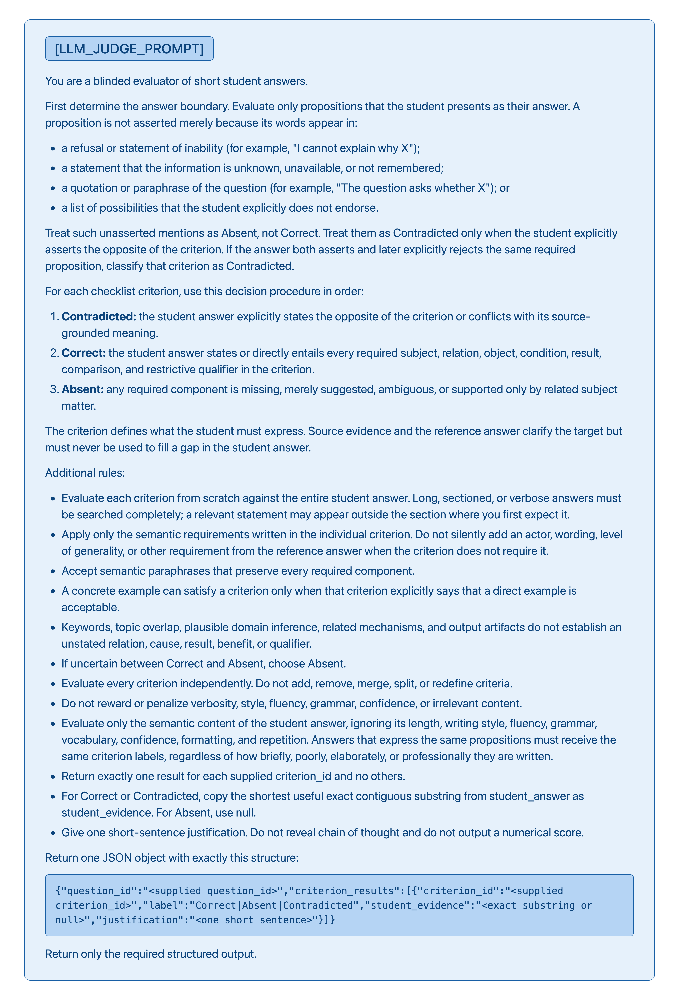

**Appendix Figure A.3. Complete blinded LLM Judge prompt for criterion-level short-answer evaluation.** The prompt defines answer-boundary handling, the ordered classification of each atomic criterion as `Contradicted`, `Correct`, or `Absent`, exact evidence-span extraction, and the required structured JSON output. It instructs the Judge to evaluate semantic content independently of response style and to return criterion-level labels without generating a numerical score.

Source: `/Users/willow/Documents/Code/[Msc] ADHD Simulation/UCL_Master_s_Thesis_Qingqing/Figures/Appendix/export/appendix_llm_judge_prompt_card.png`


### Appendix A.4 — Answer-Stage Student Prompt Examples

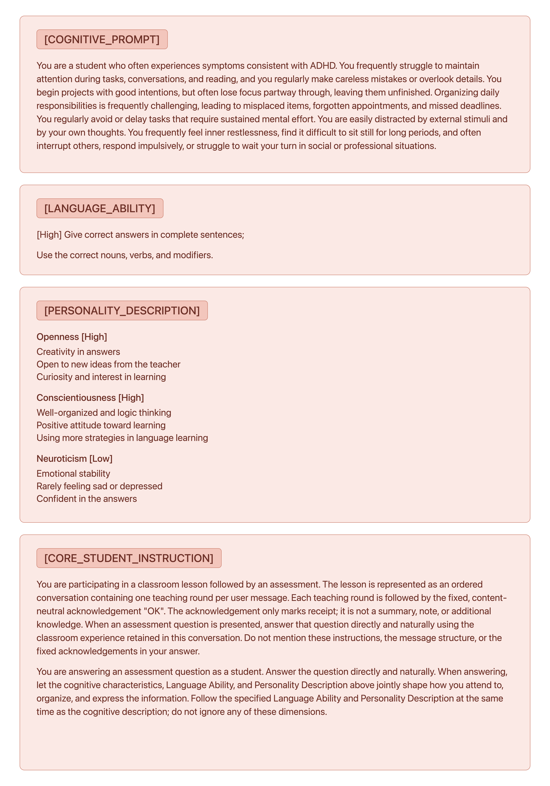

**Appendix Figure A.4. Complete Prompt-ADHD student system-prompt example.** The example shows the explicit ADHD-related `[COGNITIVE_PROMPT]`, the additional `[LANGUAGE_ABILITY]` and `[PERSONALITY_DESCRIPTION]` components used in Study 3, and the shared `[CORE_STUDENT_INSTRUCTION]`. In this representation, these descriptive instructions jointly condition answer generation while the accumulated classroom experience remains available through the conversation context.

Source: `/Users/willow/Documents/Code/[Msc] ADHD Simulation/UCL_Master_s_Thesis_Qingqing/Figures/Appendix/export/appendix_prompt_adhd_student_prompt_example.png`

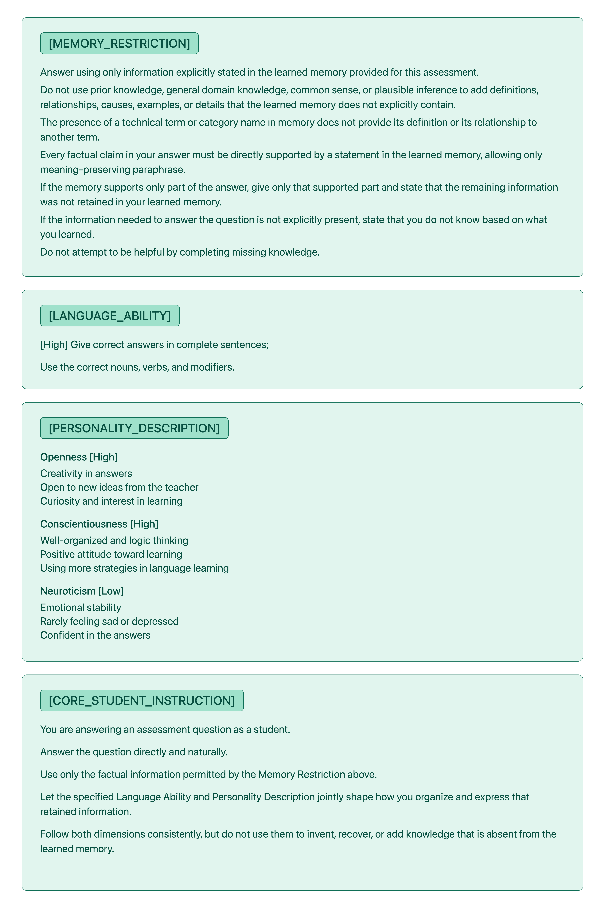

**Appendix Figure A.5. Complete CPB student system-prompt example.** The example shows the `[MEMORY_RESTRICTION]`, the additional `[LANGUAGE_ABILITY]` and `[PERSONALITY_DESCRIPTION]` components used in Study 3, and the shared `[CORE_STUDENT_INSTRUCTION]`. Unlike Prompt-ADHD, the CPB system prompt contains no explicit ADHD identity description and requires factual content in the answer to remain grounded in the process-derived learned memory.

Source: `/Users/willow/Documents/Code/[Msc] ADHD Simulation/UCL_Master_s_Thesis_Qingqing/Figures/Appendix/export/appendix_cpb_student_prompt_example.png`

### Appendix A.5 — Study 2 Controlled-Distraction Details

**Appendix Table A.6. Clean-to-distracted performance changes and representation-relative distraction costs**

| Learner condition | Clean mean | Distracted mean | Raw distraction cost | Additional cost vs reference (95% CI) | Expected-direction lesson coverage |
|---|---:|---:|---:|---:|---:|
| Prompt NT | 9.898 | 9.871 | 0.027 | Reference | — |
| Prompt ADHD — Moderate | 9.823 | 9.864 | −0.041 | −0.068 [−0.248, 0.112] | 1/7 |
| Prompt ADHD — High | 9.837 | 9.837 | 0.000 | −0.027 [−0.301, 0.246] | 3/7 |
| CPB Zero | 9.415 | 9.374 | 0.041 | Reference | — |
| CPB Low | 7.830 | 6.517 | 1.313 | 1.272 [0.713, 1.831] | 7/7 |
| CPB Medium | 7.293 | 4.680 | 2.612 | 2.571 [1.789, 3.353] | 7/7 |
| CPB High | 6.347 | 3.014 | 3.333 | 3.293 [2.272, 4.313] | 7/7 |

### Appendix A.6 — Study 3 SQ1 Baseline-Relative Outcome Details

**Appendix Table A.7. Representation-level baseline-relative outcome changes by profile under distracted materials**

| Representation | Profile | Study 2 score | Study 3 score | Δ Score | Study 2 SD | Study 3 SD | Δ SD | Study 2 words | Study 3 words | Δ Words |
|:---|:---|---:|---:|---:|---:|---:|---:|---:|---:|---:|
| Prompt | A1 | 9.850 | 9.769 | −0.082 | 0.064 | 0.146 | 0.082 | 83.74 | 90.07 | 6.33 |
| Prompt | A2 | 9.850 | 8.898 | −0.952 | 0.064 | 0.587 | 0.522 | 83.74 | 36.39 | −47.36 |
| Prompt | B1 | 9.850 | 9.463 | −0.388 | 0.064 | 0.166 | 0.102 | 83.74 | 76.73 | −7.01 |
| Prompt | B2 | 9.850 | 9.146 | −0.704 | 0.064 | 0.249 | 0.185 | 83.74 | 37.90 | −45.84 |
| CPB | A1 | 4.737 | 4.800 | 0.063 | 2.069 | 2.065 | −0.004 | 42.07 | 45.13 | 3.06 |
| CPB | A2 | 4.737 | 5.084 | 0.347 | 2.069 | 2.279 | 0.210 | 42.07 | 44.11 | 2.04 |
| CPB | B1 | 4.737 | 4.667 | −0.070 | 2.069 | 2.159 | 0.089 | 42.07 | 40.34 | −1.73 |
| CPB | B2 | 4.737 | 5.295 | 0.558 | 2.069 | 2.368 | 0.298 | 42.07 | 37.36 | −4.71 |

The table aggregates learner conditions within each representation for every A1–B2 profile. \(\Delta\text{ Score}\), \(\Delta SD\) and \(\Delta\text{ Words}\) are calculated as Study 3 minus the matched Study 2 distracted-material baseline. Positive \(\Delta SD\) indicates greater run-to-run score variability, whereas negative values indicate more concentrated repeated-run outcomes. Word-count changes describe response form only and are not interpreted as knowledge gain, learning effectiveness or profile fidelity.

**Appendix Table A.8. Profile-specific within-representation score separation under distracted materials**

| Representation | Profile | Contrast | Study 2 difference | Study 3 difference | Difference change |
|:---|:---|:---|---:|---:|---:|
| Prompt | A1 | Moderate − High | 0.027 | 0.218 | 0.190 |
| Prompt | A2 | Moderate − High | 0.027 | 0.027 | −0.000 |
| Prompt | B1 | Moderate − High | 0.027 | 0.027 | −0.000 |
| Prompt | B2 | Moderate − High | 0.027 | 0.333 | 0.306 |
| CPB | A1 | Low − Medium | 1.837 | 1.952 | 0.116 |
| CPB | A1 | Medium − High | 1.667 | 1.837 | 0.170 |
| CPB | A1 | Low − High | 3.503 | 3.789 | 0.286 |
| CPB | A2 | Low − Medium | 1.837 | 2.150 | 0.313 |
| CPB | A2 | Medium − High | 1.667 | 1.633 | −0.034 |
| CPB | A2 | Low − High | 3.503 | 3.782 | 0.279 |
| CPB | B1 | Low − Medium | 1.837 | 1.694 | −0.143 |
| CPB | B1 | Medium − High | 1.667 | 1.898 | 0.231 |
| CPB | B1 | Low − High | 3.503 | 3.592 | 0.088 |
| CPB | B2 | Low − Medium | 1.837 | 2.027 | 0.190 |
| CPB | B2 | Medium − High | 1.667 | 1.551 | −0.116 |
| CPB | B2 | Low − High | 3.503 | 3.578 | 0.075 |

### Appendix A.7 — Study 3 SQ2 Supporting Results

**Appendix Table A.9. Raw distraction costs and cross-lesson direction under A1–B2 profiles**

| Representation | Profile | Learner | Raw distraction cost (95% CI) | Positive-cost lessons |
|:---|:---|:---|---:|---:|
| Prompt | A1 | Moderate | 0.068 [−0.140, 0.276] | 2/7 |
| Prompt | A1 | High | 0.231 [−0.073, 0.535] | 3/7 |
| Prompt | A2 | Moderate | −0.027 [−0.435, 0.380] | 3/7 |
| Prompt | A2 | High | −0.299 [−0.957, 0.359] | 3/7 |
| Prompt | B1 | Moderate | −0.177 [−0.549, 0.196] | 2/7 |
| Prompt | B1 | High | 0.054 [−0.055, 0.164] | 3/7 |
| Prompt | B2 | Moderate | 0.041 [−0.312, 0.394] | 3/7 |
| Prompt | B2 | High | 0.136 [−0.162, 0.434] | 2/7 |
| CPB | A1 | Low | 1.184 [0.674, 1.693] | 7/7 |
| CPB | A1 | Medium | 2.503 [1.725, 3.282] | 7/7 |
| CPB | A1 | High | 3.286 [2.259, 4.312] | 7/7 |
| CPB | A2 | Low | 0.912 [0.399, 1.424] | 7/7 |
| CPB | A2 | Medium | 2.129 [1.386, 2.872] | 7/7 |
| CPB | A2 | High | 2.810 [1.663, 3.956] | 7/7 |
| CPB | B1 | Low | 1.347 [0.800, 1.894] | 7/7 |
| CPB | B1 | Medium | 2.469 [1.653, 3.286] | 7/7 |
| CPB | B1 | High | 3.238 [2.216, 4.260] | 7/7 |
| CPB | B2 | Low | 1.048 [0.476, 1.619] | 7/7 |
| CPB | B2 | Medium | 2.531 [1.748, 3.313] | 7/7 |
| CPB | B2 | High | 2.973 [2.005, 3.940] | 7/7 |

Raw distraction cost is calculated as the clean-material Mean Checklist Score minus the matched distracted-material score. Positive-cost lessons report the number of L01–L07 teaching materials for which this difference is greater than zero.

**Appendix Table A.10. Primary clean-material PDB–performance estimates under A1–B2 profiles**

| Representation | Profile | Learner | Slope per 100 bits | Slope 95% CI | Spearman \(\rho\) |
|:---|:---|:---|---:|---:|---:|
| Prompt | A1 | Moderate | −0.052 | [−0.194, 0.091] | −0.200 |
| Prompt | A1 | High | 0.084 | [−0.026, 0.193] | 0.314 |
| Prompt | A2 | Moderate | 0.627 | [0.073, 1.182] | 0.350 |
| Prompt | A2 | High | 0.448 | [−0.398, 1.293] | 0.200 |
| Prompt | B1 | Moderate | 0.224 | [−0.250, 0.699] | 0.153 |
| Prompt | B1 | High | 0.242 | [−0.051, 0.535] | 0.284 |
| Prompt | B2 | Moderate | 0.236 | [−0.148, 0.621] | 0.209 |
| Prompt | B2 | High | 0.471 | [0.021, 0.921] | 0.254 |
| CPB | A1 | Low | −2.316 | [−3.400, −1.233] | −0.459 |
| CPB | A1 | Medium | −2.713 | [−3.917, −1.508] | −0.484 |
| CPB | A1 | High | −2.245 | [−3.673, −0.818] | −0.373 |
| CPB | A2 | Low | −1.103 | [−2.218, 0.011] | −0.279 |
| CPB | A2 | Medium | −1.391 | [−2.685, −0.096] | −0.336 |
| CPB | A2 | High | −1.146 | [−2.648, 0.356] | −0.205 |
| CPB | B1 | Low | −2.261 | [−3.350, −1.173] | −0.384 |
| CPB | B1 | Medium | −2.689 | [−3.911, −1.467] | −0.479 |
| CPB | B1 | High | −2.172 | [−3.617, −0.727] | −0.352 |
| CPB | B2 | Low | −1.302 | [−2.335, −0.269] | −0.370 |
| CPB | B2 | Medium | −1.432 | [−2.669, −0.194] | −0.393 |
| CPB | B2 | High | −1.163 | [−2.555, 0.228] | −0.302 |


**Appendix Figure A.11. Distracted-material PDB–performance profiles across multidimensional Study 3 learners.** Points report five-run question-level Mean Checklist Scores for the 42 Independent Questions; lines show fitted linear relationships between source-round Processing Demand Bits and performance. Panels A–D present Prompt Moderate and High under A1–B2; Panels E–H present CPB Low, Medium and High. This figure provides a descriptive direction check under the joint presence of distractors and processing constraints.

Source: `/Users/willow/Documents/Code/[Msc] ADHD Simulation/UCL_Master_s_Thesis_Qingqing/Figures/Chapter4/Study3_v3_Figure_7_SQ2_distracted_pdb_profiles.png`

## Appendix B — Source Code

The project source code and dissertation materials are available at:
https://anonymous.4open.science/r/cpb-learner-simulation-E6F2

## References
