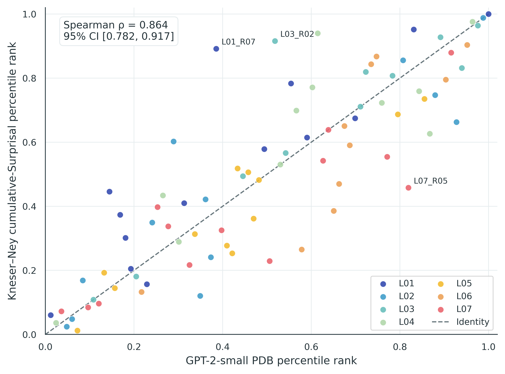
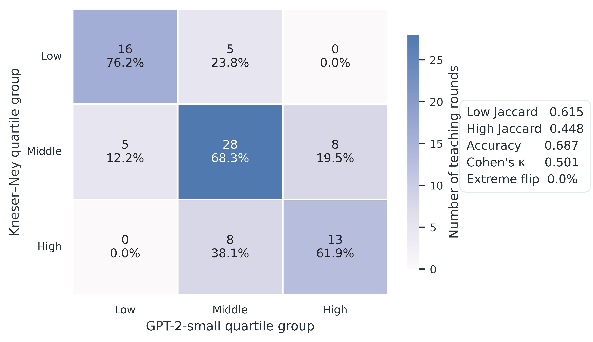
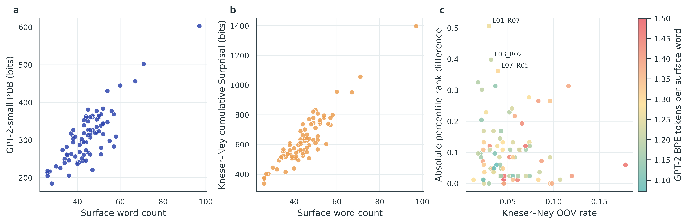
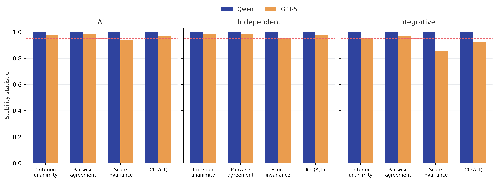
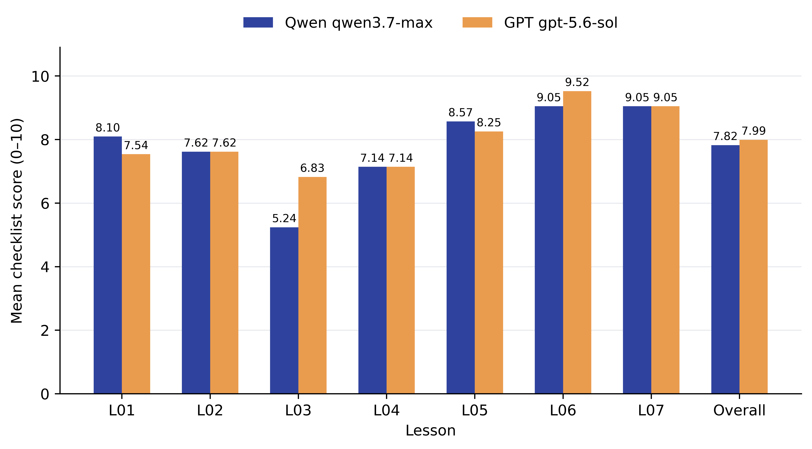
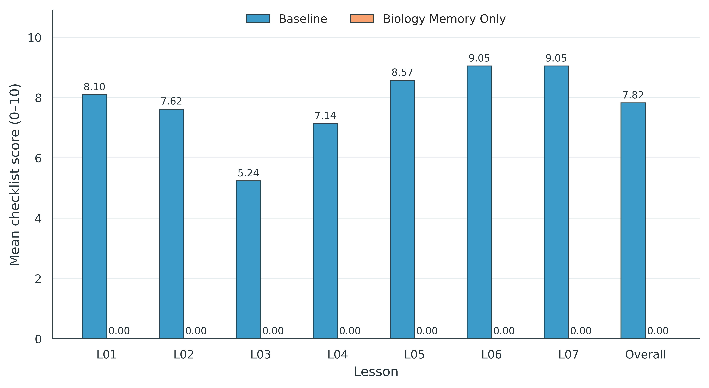
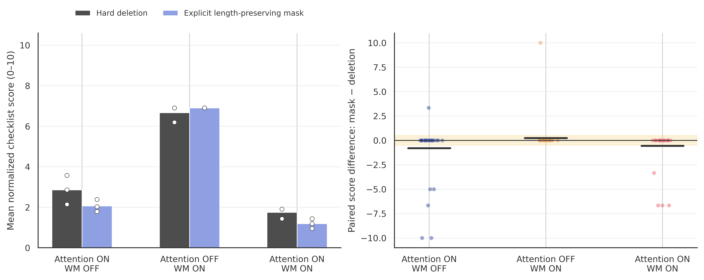
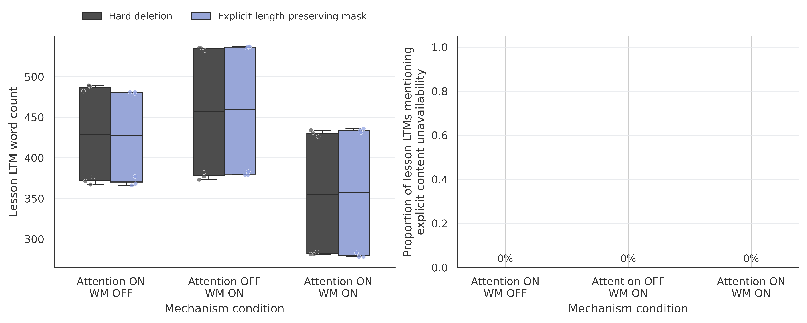

# Beyond Persona Prompting: A Cognitive-Process-Based Framework for ADHD Student Simulation with Large Language Models

## Writing and Formatting Rules

This module records internal drafting requirements that must be applied consistently when writing or revising any dissertation section. It is a drafting aid and is not part of the submitted dissertation.

1. **Table and figure numbering:** Number tables and figures independently and consecutively within each chapter. Do not derive the number from the section or subsection in which the item appears. For example, Chapter 3 tables must be numbered Table 3.1, Table 3.2, Table 3.3, Table 3.4, and so forth; Chapter 3 figures must independently be numbered Figure 3.1, Figure 3.2, Figure 3.3, and so forth. Every in-text reference must match the corresponding caption number.

2. **Named components and generic concepts:** Capitalise the formal names of implemented CPB components, such as Attention Filter, Available Input, Knowledge Encoding, and Explicit Long-Term Memory. Use lower case when referring to the corresponding concept generically rather than to the implemented component.

3. **Experimental condition names:** Use the registered experimental condition labels consistently in prose, tables, figures, filenames, and statistical outputs. At first occurrence, define the complete component state before introducing its short label: Attention Filter disabled (Attention OFF), Attention Filter enabled (Attention ON), Working-Memory Processing Capacity disabled (WM OFF), and Working-Memory Processing Capacity enabled (WM ON). Define compound labels in the same way before using A0W0, A1W0, A0W1, or A1W1. Preserve the agreed capitalisation and hyphenation of representation labels such as Prompt-NT, Prompt-ADHD, CPB-NT, and CPB-ADHD.

4. **References to ADHD:** Distinguish real people, empirical ADHD research, simulated-student conditions, and computational mechanisms. Use “people with ADHD” or “students with ADHD” when referring to human populations and use the registered condition name when referring to an experimental simulation. Do not describe an experimental condition as if it were a real clinical group.

5. **British English:** Use British English consistently throughout the dissertation, except in titles, quotations, software names, variable names, and source text that must retain their original spelling. Examples include behaviour, organisation, normalised, finalised, modelling, labelled, and artefact. Use programme for a research or educational programme and program for computer software.

6. **Acronyms:** Define each acronym at its first occurrence in the Abstract and again at its first occurrence in the main text. Use an acronym consistently after definition when it appears repeatedly. Avoid undefined acronyms in headings and avoid creating an acronym for a term used only a small number of times.

7. **Code identifiers and prose terminology:** Use plain-language technical terms in the main argument and reserve monospace formatting for literal filenames, prompt versions, variable names, schema fields, and stored condition identifiers. Do not substitute an implementation field name for an explanation of the corresponding methodological concept.

8. **Numerical reporting:** Report counts as integers and use consistent decimal precision for the same metric throughout the text, tables, and figures. Include a leading zero for values smaller than one when the statistic can exceed one, and do not report more precision than the measurement or analysis supports.

9. **Statistical notation:** Use consistent notation for descriptive statistics, effect sizes, confidence intervals, significance tests, and sample sizes. Define every non-standard metric before reporting its results. State the statistic and its value explicitly, identify the type of effect size, and use one consistent style for confidence intervals and \(p\) values throughout the dissertation.

10. **Equations and symbols:** Use LaTeX delimiters for mathematical expressions, define every symbol immediately before or after its first equation, and use the multiplication sign rather than the letter x. Number only equations referenced elsewhere. All words and labels within equations must be in English.

11. **Terminological consistency with scoped variation:** Define a canonical base term for each framework, mechanism, experimental factor, metric, and data object. Use grammatically appropriate variants when they identify different functional roles, provided that the referent remains unambiguous. Use the formal component name only when referring to the implemented component; use a generic lower-case term when discussing the broader cognitive or methodological concept. Terms that apply only to CPB must not be used to describe persona-prompted conditions.

| Canonical base term | 适用范围 | 允许的变体 |
|---|---|---|
| Cognitive-Process-Based (CPB) | 总体方法 | CPB framework, CPB representation, CPB approach, CPB pipeline, CPB condition, CPB simulated student |
| persona prompting | Prompt-based 表征方法 | persona-prompting approach, persona-prompted condition, persona-prompted simulated student |
| Attention Filter | CPB 实现组件 | Attention mechanism, Attention factor; use lower-case *attention* for the general cognitive concept |
| Working-Memory Processing Capacity | CPB 实现组件 | WM mechanism, WM capacity, WM factor; use lower-case *working memory* for the general cognitive concept |
| Available Input | CPB 中经过 Attention 和 WM 后的显式状态 | available instructional input; do not use for a persona baseline unless that condition actually produces this state |
| Knowledge Encoding | CPB 的编码阶段 | Encoding stage, Encoder; use lower-case *knowledge encoding* in general theoretical discussion |
| Explicit Long-Term Memory | CPB 的显式记忆状态 | Explicit LTM, CPB memory state; do not use for a context-only persona baseline |
| Memory-Constrained Question Answering | 仅适用于只能访问 Explicit LTM 的 CPB 问答过程 | memory-constrained QA, CPB answer generation |
| persona-prompted question answering | Prompt baseline 的回答过程 | persona-based answer generation, Prompt-condition QA |
| Processing Demand Bits (PDB) | 教学材料的处理需求代理指标 | PDB, source-round PDB, PDB value |
| Question-Targeted Distractor Assignment | 实验操纵构造程序 | distractor assignment, target assignment, after the full term has been defined and the referent is clear |
| Target Criterion Coverage | distractor target 的覆盖指标 | target criterion coverage, coverage proportion; no abbreviation is required unless usage becomes frequent |
| criterion-level LLM-as-a-Judge scoring | 所有条件共享的评分方法 | criterion-level Judge, Judge scoring |
| atomic checklist criterion | 评分单元 | criterion, checklist criterion |

The following scope boundaries must be preserved:

| Process or state | CPB | Persona baseline |
|---|---|---|
| Learning-input state | Available Input | conversational or instructional context |
| Memory state | Explicit Long-Term Memory | conversation context; no independently maintained Explicit LTM |
| Answering process | Memory-Constrained Question Answering | persona-prompted question answering |
| Learner representation | CPB representation | persona-prompted representation |
| Traceable intermediate state | CPB processing record | normally limited to the prompt, context, and generated answer |

12. **Language of the dissertation body:** All submitted dissertation content must be written in English and must not contain Chinese characters, Chinese full-width punctuation, or Chinese-language labels inside equations, tables, figures, captions, footnotes, or appendices. Chinese text is permitted only inside the internal Writing and Formatting Rules module of the Markdown master draft and must not be transferred to the submitted TeX manuscript.

## Drafting Status Tracker

This tracker is an internal drafting aid and is not part of the submitted dissertation. Status codes are: **0** — not drafted; **1** — initial draft awaiting confirmation; **2** — initially confirmed; **3** — manually confirmed; **4** — transferred to the TeX project; and **5** — finally confirmed. Parent rows describe the overall stage reached by that part of the document; the more granular child rows remain the source of truth for section-level progress.

<!-- CANONICAL DATA SOURCE: All dissertation prose and final experiments must use processed_teaching_materials_v2/frozen_v1_0_0. Development lesson files, candidate files, and historical distractor manifests are non-canonical and must not be cited as final evidence. -->

| Section | Title | Status |
|---|---|---:|
| FM.1 | Title-page metadata | 1 |
| FM.2 | Abstract | 0 |
| FM.3 | Acknowledgements | 0 |
| FM.4 | Declaration | 1 |
| FM.5 | Acronyms | 1 |
| FM.6 | Contents | 0 |
| 1 | Introduction | 0 |
| 1.1 | Background and Motivation | 0 |
| 1.2 | The Representation Problem | 0 |
| 1.3 | ADHD Student Simulation as the Research Case | 0 |
| 1.4 | Research Aim and Research Questions | 0 |
| 1.5 | Research Objectives | 0 |
| 1.6 | Contributions | 0 |
| 1.7 | Thesis Structure | 0 |
| 2 | Related Work and Background | 0 |
| 2.1 | LLM-Based Student Simulation | 0 |
| 2.2 | Persona Prompting for Learner Representation | 0 |
| 2.3 | The Representation Challenge of Multidimensional Learner Characteristics | 0 |
| 2.4 | ADHD-Related Characteristics and Learning Processes | 0 |
| 2.5 | Process- and State-Based Approaches to Learner Modelling | 0 |
| 2.6 | Evaluation of Simulated Learners and Learning Outcomes | 0 |
| 2.6.1 | Evaluation of Learner Simulation and Persona Fidelity | 0 |
| 2.6.2 | Rubric-Based Short Answer Assessment | 0 |
| 2.6.3 | LLM-as-a-Judge and Checklist-Based Evaluation | 0 |
| 2.7 | Explicit Knowledge States, Process Transparency and Traceability | 0 |
| 2.8 | Research Gap and Design Requirements | 0 |
| 3 | Materials and Methods | 1 |
| 3.1 | Research Design and Overall Strategy | 1 |
| 3.1.1 | Overall Research Strategy | 1 |
| 3.1.2 | Research Questions and Experimental Mapping | 1 |
| 3.1.3 | Controlled-Variable Principles | 1 |
| 3.2 | Instructional Materials and Preprocessing | 2 |
| 3.2.1 | Source Materials | 2 |
| 3.2.2 | Coreference Resolution and Text Preprocessing | 2 |
| 3.2.3 | Teaching-Round Segmentation | 2 |
| 3.2.4 | Instructional Corpus Characterisation | 2 |
| 3.2.5 | Classroom-Input Representations | 2 |
| 3.3 | Cognitive-Process-Based Framework | 2 |
| 3.3.1 | Attention Filter | 2 |
| 3.3.2 | Working-Memory Processing Capacity | 2 |
| 3.3.2.1 | Processing Demand | 2 |
| 3.3.2.2 | WM Capacity Threshold | 2 |
| 3.3.3 | Knowledge Encoding | 2 |
| 3.3.4 | Explicit Long-Term Memory | 2 |
| 3.3.5 | Memory-Constrained Question Answering | 2 |
| 3.4 | Experimental Manipulations and Assessment Design | 1 |
| 3.4.1 | Question Construction and Candidate Eligibility | 1 |
| 3.4.2 | Processing-Demand Stratification and Final Item Selection | 1 |
| 3.4.3 | Scoring Rubric and Atomic Checklist Criteria | 1 |
| 3.4.4 | Question-Targeted Distractor Assignment | 1 |
| 3.4.5 | Criterion-Level LLM-as-a-Judge Scoring | 1 |
| 3.5 | Methodological Validation and Quality Assurance | 1 |
| 3.5.1 | Teaching-Material Integrity Checks | 2 |
| 3.5.2 | Processing-Demand Sensitivity Analysis | 2 |
| 3.5.3 | LLM-Judge Reliability and Human Validation | 1 |
| 3.5.4 | Pretrained-Knowledge and Memory-Access Controls | 2 |
| 3.5.5 | Attention-Filter Implementation Sensitivity | 2 |
| 3.6 | Main Experimental Design | 0 |
| 3.6.1 | End-to-End Experimental Workflow | 0 |
| 3.6.2 | Study 1 — Cognitive-Mechanism Validation | 0 |
| 3.6.3 | Study 2 — CPB versus Persona-Prompted Simulation | 0 |
| 3.6.4 | Study 3 — Cross-Attribute Robustness | 0 |
| 3.7 | Evaluation Metrics and Statistical Analysis | 0 |
| 3.7.1 | RQ1 — Process and Information-Retention Metrics | 0 |
| 3.7.2 | RQ2 — Learning-Performance and Representation Metrics | 0 |
| 3.7.3 | RQ3 — Robustness and Attribute-Preservation Metrics | 0 |
| 3.7.4 | Statistical Analysis | 0 |
| 3.8 | Implementation, Reproducibility and Ethics | 0 |
| 3.8.1 | Models and Generation Settings | 0 |
| 3.8.2 | Versioning, Caching and Reproducibility | 0 |
| 3.8.3 | Ethical Scope and Interpretation | 0 |
| 4 | Results | 0 |
| 4.1 | Results Overview | 0 |
| 4.2 | RQ1 — Cognitive-Mechanism Effects | 0 |
| 4.2.1 | Attention-Filtering Effects | 0 |
| 4.2.2 | Working-Memory Processing Capacity Effects | 0 |
| 4.2.3 | Combined Attention × WM Effects | 0 |
| 4.2.4 | Source → Available Input → LTM | 0 |
| 4.2.5 | RQ1 Summary | 0 |
| 4.3 | RQ2 — CPB versus Persona-Prompted ADHD Simulation | 0 |
| 4.3.1 | Persona-Prompted NT–ADHD Differentiation | 0 |
| 4.3.2 | Graded CPB Constraint Effects | 0 |
| 4.3.3 | Sensitivity to Processing Demand | 0 |
| 4.3.4 | Independent versus Integrative Learning | 0 |
| 4.3.5 | RQ2 Summary | 0 |
| 4.4 | RQ3 — Cross-Attribute Robustness | 0 |
| 4.4.1 | Aligned-Profile Sensitivity | 0 |
| 4.4.2 | Conflict-Profile Robustness | 0 |
| 4.4.3 | Preservation of ADHD-Related Learning Effects | 0 |
| 4.4.4 | Attribute Fidelity and Cross-Attribute Interference | 0 |
| 4.4.5 | Prompt-Based versus Factorised Representation | 0 |
| 4.4.6 | RQ3 Summary | 0 |
| 4.5 | Summary of Findings | 0 |
| 5 | Discussion | 0 |
| 5.1 | Answering the Main Research Question | 0 |
| 5.2 | Interpreting the Cognitive-Process Results | 0 |
| 5.3 | What Persona Prompting Can and Cannot Represent | 0 |
| 5.4 | Factorised Student Representation | 0 |
| 5.5 | Implications for LLM-Based Learner Simulation | 0 |
| 5.5.1 | From Persona Description to Functional Representation | 0 |
| 5.5.2 | Learner Models May Need to Be Factorised Rather Than Monolithic | 0 |
| 5.5.3 | Evaluation Should Target Learning Processes and Outcomes, Not Only Persona Plausibility | 0 |
| 5.5.4 | Traceability May Be Important for Scientific Uses of Synthetic Learners | 0 |
| 5.5.5 | Implications for Educational Use | 0 |
| 5.6 | Strengths and Limitations | 0 |
| 5.7 | Ethical Interpretation | 0 |
| 6 | Conclusions | 0 |
| 7 | Future Work | 0 |
| REF | References | 0 |
| APP | Appendices | 0 |

<!-- Persona prompting's representation gap → Cognitive-Process-Based technical contribution → ADHD student-simulation scope → LLM implementation setting. -->

- **Author:** Qingqing Liu
- **Student Number:** 25098690
- **Supervisor:** Dr Sahan Bulathwela
- **Faculty:** Faculty of Engineering
- **Department:** Department of Computer Science
- **University:** University College London
- **Degree:** MSc Artificial Intelligence for Sustainable Development
- **Report statement:** A Project Report Presented in Partial Fulfilment of the Degree
- **Submission date:** September 1, 2026
- **Keywords:** large language models; simulated students; ADHD; learner modelling; working memory

## Abstract Page

<!-- Background → research gap → CPB method → three experimental studies → main results → cautious conclusion. -->

## Acknowledgements

<!-- Acknowledge supervisory guidance → academic and technical support → personal support. -->

## Declaration

I, Qingqing Liu, declare that the thesis has been composed by myself and that the work has not been submitted for any other degree or professional qualification. I confirm that the work submitted is my own, except where work which has formed part of jointly-authored publications has been included and referenced. The report may be freely copied and distributed provided the source is explicitly acknowledged.

- **Signature:** ______________________________
- **Date:** September 1, 2026

## Acronyms

<!-- Define recurring terms consistently → reduce repetition → support technical readability. -->

- **ACU:** Atomic Content Unit
- **ADHD:** Attention-Deficit/Hyperactivity Disorder
- **CPB:** Cognitive-Process-Based
- **LLM:** Large Language Model
- **LTM:** Long-Term Memory
- **NT:** Neurotypical
- **RQ:** Research Question
- **WM:** Working Memory

## Contents

<!-- Present the complete thesis hierarchy → support navigation → keep chapter and section numbering aligned. -->

## 1  Introduction

<!-- Educational value of LLM simulated students → learner-representation mismatch → ADHD as the research case → CPB aim, questions, and contributions. -->

### 1.1 Background and Motivation

<!-- Educational tutoring and intervention needs → value of LLM simulated students → importance of representing learner characteristics. -->

### 1.2 The Representation Problem

<!-- Multidimensional learner characteristics → monolithic persona representation → representation ambiguity and causal ambiguity. -->

### 1.3 ADHD Student Simulation as the Research Case

<!-- ADHD as a multidimensional case → observable behaviour plus attention and working-memory processes → need for process-sensitive representation. -->

### 1.4 Research Aim and Research Questions

<!-- Main research aim → Mechanistic Validity (RQ1) → Comparative Validity (RQ2) → Representational Robustness (RQ3). -->

### 1.5 Research Objectives

<!-- Derive requirements → design a factorised representation → implement CPB → validate mechanisms → compare methods → test multidimensional robustness. -->

### 1.6 Contributions

<!-- Process- and state-based ADHD representation → factorised learner architecture → controlled mechanism validation → traceable evaluation framework. -->

### 1.7 Thesis Structure

<!-- Related work → methods → results → discussion → conclusions → future work. -->

## 2  Related Work and Background

<!-- Learner-simulation field → persona prompting → heterogeneous-representation challenge → ADHD learning processes → process/state alternatives → evaluation and traceability gaps. -->

### 2.1 LLM-Based Student Simulation

<!-- Educational uses and capabilities → simulated-learner development → learner representation as the central methodological question. -->

### 2.2 Persona Prompting for Learner Representation

<!-- Persona/profile prompting methods → strengths for observable attributes → convenience and flexibility → limitation of placing heterogeneous attributes in one prompt. -->

### 2.3 The Representation Challenge of Multidimensional Learner Characteristics

<!-- Learners are multidimensional → coexistence does not imply one computational mechanism → representation should match functional role. -->

### 2.4 ADHD-Related Characteristics and Learning Processes

<!-- Attention allocation and distractibility → working-memory and processing constraints → knowledge acquisition and retention → behavioural manifestations. -->

### 2.5 Process- and State-Based Approaches to Learner Modelling

<!-- Explicit learner models → cognitive/process models → knowledge-state and memory representations → precedent for Attention → WM → Encoding → LTM. -->

### 2.6 Evaluation of Simulated Learners and Learning Outcomes

<!-- Persona and behavioural fidelity → task-performance evaluation → limits of self-consistency validation → need for process-sensitive evidence. -->

#### 2.6.1 Evaluation of Learner Simulation and Persona Fidelity

<!-- Behavioural fidelity → persona fidelity → neurodivergent-simulation validation → distinguish identity consistency from learning-process validity. -->

#### 2.6.2 Rubric-Based Short Answer Assessment

<!-- Constructed responses → automatic short-answer scoring → source-grounded rubrics → criterion-level assessment. -->

#### 2.6.3 LLM-as-a-Judge and Checklist-Based Evaluation

<!-- Holistic Judge limitations → structured checklist scoring → criterion-level labels → reliability and stability validation. -->

### 2.7 Explicit Knowledge States, Process Transparency and Traceability

<!-- Black-box input/output limitation → explicit Source → Available Input → LTM → Answer chain → inspectability and error attribution. -->

### 2.8 Research Gap and Design Requirements

<!-- Representation conflation + process opacity + evaluation limitation → functional representation + factorisation + explicit knowledge state + traceability + controlled evaluation. -->

## 3  Materials and Methods

<!-- Research strategy → materials → CPB components → assessment → methodological validation → main studies → metrics and reproducibility. -->

<!-- Chapter-level organising question: Can the experimental apparatus be trusted? -->

### 3.1 Research Design and Overall Strategy

<!-- Establish the three-stage evidence strategy → connect RQs to studies → define controlled-variable principles. -->

#### 3.1.1 Overall Research Strategy ⚠️

<!-- Mechanism Validation → Representation Comparison → Multidimensional Robustness. -->

This thesis used a staged experimental strategy to evaluate learner representation at three progressively broader levels: mechanistic validity, comparative validity, and representational robustness. The stages were ordered deliberately. A difference in a simulated student's final answer cannot by itself establish that an intended learning mechanism operated, because similar outputs may arise from prompt style, pre-existing model knowledge, or stochastic generation. The first study therefore examined the operation of the proposed mechanisms before the later studies compared representation approaches and introduced additional learner attributes.

Study 1 tested mechanistic validity through a \(2 \times 2\) ablation of two CPB components. The complete component states were Attention Filter disabled (Attention OFF), Attention Filter enabled (Attention ON), Working-Memory Processing Capacity disabled (WM OFF), and Working-Memory Processing Capacity enabled (WM ON). Their four factorial combinations were Attention OFF/WM OFF (A0W0), Attention ON/WM OFF (A1W0), Attention OFF/WM ON (A0W1), and Attention ON/WM ON (A1W1). The study's primary purpose was to establish whether enabling each mechanism changed the information-processing record in the direction specified by the implementation. Learning scores were retained as downstream supporting evidence rather than treated as the sole manipulation check. Study 2 then tested comparative validity by placing persona-prompted and Cognitive-Process-Based (CPB) simulated students in the same instructional and assessment setting. Its persona-prompted profiles represented neurotypical (NT) and attention-deficit/hyperactivity disorder (ADHD)-related characteristics and were labelled Prompt-NT and Prompt-ADHD. This comparison examined whether representation methods differed in their sensitivity to controlled classroom distraction and source-round processing demand. Study 3 addressed representational robustness by adding language-ability and personality attributes and comparing a joint persona representation with a factorised CPB representation.

The three stages shared one experimental backbone. A frozen instructional corpus supplied the learning material; the assigned learner representation determined how that material was processed; the simulated student completed a fixed short-answer assessment; and a condition-blind criterion-level evaluator scored the answers. Intermediate artefacts were retained wherever the representation exposed them. The design could therefore compare not only final performance but also whether an observed error could be traced to a controlled change earlier in the learning pipeline. Sections 3.2–3.5 define the common materials, mechanisms, assessment, and validation procedures before Section 3.6 specifies the three studies in detail.

#### 3.1.2 Research Questions and Experimental Mapping ⚠️

Each research question was assigned a distinct evidential role within the overall research strategy. Research Question 1 (RQ1) examines whether the cognitive mechanisms implemented in CPB produce the intended and traceable changes in information processing. Research Question 2 (RQ2) then compares CPB with persona prompting to determine whether the two representation approaches produce different learning behaviour under controlled instructional conditions. Research Question 3 (RQ3) evaluates whether the relevant ADHD-related learning effects remain robust and separable when additional learner attributes are introduced. Table 3.1 summarises this mapping. Detailed operational definitions, experimental parameters, and evaluation metrics are introduced only after the corresponding materials and mechanisms have been defined.

**Table 3.1. Mapping between the research questions, evidential roles, experimental comparisons, and primary evidence.**

| Research question                                            | Evidential role                       | Experimental comparison                                      | Primary evidence                                             |
| ------------------------------------------------------------ | ------------------------------------- | ------------------------------------------------------------ | ------------------------------------------------------------ |
| **RQ1 — Mechanism:** Does the CPB processing pipeline produce intended and traceable transitions from instructional information, through attention, working-memory processing and encoding, to the downstream knowledge state? | Mechanistic validity                  | **Study 1:** 2 × 2 Attention OFF/ON × WM OFF/ON ablation with a shared encoding stage and an A0W0 encoding-only baseline. | Mechanism activation records, changes in information availability, downstream knowledge retention, and supporting score patterns |
| **RQ2 — Representation:** Compared with persona prompting, does CPB produce learning behaviour that shows more theoretically consistent sensitivity to controlled distraction and processing demand? | Comparative representational validity | **Study 2:** Matched Prompt-NT, Prompt-ADHD, CPB-NT and CPB-ADHD conditions under controlled distraction and processing-demand manipulations. | Distraction sensitivity, processing-demand sensitivity, retained knowledge, learning performance, and error traceability |
| **RQ3 — Multidimensional Robustness:** When additional functionally heterogeneous learner characteristics are introduced, does a factorised CPB representation preserve learning-related patterns and constraint structure more consistently than joint persona prompting? | Representational robustness           | **Study 3:** Matched aligned and conflicting attribute profiles under prompt-based and factorised representations | Preservation of constraint-related effects, attribute fidelity, cross-attribute interference, and run-to-run robustness |

The main research question is answered by integrating these three forms of evidence rather than by treating any single score comparison as decisive. Study 1 first establishes whether the computational mechanisms operate as specified. The comparative results of Studies 2 and 3 are then interpreted on the basis of that mechanistic validation.


#### 3.1.3 Controlled-Variable Principles

<!-- Hold materials, models, prompts, and assessment constant → manipulate only target factors → keep condition metadata blind to the Judge. -->

The design followed three controlled-variable principles. First, task inputs and measurements were held constant across comparisons wherever they were not the variable of interest. Conditions used the same frozen lessons, lesson order, selected questions, source-grounded checklists, underlying answer-generation model, and scoring procedure. Components that necessarily differed because they constituted the representation manipulation were changed explicitly and versioned rather than treated as hidden implementation variation.

Second, each study isolated a different level of the representation. Study 1 changed only the binary mechanism settings within CPB. Study 2 compared persona prompting with graded CPB constraints while retaining the same distractor-bearing instructional corpus and assessment. Study 3 applied the same four contrastive combinations of language ability and personality to the two representation approaches; within matched CPB runs, the learning trajectory was held constant across the added response-facing profiles. This separation prevented language or personality instructions from retroactively altering an already determined CPB processing record.

Third, generation variability and evaluation were controlled separately. Stochastic experimental runs retained their random seeds and complete output artefacts so that an individual trajectory could be reproduced without requiring trajectories at different profile levels to be nested. The evaluator was blinded to student identity, representation, profile, mechanism settings, processing records, and condition labels. These metadata were joined to the score record only after evaluation. Question selection, source mapping, rubric content, and experimental conditions were frozen before answer generation and were not revised in response to observed scores.

### 3.2 Instructional Materials and Preprocessing

<!-- Raw/OpenStax material → reference-resolved text → teaching-round segmentation → frozen instructional corpus; this section defines only what the model is taught. -->

#### 3.2.1 Source Materials

<!-- Seven OpenStax-derived finance lessons → provenance and content scope → single-domain selection rationale → suitability for controlled short-answer learning. -->

The instructional corpus comprised seven English-language lessons adapted from Sections 1.1–1.7 of *OpenStax Principles of Finance 2e*. The lessons covered the definition and role of finance, the use of data and technology, careers in finance, financial markets and participants, microeconomic and macroeconomic influences, and financial instruments. A single subject area was used to reduce variation attributable to disciplinary genre while retaining a mixture of definitions, factual relations, comparisons, processes, examples, and causal or conditional information suitable for short-answer assessment.

Each lesson was represented in a structured format containing source metadata, learning objectives, the cleaned instructional text, teaching-round segmentation, and links to the corresponding assessment items. Lesson identifiers and source attribution were retained throughout preprocessing to preserve traceability between the adapted instructional materials and their original source.

To ensure experimental consistency, the final instructional corpus and associated assessment materials were frozen as dataset version `1.0.0` prior to the main experiments. The same frozen materials were subsequently used across all experimental conditions.

#### 3.2.2 Coreference Resolution and Text Preprocessing

<!-- Resolve cross-sentence and cross-round references before segmentation → prevent artificial ambiguity → preserve instructional meaning, knowledge content, and information order. -->

The source summaries were preprocessed before teaching-round segmentation so that each sentence could be interpreted without relying on an antecedent located in a previous round. Context-dependent sentence openings, including unresolved uses of *it*, *they*, and similarly underspecified noun phrases, were replaced with explicit referents where necessary. This operation was restricted to reference resolution: it was not intended to introduce new instructional claims, simplify the underlying finance content, or alter the order in which information was presented.

Following preprocessing, each sentence was reviewed for local interpretability. The review asked whether a student receiving the sentence as part of a short teaching round could identify the subject, relation, and relevant object or outcome without access to an earlier round. The resulting context-independent text formed the clean instructional source from which all experimental conditions were derived.

#### 3.2.3 Teaching-Round Segmentation

<!-- Preserve semantic and local coherence → construct frozen two- or three-sentence learning units → assign Lesson → Round → Sentence identifiers shared by all conditions. -->

The preprocessed lessons were divided into teaching rounds containing two or three complete source sentences. Original sentences were not split merely to equalise round length, because syntactic splitting could interrupt a relation or create a fragment that remained difficult to interpret despite coreference resolution. The segmentation procedure instead sought a practical balance between local coherence and moderately comparable round length while preserving source order.

Rounds were assigned identifiers of the form `R01`, `R02`, and so forth within each lesson. Sentences were assigned nested identifiers such as `R01_S01` and `R01_S02`. Each round stored its ordered sentence objects, reconstructed `instructional_text`, and deterministic surface-word count. This stable Lesson–Round–Sentence hierarchy allowed subsequent stages to refer to an exact source span without changing the instructional text or relying on approximate string matching.

Surface words were counted using a frozen deterministic rule for the English materials: alphanumeric sequences were counted as one word, with internal apostrophes and hyphens retained within a token. Word count was stored as a descriptive length measure rather than treated as an equivalent of semantic information or cognitive load.

#### 3.2.4 Instructional Corpus Characterisation

The descriptive characterisation examined whether the seven lessons provided a sufficiently coherent corpus for controlled within-corpus comparison without requiring the lessons to be identical in length. At this stage, the analysis concerned only the instructional material that could be presented to a simulated student. Experimental manipulations and assessment artefacts were excluded because they are introduced separately in Sections 3.3 and 3.4.

The frozen corpus comprised 83 teaching rounds and 201 complete sentences, containing 3,719 surface words. Lesson length ranged from 10 to 14 rounds, from 26 to 32 sentences, and from 474 to 671 surface words (Table 3.2). These differences reflect variation in the source content rather than condition-specific preprocessing.

**Table 3.2. Descriptive characteristics of the frozen instructional corpus.**

| Lesson | Teaching rounds | Sentences | Surface words |
|---|---:|---:|---:|
| L01 | 14 | 31 | 671 |
| L02 | 12 | 26 | 525 |
| L03 | 11 | 27 | 523 |
| L04 | 11 | 27 | 475 |
| L05 | 12 | 31 | 499 |
| L06 | 10 | 27 | 474 |
| L07 | 13 | 32 | 552 |
| **Total** | **83** | **201** | **3,719** |

Forty-eight rounds contained two sentences and 35 contained three. The mean round length was 44.81 surface words (\(SD = 10.43\)), the median was 44 words, and the observed range was 26–97 words. The comparatively long maximum arose because complete source sentences were retained rather than split mechanically to force uniform length. This decision prioritised local semantic coherence over exact equality in surface length.

The corpus was therefore treated as moderately comparable rather than perfectly balanced. The retained variation is made visible through the frozen round and sentence identifiers and descriptive word counts. These statistics characterise the materials used in this experiment; they are not intended to represent the distribution of instructional units in finance textbooks generally.

#### 3.2.5 Classroom-Input Representations

Each teaching round was retained in two synchronised representations. The clean representation, stored as `instructional_text`, contained only the preprocessed instructional sentences described above. The classroom-event-annotated representation, stored as `text_with_distraction`, preserved the same sentences, order, and identifiers while adding a short non-instructional classroom event in square brackets. Examples of such events included a siren outside the classroom or an object falling to the floor. The annotations represented observable elements of the classroom experience rather than finance knowledge.

Every annotated event was stored together with the identifier of one source sentence positioned immediately after it. This event-to-sentence link constituted an input contract for the later Attention mechanism: the processing stage could identify deterministically which instructional sentence was associated with an event without asking a language model to infer the relevant span. At this point in the methodology, the link specifies only the structure of the available input. The procedure used to choose question-targeted sentences and assign particular events is described separately in Section 3.4.4, after the assessment questions, checklist criteria, and source-evidence mappings have been finalised.

The two representations were required to remain otherwise equivalent. Removing all square-bracketed classroom-event annotations from `text_with_distraction` had to reconstruct `instructional_text` exactly after whitespace normalisation. Consequently, the annotated representation introduced no paraphrase, reordering, or additional instructional proposition. This invariant allowed the clean and event-bearing inputs to be selected through an explicit experimental parameter while preserving a common instructional source.

### 3.3 Cognitive-Process-Based Framework

Persona-prompted simulation can alter the style or content of a model's final response, but it does not expose the intermediate processing stages through which classroom information becomes available, encoded, and later used. The CPB framework was designed to make those stages explicit. Instead of presenting an entire lesson and a learner description in one prompt, CPB transforms each teaching round through a fixed sequence and preserves the intermediate state produced at every stage.

For round \(R_i\), let \(X_i^{\mathrm{src}}\) denote the presented classroom input, \(X_i^{\mathrm{att}}\) the input remaining after Attention Filter processing, \(X_i^{\mathrm{avail}}\) the final information available after application of the Working-Memory Processing Capacity mechanism, and \(M_i\) the memory entry produced from that available information. The learning pipeline is:

\[
X_i^{\mathrm{src}}
\longrightarrow
X_i^{\mathrm{att}}
\longrightarrow
X_i^{\mathrm{avail}}
\longrightarrow
M_i.
\]

Across a lesson, the ordered set of non-empty memory entries forms an Explicit Long-Term Memory state that is subsequently used for question answering. The framework thus separates three conceptually different operations: determining what information remains available, encoding that information into a persistent knowledge state, and generating an answer from the stored state. This separation permits each transformation to be inspected without claiming that the computational operations reproduce the full cognitive processes of a human learner.

The following subsections define the mechanisms in their processing order. Study-specific combinations and parameter values are reported later with the main experimental designs so that the present section remains a definition of the reusable CPB architecture rather than a description of individual experimental conditions.

#### 3.3.1 Attention Filter

The Attention Filter operationalises whether instructional information associated with a registered classroom event remains available for subsequent processing. It consumes the event-annotated round and event-to-sentence link defined in Section 3.2.5, and is applied independently to each eligible teaching round before the Working-Memory Processing Capacity mechanism and Knowledge Encoding. The mechanism does not infer whether free text is distracting; it acts only on the frozen annotations and sentence identifiers supplied by the dataset.

For an eligible round \(R_i\), the Attention-trigger indicator was defined as:

\[
Z_i^{A}
\sim
\operatorname{Bernoulli}(p_A),
\]

where \(p_A \in [0,1]\) is the configured trigger probability. Attention OFF is represented by \(p_A = 0\), deterministic Attention ON by \(p_A = 1\), and intermediate values permit probabilistic triggering. For probabilistic conditions, the uniform draw was derived deterministically from the registered random seed, lesson identifier, and round identifier. This stateless procedure ensures that a saved seed reproduces the same decision regardless of the order in which rounds are processed. A round without a registered classroom event is ineligible to trigger.

When the mechanism did not trigger, all instructional sentences remained available and the classroom-event annotation remained part of the experienced input. When it triggered, the source sentence linked to that event was represented as unavailable through direct deletion:

\[
g_{\mathrm{delete}}(s) = \varnothing,
\]

where \(s\) denotes the registered target sentence. The event annotation itself was retained, while the target instructional content was excluded from all downstream processing. The resulting text formed \(X_i^{\mathrm{att}}\), the input passed to the Working-Memory Processing Capacity stage. If no original instructional sentence remained after the combined upstream transformations, the residual event annotation alone was not treated as learnable instructional content and could not generate a memory entry.

Each decision produced a structured log containing the trigger probability, seed and random draw, event assignment, target sentence identifier, unavailable sentence identifier, and the identifiers of the remaining instructional sentences. These records make the intervention attributable to a specific source span rather than to an unobserved change in the final answer.

Direct deletion was selected after the implementation-sensitivity analysis in Section 3.5.5. It most directly represents the target information as unavailable and introduces no additional missingness statement. It also reduces the amount of text passed downstream, and should therefore be understood as a transparent experimental operationalisation rather than as a complete model of human attentional capture or perceptual duration.

#### 3.3.2 Working-Memory Processing Capacity

The Working-Memory Processing Capacity mechanism is the second information-availability stage in the CPB pipeline. Its input is the instructional information that remains after Attention Filter processing, and its output is the final text made available to Knowledge Encoding. The mechanism was designed to introduce a transparent, demand-sensitive intake constraint: a round whose estimated processing demand exceeds the configured capacity activates a predefined information-removal operation.

The implementation separates two decisions that should not be conflated. Section 3.3.2.1 defines how the processing demand of the original teaching round was calculated offline. Section 3.3.2.2 then defines how a configurable capacity threshold transforms that frozen annotation into a deterministic mechanism decision. This separation allows the same round-level demand value to be reused across conditions while the capacity parameter is manipulated independently.

##### 3.3.2.1 Processing Demand

Surprisal provides an information-theoretic measure of how unexpected a linguistic unit is given its preceding context. For model token \(x_{i,t}\) at position \(t\) in teaching round \(R_i\), token-level Surprisal was defined as:

\[
I(x_{i,t})
=
-\log_2 P\left(x_{i,t}\mid \mathrm{BOS},x_{i,<t}\right),
\]

where \(\mathrm{BOS}\) denotes the round-initial boundary and \(x_{i,<t}\) denotes the preceding tokens within the same round. A token assigned a lower conditional probability receives a larger value, measured in bits.

The use of Surprisal was motivated by expectation-based accounts of incremental language processing. Hale (2001) formalised word-by-word Surprisal as a predictor of sentence-processing difficulty under a probabilistic parsing model. Smith and Levy (2013) subsequently reported a logarithmic relationship between word predictability and reading time across large behavioural datasets, and Shain et al. (2024) found robust logarithmic predictability effects across multiple reading datasets and language models. Predictability-sensitive neural responses have also been observed during continuous natural speech comprehension (Broderick et al., 2019), indicating that Surprisal-related processing is not restricted to screen-based reading.

This evidence supports Surprisal as a correlate of incremental linguistic processing difficulty, but not as a complete measure of comprehension or memory demand. Sentence processing is also affected by dependency locality, retrieval, syntactic integration, discourse context, and prior knowledge. Rathi (2021), for example, found that broad-coverage prediction of reading difficulty benefited from combining neural Surprisal with dependency-based measures. The resulting round-level measure, termed Processing Demand Bits (PDB), is therefore used here within a restricted, study-specific interpretation.

A single value was obtained for each teaching round by summing token-level Surprisal:

\[
D(R_i)
=
\sum_{t=1}^{T_i}
-\log_2 P\left(x_{i,t}\mid \mathrm{BOS},x_{i,<t}\right),
\]

where \(T_i\) is the number of model tokens in the round. The resulting value, stored as `processing_demand_bits`, represents the cumulative language-model-based processing demand of that complete instructional round. Since the value is cumulative, it reflects both the amount of text and its estimated contextual unpredictability. Surface word count was consequently retained as a separate descriptive annotation rather than treated as equivalent to PDB.

The primary estimator was Generative Pre-trained Transformer 2 small (GPT-2 small), an approximately 124-million-parameter autoregressive Transformer, with model and tokenizer fixed at revision `607a30d783dfa663caf39e06633721c8d4cfcd7e` (Radford et al., 2019). GPT-2 directly provides the next-token conditional probabilities required by the equation over byte-level byte-pair encoding (BPE) tokens. It was selected as a transparent measurement instrument because it is publicly available, locally executable, compact enough for repeated central processing unit (CPU)-based rescoring, and not subject to a conventional word-level out-of-vocabulary (OOV) failure. The selection did not assume that a larger or more recent language model would necessarily provide a more human-like estimate. Although improved language modelling has sometimes increased the predictive value of Surprisal for reading time (Goodkind and Bicknell, 2018), increasing Transformer scale does not uniformly improve psycholinguistic fit (Oh and Schuler, 2023).

The model state was reset at the beginning of every teaching round and retained only across tokens within that round. Earlier rounds, classroom-event annotations, learner condition, processing outputs, stored memory, and assessment content were excluded. The reset made the value for a round independent of its location within a lesson and allowed the same frozen annotation to be reused across all simulated learners. PDB was calculated offline before student simulation, stored in the structured lesson record, and never generated or modified by the simulated student model.

Accordingly, PDB is used as a reproducible control variable for ordering the estimated linguistic processing demand of instructional rounds under a fixed model. It is not a count of instructional facts, a direct estimate of comprehension difficulty, a physiological measure of working-memory load, or an estimate of the capacity of a neurotypical learner or a learner with ADHD. The reproducibility and estimator sensitivity of this annotation are evaluated separately in Section 3.5.2.

##### 3.3.2.2 WM Capacity Threshold

Working-Memory Processing Capacity was operationalised as a configurable threshold \(C_{\mathrm{WM}}\) on the frozen round-level PDB annotation. For teaching round \(R_i\), overflow was defined as:

\[
\operatorname{Overflow}(R_i;C_{\mathrm{WM}})
=
\mathbb{1}\left[D(R_i)>C_{\mathrm{WM}}\right].
\]

The comparison always used \(D(R_i)\) for the original clean instructional round. It was not recalculated after Attention Filter processing, because PDB characterises the registered instructional exposure rather than the shorter text that may remain under a particular learner condition. This choice keeps the demand annotation constant while allowing information availability to vary across conditions.

If overflow was not triggered, all instructional sentences remaining after Attention Filter processing proceeded to Knowledge Encoding. If overflow was triggered, the earliest remaining instructional sentence was made unavailable through the same direct-deletion representation defined in Section 3.3.1. This was a single-step, first-in-first-out-style operation: exactly one sentence was removed from an overflowing round, and the mechanism did not continue deleting sentences until the residual text fell below the threshold. The rule therefore represents a controlled intake failure under excessive round-level demand rather than a dynamic model of memory slots or continuous resource depletion.

If upstream Attention Filter processing and the overflow operation together left no original instructional sentence, the next stage received an empty input and did not create a memory entry. The mechanism log retained the round identifier, frozen PDB value, configured threshold, overflow decision, removed sentence identifier, and remaining sentence identifiers, enabling losses attributed to the Working-Memory Processing Capacity mechanism to be distinguished from earlier losses.

The capacity parameter is an experimental control. Altering \(C_{\mathrm{WM}}\) changes which rounds activate the removal rule without altering the source material or its PDB annotation. It does not estimate a participant's biological working-memory capacity, imply that one bit corresponds to one human memory unit, or divide natural instructional language into universally valid capacity bands. The numerical thresholds used by the individual studies are specified with their experimental conditions in Section 3.6.

#### 3.3.3 Knowledge Encoding

Knowledge Encoding converts the final Available Input from one teaching round into one brief memory entry. It follows the information-availability mechanisms so that the encoder cannot recover source sentences that were made unavailable upstream. All CPB conditions used the same DeepSeek Chat model, system prompt, temperature setting, output limit, and retry policy; only the text received by the encoder could differ across processing conditions.

The encoder was instructed to integrate the received classroom information in its own words, preserve the main ideas and relations it understood, avoid outside knowledge, and return a single plain-text entry without a heading, bullet points, commentary, or line breaks. The full frozen prompt is reproduced in the Appendix. The request did not include the clean instructional source, source identifiers, learner-condition name, PDB value, later assessment content, or scoring information.

A round entered the encoder only when at least one original instructional sentence remained available. If no instructional sentence survived upstream processing, any residual classroom-event annotation was insufficient to constitute learning input: the round was assigned the status `no_visible_information`, no application programming interface (API) call was made, and no memory entry was created.

Encoding also used a content-addressed cache. Its key incorporated the exact Available Input, the frozen encoding prompt, and the model configuration. Identical visible input therefore reused the same encoded entry across conditions, whereas different Available Input produced a separately encoded entry. This procedure prevented repeated sampling of the shared encoder from introducing an avoidable source of variation into otherwise matched mechanism comparisons.

#### 3.3.4 Explicit Long-Term Memory

The encoded entries were stored as an Explicit Long-Term Memory (Explicit LTM) state in teaching order for each lesson. Each non-empty entry preserved the simulated-student condition, lesson identifier, teaching-round identifier, sequential memory identifier, encoded content, encoding status, prompt version, and cache provenance. Memories were stored separately by lesson and condition, preventing content acquired under one experimental trajectory from being silently combined with another.

The explicit state serves two methodological functions. First, it fixes the knowledge source supplied during later assessment: the answering model receives the stored memory rather than the full instructional material. Second, it supports process traceability. Information present in the source can be compared with the upstream availability record, the associated memory entry, and the final answer, making it possible to locate where an omission first appeared instead of treating the complete learning process as a single opaque generation.

The term *Explicit Long-Term Memory* is used as a functional label for this persistent experimental state. It does not imply that the JSON Lines (JSONL) record reproduces the capacity, consolidation, retrieval dynamics, or biological implementation of human long-term memory. Its purpose is to create an inspectable and reproducible knowledge state between learning and assessment.

#### 3.3.5 Memory-Constrained Question Answering

After all teaching rounds in a lesson had been processed, the answering model received the ordered Explicit LTM for that lesson and one assessment question. The original lesson, the intermediate processing log, and all information that had not entered the stored memory were withheld. Each question was answered through an independent, stateless request, so one answer could not become additional context for a later item.

The system prompt required every factual claim to be supported explicitly by the supplied memory. It prohibited reliance on prior knowledge, general domain knowledge, common-sense completion, or plausible inference to reconstruct missing definitions, relations, causes, examples, or qualifiers. When the memory supported only part of an answer, the model was instructed to report only the supported part and acknowledge that the remainder had not been retained. When no relevant support was present, it was instructed to state that it could not answer on the basis of what it had learned. The frozen Memory Restriction Prompt V2 is reproduced in the Appendix.

This restriction makes experimentally constructed memory the intended evidence source for CPB answers, but it is an operational prompt constraint rather than a mechanism for removing a language model's parametric knowledge. The model may still possess relevant information internally. Claims about the effectiveness of the restriction are therefore based on the separate memory-access control rather than assumed from the instruction itself.

### 3.4 Experimental Manipulations and Assessment Design

The assessment framework was designed to measure retained instructional content while preserving a traceable link to the source material. Construction proceeded in a fixed order. Teaching rounds were first reviewed for source-grounded, checklist-scorable question candidates. Eligible independent candidates were then stratified by the PDB of their source round and selected within each lesson. The scoring criteria and their source-evidence mappings were finalised for the selected questions before target sentences were derived and classroom events were assigned. The frozen criteria were subsequently applied through a condition-blind criterion-level Judge.

This order prevented observed answer scores from influencing question selection, demand classification, rubric construction, or event placement. Question wording, source mappings, reference answers, and criteria were fixed before any simulated-student answer was generated.

#### 3.4.1 Question Construction and Candidate Eligibility

Each teaching round was reviewed to determine whether it supported an independent short-answer question that could be answered from that round alone. Questions were generated only where the expected answer could be expressed through explicit and independently judgeable content requirements. Supported forms included definitions, direct factual or list questions, comparisons, relationships, and conditional or causal questions when the relevant relation was stated in the source. The aim was not to force every round into the assessment, but to build a sufficiently broad eligible pool without introducing questions that depended on unstated domain knowledge.

Every independent candidate declared one source round, one or more source sentence identifiers, a question type, question text, reference answer, and a provisional source-grounded checklist. Eligibility was determined before PDB was used for selection. A candidate had to be answerable from its declared source sentences, use evidence that appeared explicitly in those sentences, and support criteria that could be judged separately. Candidate-stage checklists were limited to five criteria; every selected final item was revised to contain two or three non-overlapping criteria. Vague requirements, unresolved references, and criteria requiring inferred rather than stated relations were rejected or revised.

Independent questions operationalised retention of locally presented information. A second question scope was used to examine cross-round integration. One integrative question was constructed for each lesson and required information from at least two teaching rounds, for example by relating two definitions or identifying components of a broader framework. Integrative items followed the same source-grounding and checklist-scorability requirements but were constructed separately from the single-round candidate pool.

The resulting candidate records fixed the semantic content to be assessed before any demand-based selection occurred. This separation is important because PDB characterises the source teaching round rather than the wording or apparent difficulty of the resulting question.

#### 3.4.2 Processing-Demand Stratification and Final Item Selection

After candidate eligibility had been established, independent candidates were ranked within each lesson by the frozen `processing_demand_bits` value of their source teaching round. The three eligible candidates with the lowest values and the three with the highest values were selected. Candidates between these extremes formed an unselected buffer rather than being forced into either group. The procedure produced three Low-Demand and three High-Demand independent items for each lesson.

The labels describe the estimated linguistic processing demand of the source round; they do not describe intrinsic question difficulty. Selection was performed within lessons so that all seven lessons contributed the same number of questions and so that between-lesson differences in topic or language did not determine the composition of the demand groups. The frozen labels are consequently lesson-relative. A pooled boundary across lessons was retained only as a later diagnostic and did not overwrite the registered within-lesson selections.

Checklist size was controlled during finalisation. Within every lesson, the three selected Low-Demand questions and three selected High-Demand questions contained the same total number of criteria. This balance reduced the possibility that one demand group could receive systematically different scores merely because it offered more or fewer opportunities for partial credit.

The final assessment comprised 42 independent questions: 21 Low-Demand and 21 High-Demand items. The seven integrative questions were added without a Low- or High-Demand label because each depended on multiple teaching rounds and therefore had no single source-round PDB value. Each lesson consequently contributed six independent questions and one integrative question, giving 49 frozen assessment items in total.

Table 3.3 reports the resulting composition. Equal criterion totals were enforced between the Low- and High-Demand groups separately within every lesson; criterion counts were not forced to be identical across lessons. The final assessment contained 137 criteria, of which 116 belonged to independent questions and 21 to integrative questions.

**Table 3.3. Composition of the frozen assessment by lesson and demand group.**

| Lesson | Low-Demand independent items | High-Demand independent items | Integrative items | Low / High criteria | All criteria |
|---|---:|---:|---:|---:|---:|
| L01 | 3 | 3 | 1 | 8 / 8 | 19 |
| L02 | 3 | 3 | 1 | 7 / 7 | 17 |
| L03 | 3 | 3 | 1 | 9 / 9 | 21 |
| L04 | 3 | 3 | 1 | 9 / 9 | 21 |
| L05 | 3 | 3 | 1 | 9 / 9 | 21 |
| L06 | 3 | 3 | 1 | 8 / 8 | 19 |
| L07 | 3 | 3 | 1 | 8 / 8 | 19 |
| **Total** | **21** | **21** | **7** | **58 / 58** | **137** |

#### 3.4.3 Scoring Rubric and Atomic Checklist Criteria

Each frozen question was paired with a checklist of two or three explicit answer criteria. A criterion represented one independently judgeable component required by the question, such as a named fact, relation, comparison, condition, or result. Criteria were written to minimise semantic overlap so that the same information could not receive credit twice. They also avoided subjective requirements such as answering *adequately* or *in sufficient detail*.

Every criterion declared one or more source sentence identifiers and one or more exact evidence spans copied from those sentences. The evidence spans established the intended source-grounded interpretation and enabled later records to be joined to the precise instructional content from which a criterion was derived. They did not introduce additional requirements beyond the criterion wording. A reference answer was retained for question validation and Judge interpretation, but the frozen checklist remained the scoring source of truth.

The term *atomic* is used here in a practical assessment sense. It means sufficiently separable for a Correct, Absent, or Contradicted decision; it does not claim that the criteria are uniquely minimal linguistic propositions or cognitive information units. Checklist criteria were not used to calculate PDB, determine WM capacity, or drive any learning mechanism. Their purpose was to support transparent partial credit and source-to-answer traceability.

The frozen question record retained the question identifier, scope, type, wording, source round and sentence identifiers, source-round descriptors, demand label where applicable, reference answer, and checklist. Together with the event assignment defined in Section 3.4.4, this schema provided stable keys across instructional text, processing records, explicit memory, student answers, and later Judge outputs.

#### 3.4.4 Question-Targeted Distractor Assignment

Question-targeted distractor assignment was performed only after the independent questions, checklist criteria, and source-evidence mappings had been finalised. Each independent question declared one source teaching round and one or more source sentence identifiers. Where a question depended on more than one sentence, the target was the declared sentence supporting the greatest number of checklist criteria; ties were resolved using the stored source-sentence order. A short instructionally irrelevant classroom event was inserted immediately before the selected sentence in a separate event-annotated representation. The clean instructional representation was not modified.

This deterministic rule was chosen to provide a unique, reproducible, and information-bearing target when multiple source sentences supported an item, thereby increasing the detectability of the manipulation. It did not constitute random sampling from all question-relevant evidence: by construction, it favoured sentences supporting a larger share of the checklist. To make this design property explicit, target criterion coverage was retained for later analysis and defined for question \(q\) as

\[
\operatorname{TargetCriterionCoverage}_q
=
\frac{N_{q,\mathrm{criteria\ mapped\ to\ target\ sentence}}}
{N_{q,\mathrm{criteria}}}.
\]

The event bank contained brief externally noticeable occurrences unrelated to the finance content, such as a bird passing the window, a siren outside the classroom, or a nearby object falling. Events were enclosed in square brackets so that they could be detected and audited deterministically. Each assignment recorded the question identifier, classroom event, target sentence identifier, containing round identifier, number of criteria mapped to the target sentence, total number of criteria for the question, and target criterion coverage. This established a traceable link between each independent assessment item and the source sentence whose availability could subsequently be altered by the Attention mechanism.

Each of the 42 independent questions was assigned one classroom event, yielding six targeted assignments per lesson. The seven cross-round integrative questions did not receive dedicated assignments because they depended on information distributed across multiple teaching rounds and were not part of the matched question-targeted manipulation. Removing the bracketed events from every annotated round was required to recover the clean instructional text exactly.

The target-sentence rule controlled the direct location of the manipulation but did not require the associated knowledge to be unique within a lesson. The same or related information could appear in another teaching round and could therefore be acquired independently from that location. Consequently, a correct answer to a targeted question did not by itself indicate failure of the Attention mechanism, because the response could be supported by independently encountered lesson content. This design preserved cumulative learning while keeping the directly manipulated source span explicit and auditable.

#### 3.4.5 Criterion-Level LLM-as-a-Judge Scoring

Student answers were evaluated using a large language model (LLM) at criterion level rather than through a holistic numerical rating. This procedure is referred to as criterion-level LLM-as-a-Judge scoring. The operational Judge used Qwen3.7-Max with the frozen prompt version `final_judge_v2.1.qwen-style-length-invariant` and temperature 0. Except in the explicitly repeated reliability experiment, each question answer was evaluated through one independent API request.

The Judge received the question identifier, question text, reference answer, complete frozen checklist, source-evidence spans, and student answer. It did not receive the simulated student's identity or profile, representation method, Attention or WM settings, classroom-event condition, PDB value, demand group, processing log, Explicit LTM, or any prior score. These metadata were reattached locally only after the blind Judge record had been saved.

For each frozen criterion, the Judge applied a fixed decision order: *Contradicted*, then *Correct*, then *Absent*. *Contradicted* indicated that the answer explicitly conflicted with the source-grounded requirement. *Correct* required the answer to state or directly entail all required subjects, relations, objects, conditions, results, comparisons, and restrictive qualifiers. *Absent* indicated that required information was missing, merely suggested, ambiguous, or mentioned only in a refusal or statement of inability. Semantic paraphrases were accepted, but keywords, related subject matter, and plausible domain inference were insufficient. The Judge was prohibited from adding, removing, merging, splitting, or redefining criteria.

The prompt further required content to be evaluated independently of answer length, fluency, grammar, vocabulary, confidence, formatting, repetition, or professional style. This constraint was necessary because the simulated profiles could vary in their response presentation while being evaluated on the same retained instructional content. For Correct and Contradicted labels, the Judge returned the shortest useful contiguous evidence span from the student answer; Absent criteria used a null evidence value.

The Judge did not assign a holistic score. After schema and criterion-set validation, Python calculated the normalised question score deterministically:

\[
\operatorname{Score}_q
=
10 \times
\frac{N_{q,\mathrm{Correct}}}{N_{q,\mathrm{Criteria}}}.
\]

Absent and Contradicted criteria both contributed zero points, while the distinction between them was preserved for error analysis. No partial credit was awarded within a criterion. The complete Judge prompt and input–output schemas are reproduced in the Appendix, and repeated-call and cross-model reliability are evaluated in Section 3.5.3.

### 3.5 Methodological Validation and Quality Assurance

The experimental apparatus contained several constructed or computationally operationalised components: preprocessed and segmented instructional material, a model-derived processing-demand measure, source-grounded assessment rubrics, an LLM-based Judge, and an explicit memory-access restriction. Each component could otherwise provide an alternative explanation for an apparent effect in the three main studies. Methodological validation was therefore conducted before substantive interpretation to determine whether the observed results could reasonably be attributed to the learner representation rather than to material corruption, estimator instability, scoring unreliability, or failure of the memory-access protocol.

The validation programme was organised as five linked quality gates (Table 3.4). The gates were not treated as interchangeable. Material validation concerned structural and semantic integrity; processing-demand validation concerned reproducibility and estimator sensitivity; Judge validation concerned measurement repeatability and model dependence; the memory-access controls concerned pretrained knowledge and compliance with the explicit-memory restriction; and Attention-implementation validation examined whether an ostensibly length-preserving alternative acted as a neutral replacement for direct deletion.

**Table 3.4. Methodological validation framework.**

| Validation component | Principal threat | Validation question | Primary evidence | Decision rule |
|---|---|---|---|---|
| Instructional material | Preprocessing or segmentation artefact | Was the frozen instructional and assessment structure internally consistent and source-grounded? | Release-level structural, linkage, evidence, and distractor audit | No unresolved release errors |
| Processing demand | Dependence on one probability estimator | Were stored values reproducible, and was the broad demand ordering robust to a heterogeneous estimator? | Recalculation, repeated runs, rank agreement, tail agreement, and failure-mode diagnostics | Exact reproduction within tolerance, stable ordering, and no extreme Low-to-High reversals |
| LLM Judge | Stochastic or model-dependent scoring | Was criterion-level scoring repeatable under a frozen blind prompt? | Three repeated scoring runs with two Judge models | Prespecified agreement, invariance, intraclass-correlation, and replicate-mean thresholds |
| Memory access | Pretrained-knowledge use despite the restriction | Did the answer model refrain from reconstructing finance answers when only irrelevant explicit memory was available? | Question-only and irrelevant-memory controls | Expected contrast with valid Judge records |
| Attention implementation | Representation-specific downstream effect | Could explicit length-preserving masking replace deletion without materially changing results? | Paired deletion–masking sensitivity analysis | Entire 95% interval within the prespecified \(\pm 0.5\)-point equivalence region |

#### 3.5.1 Teaching-Material Integrity Checks

<!-- MISSING/UNCONFIRMED: The frozen validation artefacts do not separately report the number of coreference substitutions or a case-by-case manual review table for those substitutions. The confirmed claims below are limited to the release-level structural, reconstruction, source-grounding, and semantic question audit. -->

The source lessons underwent coreference resolution, segmentation, identifier assignment, processing-demand annotation, question construction, and distractor placement. This sequence created a potential material-construction confound: a preprocessing error could delete a necessary qualification, disrupt a relation across a round boundary, duplicate content, misalign a question with its evidence, or place a distractor at the wrong target. A release-level audit was therefore applied to the complete frozen dataset rather than to a sample.

The audit covered seven lessons, 83 teaching rounds, 201 sentences, and 3,719 surface words. Round identifiers were unique and sequential within each lesson, every round contained two or three intact sentences, and the ordered sentence records reconstructed the stored clean instructional text exactly after whitespace normalisation. All sentence identifiers followed the nested round–sentence convention, stored word counts reproduced the frozen counting procedure, and every processing-demand value was finite and positive. Removing square-bracketed distractor labels also recovered the clean instructional text exactly.

Assessment traceability was checked for all 49 selected questions and all 137 checklist criteria. Each lesson contained three Low-Demand independent questions, three High-Demand independent questions, and one cross-round integrative question. Each criterion had a sequential identifier, non-empty wording, declared source sentence identifiers, and evidence spans that were exact substrings of those sentences. The 42 independent questions each had one linked distractor assignment. In every case, the target sentence belonged to the question's declared evidence set, the distractor occurred before that sentence, and lesson-level, question-level, and assessment-linkage records agreed. Equal total criterion counts were maintained between the Low- and High-Demand groups within every lesson.

**Table 3.5. Frozen instructional and assessment corpus after validation.**

| Component | Count |
|---|---:|
| Lessons | 7 |
| Teaching rounds | 83 |
| Sentences | 201 |
| Surface words | 3,719 |
| Independent questions | 42 |
| Cross-round integrative questions | 7 |
| Checklist criteria | 137 |
| Materialised distractor assignments | 42 |
| Unresolved release errors | 0 |

All automated and recorded semantic-grounding checks passed. The validation did not require a targeted fact to be unique across an entire lesson: a learner was permitted to acquire the same or related information from another teaching round. Following validation, the 14 canonical lesson and assessment JavaScript Object Notation (JSON) files were frozen as dataset version `1.0.0`. Candidate questions, manual-review states, superseded materials, and other development metadata were excluded from the experimental schema. Any subsequent change to instructional text, segmentation, identifiers, demand values, questions, criteria, evidence, or distractor placement therefore requires a new dataset version and a complete validation rerun.

#### 3.5.2 Processing-Demand Sensitivity Analysis

Processing Demand Bits (PDB) were used to order instructional rounds and support controlled demand stratification. Because Surprisal is conditional on a probability estimator, PDB cannot be assumed to be estimator-independent. The sensitivity analysis therefore asked two narrower questions: whether the frozen GPT-2-small values could be reproduced exactly in the registered environment, and whether the broad relative ordering remained similar under a methodologically heterogeneous language model. The analysis covered all 83 teaching rounds; a separate selection analysis covered the source rounds of the 42 independent questions and excluded the seven integrative questions because they had no single source-round PDB value.

The primary estimator was the frozen GPT-2-small autoregressive language model described in Section 3.3.2.1. It accumulated token-level negative log probabilities in bits within each teaching round and reset context at the start of the next round. The comparator was a fixed-discount interpolated Kneser–Ney word trigram (Kneser and Ney, 1995), trained on continuous Brown and Reuters document streams and reset with two unscored start symbols at each round boundary. This comparator deliberately differed from GPT-2 in architecture, training data, vocabulary, tokenisation, and context representation. Since GPT-2 accumulated Surprisal over BPE tokens whereas the comparator accumulated it over word tokens, their raw totals were not treated as interchangeable. Comparison instead used average-tie percentile ranks and estimator-specific empirical Low, Middle, and High groups defined by the lower and upper quartiles.

Locally recomputed GPT-2 values differed from the six-decimal values stored in the frozen lesson files by at most 0.000349 bits, below the prespecified 0.001-bit tolerance. Ten repeated calculations produced a maximum range of zero bits for both estimators. The stored PDB field was therefore deterministic under the frozen implementation.

Across the 83 rounds, the two estimators produced a Spearman rank correlation of \(\rho = 0.864\). A 5,000-iteration bootstrap that resampled rounds within lessons produced a 95% confidence interval (CI) of \([0.782, 0.917]\), and lesson-specific correlations ranged from 0.782 to 0.952. Figure 3.1 shows that most rounds retained a broadly similar relative position despite the heterogeneous estimators.



**Figure 3.1. Cross-estimator percentile-rank agreement for the 83 frozen teaching rounds.** Each point represents one teaching round, colour identifies the lesson, and the dashed line represents identical percentile ranks. Displacement from the identity line records estimator sensitivity rather than demonstrating that either estimator is uniquely correct.

Decision-level agreement was more moderate. Low-tail Jaccard similarity was 0.615, High-tail Jaccard similarity was 0.448, three-group classification agreement was 68.67%, and unweighted Cohen's \(\kappa = 0.501\). Importantly, no round moved directly from Low under one estimator to High under the other. As Figure 3.2 indicates, the results support broad ordinal robustness but not exact estimator-invariant quartile membership.



**Figure 3.2. Sensitivity of empirical Low, Middle, and High demand groups to the probability estimator.** 

Rows show Kneser–Ney groups and columns show GPT-2-small groups. Diagonal cells indicate agreement; the empty opposite corners indicate that no severe Low-to-High reversal occurred.

Because PDB is cumulative, a length association was expected. GPT-2 PDB correlated with surface word count at \(\rho = 0.727\), compared with \(\rho = 0.852\) for the Kneser–Ney total. The token-weighted Kneser–Ney OOV rate was 4.98%. Neither Kneser–Ney OOV rate nor GPT-2 BPE tokens per surface word was strongly associated with absolute cross-estimator rank disagreement (\(\rho = -0.108\) and \(\rho = -0.042\), respectively). Figure 3.3 reports these diagnostics. They are checks for identifiable estimator failure modes rather than evidence that PDB directly measures human cognitive load.



**Figure 3.3. Length and estimator-failure-mode diagnostics.** 

The first two panels relate surface word count to the cumulative Surprisal totals. The third relates Kneser–Ney OOV rate to absolute cross-estimator rank disagreement, with colour representing GPT-2 BPE tokens per surface word.

**Table 3.6. Summary of PDB sensitivity results.**

| Validation dimension | Result |
|---|---:|
| Maximum stored-value reproduction difference | 0.000349 bits |
| Maximum range across ten repetitions, both estimators | 0 bits |
| Cross-estimator Spearman \(\rho\) | 0.864 |
| Lesson-stratified bootstrap 95% CI | \([0.782, 0.917]\) |
| Lesson-specific Spearman \(\rho\) range | 0.782–0.952 |
| Low-tail / High-tail Jaccard similarity | 0.615 / 0.448 |
| Low/Middle/High agreement | 68.67% |
| Unweighted Cohen's \(\kappa\) | 0.501 |
| Extreme Low-to-High reversals | 0 |
| GPT-2 PDB–word-count Spearman \(\rho\) | 0.727 |
| Token-weighted Kneser–Ney OOV rate | 4.98% |

For the 42 selected independent questions, any pooled threshold in [317.435690, 326.551889) bits produced the same descriptive 21-versus-21 split, with midpoint 321.993790 bits. This pooled grouping disagreed with the frozen within-lesson label for two questions and was retained only as a design diagnostic; it did not replace the lesson-relative labels used for question selection.

Taken together, the sensitivity analysis supported GPT-2 small as a deterministic and operationally useful primary estimator for this corpus. Strong continuous agreement and the absence of extreme reversals indicated that the broad demand ordering was not solely an artefact of one estimator. The moderate tail agreement nevertheless prevented a stronger claim of model-independent classification. PDB was consequently frozen as a reproducible, model-relative annotation for experimental control, not interpreted as a physiological working-memory capacity measure or a direct measure of human comprehension difficulty.

#### 3.5.3 LLM-Judge Reliability and Human Validation

<!-- MISSING/UNCONFIRMED: Blinded human scoring and human–Judge criterion-level agreement have not yet been completed. This subsection therefore establishes repeated-call reliability and cross-model sensitivity only; it does not establish agreement with expert human assessment. -->

The LLM Judge was treated as a measurement instrument rather than assumed to be reliable because it produced structured output. Repeated-call stability was evaluated using the same 49 question-only Baseline answers, comprising 42 independent and seven integrative questions. Each answer was scored three times by Qwen3.7-Max and three times by GPT-5.6-sol, producing 147 valid calls per model. Both models received the same condition-blind payload and frozen criterion-level prompt. No adaptive prompt modification was permitted between repetitions.

Four complementary stability measures were calculated: criterion-label unanimity across the three calls, mean pairwise criterion agreement, exact question-score invariance, and single-measure absolute-agreement intraclass correlation, \(\operatorname{ICC}(A,1)\). The analysis also recorded the maximum difference among the three replicate-level mean scores. Before testing, the acceptance thresholds were fixed at 95% criterion-label unanimity, 97% pairwise criterion agreement, 90% exact score invariance, \(\operatorname{ICC}(A,1)\) of at least 0.95, a maximum replicate-mean difference of 0.10 points, and at least 90% criterion unanimity in every lesson.

**Table 3.7. Repeated-call stability under the frozen blind Judge prompt.**

| Scope | Judge | Criterion-label unanimity | Pairwise criterion agreement | Exact score invariance | \(\operatorname{ICC}(A,1)\) | Maximum replicate-mean difference |
|---|---|---:|---:|---:|---:|---:|
| All 49 questions | Qwen3.7-Max | 100.00% | 100.00% | 100.00% | 1.0000 | 0.0000 |
| All 49 questions | GPT-5.6-sol | 97.81% | 98.54% | 93.88% | 0.9700 | 0.2041 |
| 42 independent questions | Qwen3.7-Max | 100.00% | 100.00% | 100.00% | 1.0000 | 0.0000 |
| 42 independent questions | GPT-5.6-sol | 98.28% | 98.85% | 95.24% | 0.9774 | 0.1587 |
| 7 integrative questions | Qwen3.7-Max | 100.00% | 100.00% | 100.00% | 1.0000 | 0.0000 |
| 7 integrative questions | GPT-5.6-sol | 95.24% | 96.83% | 85.71% | 0.9231 | 0.4762 |

Qwen3.7-Max produced identical criterion labels and question scores in all three repetitions and passed every prespecified repeatability threshold. GPT-5.6-sol retained high overall agreement but exceeded the maximum permitted replicate-mean difference: its three overall means were 7.925, 8.129, and 7.925. Its three non-unanimous criterion decisions were confined to one criterion each in L01_QC08, L03_QC07, and L05_IQC01. Figure 3.4 shows the resulting difference in repeated-call stability, including the lower invariance of GPT-5.6-sol on integrative questions.



**Figure 3.4. Repeated-call stability of Qwen3.7-Max and GPT-5.6-sol under an identical condition-blind criterion-level prompt.** 

Results are separated for all questions, independent questions, and integrative questions. Qwen3.7-Max was invariant over the tested repetitions; GPT-5.6-sol showed three criterion-level changes.

Repeated-call stability did not imply that the two models assigned identical scores. After averaging the three repetitions for each Judge, the overall mean was 7.82 for Qwen3.7-Max and 7.99 for GPT-5.6-sol, a difference of \(-0.17\) points on the 0–10 scale. Exact question-score agreement was 77.55% (38 of 49 questions), the mean absolute question-level difference was 0.94 points, and the Pearson correlation between question scores was \(r = 0.703\). Lesson-level differences were directionally mixed and largest for L03, where Qwen3.7-Max assigned 5.24 and GPT-5.6-sol assigned 6.83 on average.



**Figure 3.5. Mean Baseline scores assigned by Qwen3.7-Max and GPT-5.6-sol for L01–L07 and overall.** 

Each value is averaged across three Judge repetitions. The figure demonstrates that within-model repeatability can coexist with model-dependent criterion interpretation.

On the tested answer set and prompt, Qwen3.7-Max was selected and frozen as the operational Judge because it met all repeated-call thresholds and was more invariant than the comparison model. This is an operational reliability decision, not a claim that Qwen3.7-Max is substantively correct, unbiased, or interchangeable with an expert human assessor. The cross-model differences reinforce that deterministic repetition is not equivalent to construct validity. A stronger scoring-validity claim remains conditional on the planned blinded human–Judge criterion agreement study.

#### 3.5.4 Pretrained-Knowledge and Memory-Access Controls

<!-- MISSING/UNCONFIRMED: A clean-course-memory positive control has not yet been completed within this validation experiment. The negative memory-access control deliberately uses a non-empty, domain-irrelevant biology-memory artefact rather than an empty-memory condition. -->

The preliminary knowledge test addressed two threats. First, a capable answer model might solve the finance questions from pretrained knowledge without receiving the experimental lesson. Second, it might ignore an instruction to rely only on explicit memory and reconstruct an answer from parametric knowledge. The control experiment therefore compared a question-only Baseline with a non-empty, domain-irrelevant memory condition across the same 49 frozen questions. The biology memory replaced an empty-memory condition because it provided a stricter operational test: the answer model received a structurally plausible explicit memory to follow, but that memory contained no information capable of satisfying the finance criteria.

In the question-only Baseline, DeepSeek Chat received the shared answer instruction and one assessment question, but no lesson, memory block, or memory-only restriction. In the Biology Memory Only condition, the model received a strict Memory Restriction Prompt and one generated biology memory for every finance question. The memory contained 14 plain-text entries and 702 words, approximating the structure and length of the registered finance-memory reference while excluding finance content. The answer model was not shown the frozen lessons, reference answers, criteria, evidence, demand labels, or Judge outputs in either condition.

All answers were scored blindly by Qwen3.7-Max using the criterion-level procedure. The question-only Baseline used the mean of the three invariant Qwen Judge repetitions from Section 3.5.3. The Biology Memory Only condition used one validated Judge call per answer. All 196 calls contributing to the comparison satisfied the output-schema, criterion-set, and evidence-validation contracts.

**Table 3.8. Mean checklist scores for the question-only and irrelevant-memory controls.**

| Lesson | Questions | Question-only Baseline | Biology Memory Only | Difference |
|---|---:|---:|---:|---:|
| L01 | 7 | 8.10 | 0.00 | -8.10 |
| L02 | 7 | 7.62 | 0.00 | -7.62 |
| L03 | 7 | 5.24 | 0.00 | -5.24 |
| L04 | 7 | 7.14 | 0.00 | -7.14 |
| L05 | 7 | 8.57 | 0.00 | -8.57 |
| L06 | 7 | 9.05 | 0.00 | -9.05 |
| L07 | 7 | 9.05 | 0.00 | -9.05 |
| **Overall** | **49** | **7.82** | **0.00** | **-7.82** |

The question-only Baseline achieved an overall mean of 7.82, with lesson means ranging from 5.24 for L03 to 9.05 for L06 and L07. The assessment therefore contained substantial knowledge that the pretrained answer model could already express without exposure to the experimental lessons. Scores in the main studies cannot consequently be interpreted as pure measures of newly acquired knowledge and must be compared across controlled representation conditions and, where relevant, against this baseline.

In contrast, every Biology Memory Only answer received zero. All 137 checklist criteria were labelled Absent, with no Correct or Contradicted labels and no validation errors. Figure 3.6 shows that this pattern occurred in every lesson.



**Figure 3.6. Mean Qwen3.7-Max scores for the question-only Baseline and Biology Memory Only control across L01–L07 and overall.** Baseline values are averaged over three invariant Judge repetitions; Biology Memory Only values are based on one validated Judge call per answer.

Within this control, the zero-score irrelevant-memory result supports the operational effectiveness of the Memory Restriction Prompt: when the only supplied explicit memory was unrelated to finance, the answer model did not receive credit for reconstructing finance answers from pretrained knowledge. This finding demonstrates prompt compliance under one tested, non-empty irrelevant-memory condition; it does not show that parametric knowledge was removed or made inaccessible. Its scope remains bounded by the use of one generated biology-memory artefact.

#### 3.5.5 Attention-Filter Implementation Sensitivity

Direct deletion provides the most literal implementation of information becoming unavailable: the selected instructional sentence is absent from all downstream processing. However, deletion also shortens the Available Input. A sensitivity experiment therefore tested whether an explicit, surface-character-length-preserving mask could serve as a neutral alternative representation of unavailable content. Under this policy, the selected sentence \(s\) was replaced by:

\[
g_{\mathrm{mask}}(s)
=
\texttt{[CONTENT UNAVAILABLE: }\operatorname{repeat}(\texttt{*},k)\texttt{]},
\]

where \(\operatorname{repeat}(\texttt{*},k)\) denotes a string containing exactly \(k\) asterisks, and \(k\) was selected so that:

\[
\left|g_{\mathrm{mask}}(s)\right|_{\mathrm{char}}
=
|s|_{\mathrm{char}}.
\]

Length equality was defined over Python surface characters. It did not equate tokenizer length, model Surprisal, display width, acoustic duration, or human processing time. Moreover, the mask explicitly communicated that information was missing. It was therefore treated as a candidate unavailable-content representation rather than assumed to be a pure length-only control.

The comparison used frozen lessons L01 and L02. Three CPB mechanism conditions—Attention ON/WM OFF, Attention OFF/WM ON, and Attention ON/WM ON—were crossed with direct deletion and explicit masking. Each of the six cells was run three times, producing 18 student cells, 252 scored answers, and 126 matched deletion–masking answer pairs. Attention decisions, Attention-selected sentence identifiers, WM decisions, WM-selected sentence identifiers, and frozen PDB values were held identical within each pair. The shared Knowledge Encoder, memory-constrained answering procedure, frozen questions and criteria, and Qwen3.7-Max Judge were also held constant.

For matched case \(j\), the score difference was:

\[
\Delta_j
=
\operatorname{Score}_{j,\mathrm{mask}}
-
\operatorname{Score}_{j,\mathrm{deletion}}.
\]

Practical equivalence required the complete 95% interval for the mean paired difference to lie within a prespecified margin of \(\pm 0.5\) points on the 0–10 checklist scale. The interval was estimated by resampling the 14 lesson–question clusters while retaining their associated mechanism-condition and repetition observations.

**Table 3.9. Sensitivity of assessment scores to the representation of unavailable content.**

| Mechanism condition | Paired answers | Deletion mean | Mask mean | Mean difference: mask − deletion | 95% CI | Exact score agreement | Criterion-label agreement |
|---|---:|---:|---:|---:|---:|---:|---:|
| Attention ON/WM OFF | 42 | 2.857 | 2.063 | -0.794 | \([-1.825, 0.079]\) | 85.71% | 89.81% |
| Attention OFF/WM ON | 42 | 6.667 | 6.905 | +0.238 | \([0.000, 0.714]\) | 97.62% | 98.15% |
| Attention ON/WM ON | 42 | 1.746 | 1.190 | -0.556 | \([-1.508, 0.000]\) | 90.48% | 93.52% |
| **Overall** | **126** | **3.757** | **3.386** | **-0.370** | **\([-1.005, 0.106]\)** | **91.27%** | **93.83%** |

The overall confidence interval crossed zero but was not wholly contained within the equivalence region. The experiment therefore did not establish a conventional directional difference between the two policies, but it also failed to establish their practical equivalence. The mean absolute paired difference was 0.582 points. Only 11 of the 126 paired scores changed, yet several changes were between 5 and 10 points. The aggregate mean thus concealed a sparse pattern in which most outputs were invariant while a small number, particularly in Attention-related conditions, showed substantial downstream sensitivity.



**Figure 3.7. Paired assessment-score sensitivity under direct deletion and explicit surface-character-length-preserving masking.** The left panel reports mean checklist scores by mechanism condition, with the three student-repetition means shown separately. The right panel reports matched mask-minus-deletion score differences; the shaded region marks the prespecified \(\pm 0.5\)-point equivalence range. High exact agreement coexisted with a small number of large paired changes.

The memory records did not support the simplest explanation that the placeholder was copied into LTM as new remembered content. No masked LTM explicitly referred to unavailable or missing content, and total LTM word counts were similar across the two policies. Mean deletion and masking LTM lengths were 428.83 and 425.33 words for Attention ON/WM OFF, 455.67 and 458.33 for Attention OFF/WM ON, and 356.17 and 356.67 for Attention ON/WM ON. The absence of literal leakage does not demonstrate neutrality; together with the score changes, it is consistent with the placeholder altering how the encoder organised or compressed the remaining input.



**Figure 3.8. Explicit Long-Term Memory representation under direct deletion and explicit masking.** The left panel compares lesson-level memory word counts across mechanism conditions and policies. The right panel reports explicit missingness-cue incidence in masked memories. Similar lengths and zero literal cue incidence rule out direct placeholder reproduction as the explanation for the score changes, but do not show that the placeholder was processing-neutral.

Direct deletion was retained as the primary implementation on the combined grounds of construct alignment, intervention parsimony, and empirical sensitivity. It directly represents the registered instructional information as unavailable and introduces no additional semantic statement about the existence or location of missing content. By contrast, the candidate mask supplied such a cue and did not satisfy the prespecified equivalence requirement. This decision does not establish deletion as an unbiased model of human attentional failure. Deletion changes both semantic availability and the amount of text passed downstream, and the sensitivity sample was restricted to L01–L02, one shared encoder, one answer model, and one Judge configuration. The experiment instead showed that explicit masking could not be treated as a neutral solution to the length difference.

In summary, the frozen instructional release passed its recorded integrity checks, the PDB annotation was exactly reproducible and broadly rank-robust while remaining estimator-relative, and Qwen3.7-Max met all repeated-call reliability thresholds under the frozen Judge prompt. The non-empty biology-memory control supported compliance with the explicit-memory restriction in the tested irrelevant-memory condition, while the unavailable-content sensitivity analysis justified retaining direct deletion over the tested mask. The unresolved human–Judge validation and clean-course-memory positive control remain explicit boundaries rather than completed evidence. These validated components and limitations define the apparatus used in the main experimental design described in Section 3.6.

### 3.6 Main Experimental Design

<!-- Assemble validated components → run three studies in RQ order → retain complete artefacts and process logs. -->

#### 3.6.1 End-to-End Experimental Workflow

<!-- Frozen material → cognitive processing → Available Input → Encoding → LTM → QA → Judge → analysis. Keep this subsection concise and use it only to integrate the workflow. -->

#### 3.6.2 Study 1 — Cognitive-Mechanism Validation

<!-- Attention OFF/ON \(\times\) WM OFF/ON ablation → isolate independent and combined mechanism effects → answer RQ1. -->

#### 3.6.3 Study 2 — CPB versus Persona-Prompted Simulation

<!-- Prompt-NT and Prompt-ADHD versus zero-, low-, medium-, and high-constraint CPB conditions → answer RQ2. -->

```
“Theoretical consistency” was operationalised as:

expected NT–ADHD differentiation under distraction;
graded performance changes across CPB constraint levels;
stronger negative association between processing demand and performance under stronger cognitive constraints.
```


#### 3.6.4 Study 3 — Cross-Attribute Robustness

<!-- Add Big Five and language ability → compare joint persona and factorised CPB representations → answer RQ3. -->

### 3.7 Evaluation Metrics and Statistical Analysis

<!-- Define process, performance, and robustness measures before the results → align every metric with its research question. -->

#### 3.7.1 RQ1 — Process and Information-Retention Metrics

<!-- PENDING: Study 1 process analysis and the semantic-retention measure remain intentionally unwritten until the RQ1 evaluation framework is frozen. -->

| Condition | Attention | WM   | Encoding | Interpretation             |
| --------- | --------- | ---- | -------- | -------------------------- |
| **A0W0**  | OFF       | OFF  | ON       | **Encoding-only baseline** |
| **A1W0**  | ON        | OFF  | ON       | Attention + Encoding       |
| **A0W1**  | OFF       | ON   | ON       | WM + Encoding              |
| **A1W1**  | ON        | ON   | ON       | Attention + WM + Encoding  |

#### 3.7.2 RQ2 — Learning-Performance and Representation Metrics

RQ2 examined whether the Cognitive-Process-Based (CPB) representation produced learning behaviour that was more consistently aligned with theoretically expected responses to controlled distraction and instructional processing demand, including graded performance changes across increasingly restrictive CPB cognitive-processing constraint profiles. Lower performance was not treated as evidence of a more valid ADHD-related simulation, because reduced scores could arise for reasons unrelated to the intended learning mechanisms. Instead, theoretical consistency was operationalised in terms of whether learning performance changed systematically in relation to the experimentally controlled conditions.

Three forms of evidence were treated as primary for RQ2. First, the persona-prompted conditions were examined to determine whether the Prompt-NT and Prompt-ADHD profiles produced distinguishable learning-performance patterns, particularly under controlled distraction. Second, the four CPB conditions were examined to determine whether increasing cognitive-constraint severity produced graded changes in downstream question performance. Third, question performance was analysed in relation to the Processing Demand Bits (PDB) of the corresponding instructional segments to determine whether sensitivity to instructional processing demand varied systematically across learner representations and CPB constraint levels. Performance on independent and integrative questions was additionally examined as secondary behavioural evidence.

##### 3.7.2.1 Primary Learning-Performance Outcome


#### 3.7.3 RQ3 — Robustness and Attribute-Preservation Metrics

<!-- ADHD-effect preservation after attribute addition → personality/language fidelity → cross-attribute interference and robustness. -->

#### 3.7.4 Statistical Analysis

<!-- Paired and factorial comparisons → bootstrap confidence intervals → effect sizes → sensitivity and robustness analyses. -->

### 3.8 Implementation, Reproducibility and Ethics

<!-- Document models and settings → freeze dataset and prompt versions → define reproducibility artefacts → constrain ethical interpretation. -->

#### 3.8.1 Models and Generation Settings

<!-- Record model versions, endpoints, temperatures, and generation settings → keep configurations comparable across conditions. -->

#### 3.8.2 Versioning, Caching and Reproducibility

<!-- Frozen datasets and prompt versions → content-addressed caches → run IDs and retained raw outputs. -->

#### 3.8.3 Ethical Scope and Interpretation

<!-- Controlled computational representation → no claim of reproducing real ADHD individuals → scientific-use boundaries and responsible interpretation. -->
<!-- Keep the eventual synthesis concise: one statement for RQ1, one for RQ2, one for RQ3, and one for the main research question. Do not turn it into another mini-results chapter; proceed directly to the Discussion. -->

## 4  Results

<!-- Validation evidence already established → report RQ1 mechanism results → RQ2 representation comparison → RQ3 robustness → integrated findings. -->
<!-- Planned Chapter 4 transition: “The methodological checks reported in Section 3.5 established the suitability of the instructional materials, processing-demand measure, memory-access controls, and scoring procedure. This chapter therefore focuses exclusively on the substantive results corresponding to RQ1–RQ3.” This transition should make clear that apparatus validation is complete before substantive results are presented. -->

### 4.1 Results Overview

<!-- Restate the three research questions → explain the analysis order → separate methodological validation from substantive results. Organising question: What does the apparatus reveal about learner representation? -->

### 4.2 RQ1 — Cognitive-Mechanism Effects

<!-- PENDING: Study 1 process analysis remains intentionally unwritten. Test whether CPB mechanisms alter information availability and knowledge state as intended, treating performance as downstream support. -->

#### 4.2.1 Attention-Filtering Effects

<!-- Attention manipulation → targeted source removal → change in Available Input → manipulation-fidelity evidence. -->

#### 4.2.2 Working-Memory Processing Capacity Effects

<!-- WM constraint under high processing demand → expected information removal → load-sensitive mechanism evidence. -->

#### 4.2.3 Combined Attention × WM Effects

<!-- Compare A0W0, A1W0, A0W1, and A1W1 → estimate independent, combined, and interaction patterns. -->

#### 4.2.4 Source → Available Input → LTM

<!-- Trace source information through upstream processing and encoding → locate where loss occurs → test unintended recovery. -->

#### 4.2.5 RQ1 Summary

<!-- Synthesize manipulation fidelity and retention results → answer whether CPB works mechanistically as designed. -->

### 4.3 RQ2 — CPB versus Persona-Prompted ADHD Simulation

<!-- Compare representation methods under controlled conditions → test whether learning behaviour reflects distraction and processing demand. -->

#### 4.3.1 Persona-Prompted NT–ADHD Differentiation

<!-- Compare Prompt-NT with Prompt-ADHD under matched distraction and no-distraction conditions → estimate the NT–ADHD score difference and representation-by-distraction interaction → answer whether persona prompting alone produces the expected difference in learning performance. Report uncertainty and examine whether Target Criterion Coverage influences the estimated distraction effect. -->

#### 4.3.2 Graded CPB Constraint Effects

<!-- Compare checklist performance across the zero-, low-, medium-, and high-constraint CPB conditions under matched distraction and no-distraction settings → test the pre-specified monotonic trend and adjacent-level contrasts → answer whether stronger cognitive constraints produce graded changes in learning performance. -->

#### 4.3.3 Sensitivity to Processing Demand

<!-- Estimate the relationship between source-round PDB and checklist performance for each representation or CPB constraint level → compare correlations or regression slopes → test the PDB-by-constraint interaction → answer whether performance declines more strongly with processing demand under stronger cognitive constraints. -->

#### 4.3.4 Independent versus Integrative Learning

<!-- Contrast local independent questions with cross-round integrative questions → test whether cognitive-constraint effects are stronger when information must be retained and combined across teaching rounds → treat this comparison as secondary behavioural evidence. -->

#### 4.3.5 RQ2 Summary

<!-- Integrate persona-prompted NT–ADHD differentiation, graded CPB constraint effects, processing-demand sensitivity, independent-versus-integrative performance, and CPB traceability evidence → answer whether CPB provides a more theory-consistent and interpretable representation than persona prompting under the tested conditions. -->

### 4.4 RQ3 — Cross-Attribute Robustness

<!-- Add personality and language attributes → test ADHD-pattern preservation → compare monolithic prompting with factorised control. -->

#### 4.4.1 Aligned-Profile Sensitivity

<!-- Planned comparison: A1 (High Language + favourable BF) versus A2 (Low Language + unfavourable BF). Test whether aligned cues produce amplification under Prompt Only. -->

#### 4.4.2 Conflict-Profile Robustness

<!-- Planned comparison: B1 (High Language + unfavourable BF) versus B2 (Low Language + favourable BF). Test whether conflicting cues produce dominance, entanglement, or material-dependent instability. -->

#### 4.4.3 Preservation of ADHD-Related Learning Effects

<!-- Test whether CPB preserves its Attention- and WM-related learning pattern after Language Ability and Big-Five attributes are added. This analysis directly addresses representational robustness. -->

#### 4.4.4 Attribute Fidelity and Cross-Attribute Interference

<!-- Check whether Language Ability produces the intended language differences, whether the Big-Five cues are expressed, and whether response-facing attributes inappropriately contaminate knowledge outcomes. -->

#### 4.4.5 Prompt-Based versus Factorised Representation

<!-- Integrate the comparison between cue amplification or conflict instability under Prompt Only and stability under the factorised CPB representation. -->

#### 4.4.6 RQ3 Summary

<!-- Integrate effect preservation and attribute fidelity → answer the multidimensional robustness question. -->

### 4.5 Summary of Findings

<!-- RQ1 mechanistic validity → RQ2 comparative validity → RQ3 representational robustness → main-RQ synthesis. -->

## 5  Discussion

<!-- Answer the main RQ → interpret cognitive mechanisms → delimit persona prompting → develop the factorised representation → implications, limitations, and ethics. -->

### 5.1 Answering the Main Research Question

<!-- Integrate RQ1–RQ3 evidence → state whether CPB is more theory-consistent, traceable, and robust under the studied conditions. -->

### 5.2 Interpreting the Cognitive-Process Results

<!-- Information entering the encoder → information retained in LTM → unintended recovery of filtered information → interpretation of mechanism fidelity. -->

### 5.3 What Persona Prompting Can and Cannot Represent

<!-- Acknowledge strengths for response-facing attributes → identify limitations for learning-process fidelity → define appropriate scope. -->

### 5.4 Factorised Student Representation

<!-- Cognitive Process + Knowledge State + Expression + Other Characteristics → conceptual separation of functional dimensions. -->

### 5.5 Implications for LLM-Based Learner Simulation

<!-- Findings → implications for representation design → scope conditions → guidance for future synthetic-learner research. -->

#### 5.5.1 From Persona Description to Functional Representation

<!-- Characteristic labels → functional locus → prompt response-facing attributes → explicit mechanisms for process-affecting attributes. -->

#### 5.5.2 Learner Models May Need to Be Factorised Rather Than Monolithic

<!-- Separate cognition, knowledge, expression, personality, and context → reduce cross-attribute interference → motivate modular learner architectures. -->

#### 5.5.3 Evaluation Should Target Learning Processes and Outcomes, Not Only Persona Plausibility

<!-- Persona fidelity ≠ process validity → inspect acquisition, retention, and controlled-task effects → evaluate both appearance and learning consequences. -->

#### 5.5.4 Traceability May Be Important for Scientific Uses of Synthetic Learners

<!-- Input/output observation → explicit process chain → identify why errors occur → support research-oriented simulation and intervention testing. -->

#### 5.5.5 Implications for Educational Use

<!-- Teaching-material and intervention stress testing → hypothesis generation → accessibility exploration → never substitute synthetic learners for human validation. -->

### 5.6 Strengths and Limitations

<!-- Controlled mechanisms and traceability strengths → single-domain and model dependence → proxy-measure and external-validity limitations → criterion-coverage-weighted distractor targeting increased manipulation detectability but did not constitute random sampling of question-relevant evidence. -->

### 5.7 Ethical Interpretation

<!-- Avoid stereotyping and diagnostic claims → distinguish computational conditions from real people → require transparent, cautious, and human-validated use. -->

## Chapter 6  Conclusions

<!-- Revisit the problem and main RQ → summarise RQ1–RQ3 evidence → state the principal contribution and its limits. -->

## Chapter 7  Future Work

<!-- Human-learner validation → richer cognitive mechanisms → broader subjects and learner attributes → improved retrieval, longitudinal learning, and educational evaluation. -->

## References

<!-- Consolidate all cited primary and secondary sources → maintain one consistent citation style → verify bibliographic completeness. -->

## Appendices

<!-- Prompts and rubrics → dataset schemas and validation details → supplementary results → reproducibility and source-code information. -->
